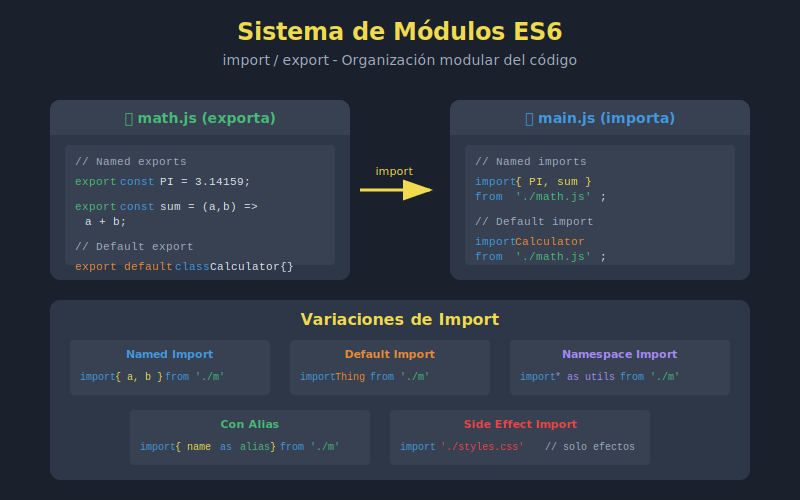

# 📘 Módulos ES6 en JavaScript

## 🎯 Objetivos

- Comprender el sistema de módulos ES6
- Crear módulos con `export` e `import`
- Organizar código en archivos separados
- Entender el scope de módulos
- Configurar proyectos para usar módulos

---

## 🖼️ Diagrama



---

## 📋 Contenido

### 1. ¿Qué son los Módulos?

Los **módulos ES6** permiten dividir el código en archivos separados, cada uno con su propio scope. Esto facilita:

- **Organización**: Código separado por responsabilidades
- **Reutilización**: Importar funcionalidad donde se necesite
- **Mantenibilidad**: Archivos más pequeños y enfocados
- **Encapsulación**: Variables privadas por defecto

```javascript
// ❌ Sin módulos - todo en un archivo global
// app.js (1000+ líneas)
var users = [];
var products = [];
function addUser() { /* ... */ }
function addProduct() { /* ... */ }
// Todo contamina el scope global

// ✅ Con módulos ES6 - separado y organizado
// users.js
export const users = [];
export const addUser = (user) => { /* ... */ };

// products.js
export const products = [];
export const addProduct = (product) => { /* ... */ };

// app.js
import { users, addUser } from './users.js';
import { products, addProduct } from './products.js';
```

### 2. Sintaxis Básica de Export

#### Named Exports (Exportaciones nombradas)

```javascript
// math.js

// Export individual
export const PI = 3.14159;

export const sum = (a, b) => a + b;

export const multiply = (a, b) => a * b;

export class Calculator {
  add(a, b) { return a + b; }
  subtract(a, b) { return a - b; }
}

// También puedes exportar al final
const divide = (a, b) => a / b;
const modulo = (a, b) => a % b;

export { divide, modulo };
```

### 3. Sintaxis Básica de Import

```javascript
// app.js

// Importar exports específicos
import { PI, sum, multiply } from './math.js';

console.log(PI);           // 3.14159
console.log(sum(2, 3));    // 5
console.log(multiply(4, 5)); // 20

// Importar todo como objeto
import * as MathUtils from './math.js';

console.log(MathUtils.PI);        // 3.14159
console.log(MathUtils.sum(2, 3)); // 5

// Importar clase
import { Calculator } from './math.js';
const calc = new Calculator();
console.log(calc.add(10, 5)); // 15
```

### 4. Renombrar Imports/Exports

```javascript
// utils.js
const helper = () => 'I help!';
const process = () => 'Processing...';

// Renombrar al exportar
export { helper as utilHelper, process as utilProcess };

// ---

// app.js
// Renombrar al importar
import { utilHelper as myHelper } from './utils.js';
import { sum as add, multiply as mult } from './math.js';

console.log(myHelper()); // "I help!"
console.log(add(2, 3));  // 5
console.log(mult(4, 5)); // 20

// Útil para evitar conflictos de nombres
import { format as dateFormat } from './date-utils.js';
import { format as stringFormat } from './string-utils.js';
```

### 5. Estructura de un Proyecto Modular

```
project/
├── index.html
├── js/
│   ├── main.js          # Punto de entrada
│   ├── config.js        # Configuración
│   ├── utils/
│   │   ├── index.js     # Barrel export
│   │   ├── strings.js
│   │   ├── numbers.js
│   │   └── dates.js
│   ├── models/
│   │   ├── index.js
│   │   ├── User.js
│   │   └── Product.js
│   └── services/
│       ├── index.js
│       ├── api.js
│       └── storage.js
└── package.json
```

### 6. Configurar Módulos en el Navegador

```html
<!-- index.html -->
<!DOCTYPE html>
<html lang="es">
<head>
  <meta charset="UTF-8">
  <title>App con Módulos ES6</title>
</head>
<body>
  <div id="app"></div>

  <!-- IMPORTANTE: type="module" -->
  <script type="module" src="./js/main.js"></script>
</body>
</html>
```

```javascript
// js/main.js
import { initApp } from './app.js';
import { loadConfig } from './config.js';

const config = loadConfig();
initApp(config);
```

### 7. Configurar Módulos en Node.js

```json
// package.json
{
  "name": "my-project",
  "version": "1.0.0",
  "type": "module"
}
```

```javascript
// O usar extensión .mjs
// utils.mjs
export const helper = () => 'helping';

// main.mjs
import { helper } from './utils.mjs';
```

### 8. Scope de Módulos

Cada módulo tiene su propio scope. Las variables no son globales:

```javascript
// moduleA.js
const secret = 'private to moduleA';
export const publicValue = 'accessible';

// moduleB.js
const secret = 'private to moduleB'; // No hay conflicto
export const publicValue = 'also accessible';

// main.js
import { publicValue as valueA } from './moduleA.js';
import { publicValue as valueB } from './moduleB.js';

// secret no es accesible desde aquí
console.log(valueA); // "accessible"
console.log(valueB); // "also accessible"
```

### 9. Módulos son Singletons

Un módulo se ejecuta solo una vez, sin importar cuántas veces se importe:

```javascript
// counter.js
console.log('Module loaded!'); // Solo se ejecuta una vez

let count = 0;

export const increment = () => ++count;
export const getCount = () => count;

// ---

// fileA.js
import { increment, getCount } from './counter.js';
increment();
console.log(getCount()); // 1

// fileB.js
import { increment, getCount } from './counter.js';
increment();
console.log(getCount()); // 2 (no 1, comparten estado)

// main.js
import './fileA.js';
import './fileB.js';
// "Module loaded!" aparece solo UNA vez
```

### 10. Strict Mode Automático

Los módulos ES6 siempre están en strict mode:

```javascript
// module.js
// No necesitas "use strict"

// Esto dará error en módulos
undeclaredVar = 5; // ❌ ReferenceError

// Las funciones no tienen this global
function showThis() {
  console.log(this); // undefined, no window
}
```

### 11. Top-Level Await (ES2022)

En módulos puedes usar `await` sin función `async`:

```javascript
// config.js
const response = await fetch('/api/config');
export const config = await response.json();

// main.js
import { config } from './config.js';
// config ya está cargado cuando llega aquí
console.log(config);
```

### 12. Ejemplo Práctico: Aplicación Modular

```javascript
// js/config.js
export const API_URL = 'https://api.example.com';
export const APP_NAME = 'My App';
export const VERSION = '1.0.0';

// js/utils/strings.js
export const capitalize = str =>
  str.charAt(0).toUpperCase() + str.slice(1);

export const truncate = (str, length) =>
  str.length > length ? str.slice(0, length) + '...' : str;

// js/utils/index.js (barrel export)
export * from './strings.js';
export * from './numbers.js';
export * from './dates.js';

// js/models/User.js
export class User {
  constructor(name, email) {
    this.name = name;
    this.email = email;
  }

  greet() {
    return `Hello, I'm ${this.name}`;
  }
}

// js/services/api.js
import { API_URL } from '../config.js';

export const fetchUsers = async () => {
  const response = await fetch(`${API_URL}/users`);
  return response.json();
};

// js/main.js
import { APP_NAME, VERSION } from './config.js';
import { capitalize } from './utils/index.js';
import { User } from './models/User.js';
import { fetchUsers } from './services/api.js';

console.log(`${APP_NAME} v${VERSION}`);

const init = async () => {
  const users = await fetchUsers();
  users.forEach(userData => {
    const user = new User(userData.name, userData.email);
    console.log(capitalize(user.greet()));
  });
};

init();
```

---

## ⚠️ Consideraciones Importantes

### CORS y Servidor Local

Los módulos ES6 **no funcionan** con `file://`. Necesitas un servidor:

```bash
# Opciones para servidor local

# Python
python -m http.server 8000

# Node.js (con npx)
npx serve

# VS Code - Live Server extension
# Click derecho -> "Open with Live Server"
```

### Extensión de Archivo

En el navegador, **siempre incluir** la extensión `.js`:

```javascript
// ❌ No funciona en navegador
import { sum } from './math';

// ✅ Funciona en navegador
import { sum } from './math.js';
```

### Rutas Relativas

Siempre usar rutas relativas con `./` o `../`:

```javascript
// ❌ No es válido
import { sum } from 'math.js';

// ✅ Válido
import { sum } from './math.js';
import { helper } from '../utils/helper.js';
```

---

## 💡 Mejores Prácticas

### ✅ Hacer

```javascript
// Un export principal por archivo
// User.js
export class User { /* ... */ }

// Nombres descriptivos
export const calculateTotalPrice = (items) => { /* ... */ };

// Barrel exports para carpetas
// utils/index.js
export * from './strings.js';
export * from './numbers.js';
```

### ❌ Evitar

```javascript
// Demasiados exports en un archivo
export const a = 1;
export const b = 2;
// ... 50 exports más

// Imports circulares
// a.js imports b.js, b.js imports a.js
```

---

## 📚 Recursos Adicionales

- [MDN - JavaScript Modules](https://developer.mozilla.org/es/docs/Web/JavaScript/Guide/Modules)
- [JavaScript.info - Modules](https://javascript.info/modules-intro)
- [V8 - JavaScript Modules](https://v8.dev/features/modules)

---

## ✅ Checklist de Aprendizaje

- [ ] Crear exports nombrados
- [ ] Importar exports específicos
- [ ] Renombrar imports/exports
- [ ] Importar todo como namespace (`* as`)
- [ ] Configurar módulos en HTML (`type="module"`)
- [ ] Entender scope de módulos
- [ ] Usar barrel exports
- [ ] Organizar proyecto con módulos

---

## 🔗 Navegación

| ⬅️ Anterior | 🏠 Índice | ➡️ Siguiente |
|-------------|-----------|--------------|
| [Destructuring Objetos](./02-destructuring-objetos.md) | [Semana 4](../README.md) | [Named vs Default Exports](./04-named-default-exports.md) |
