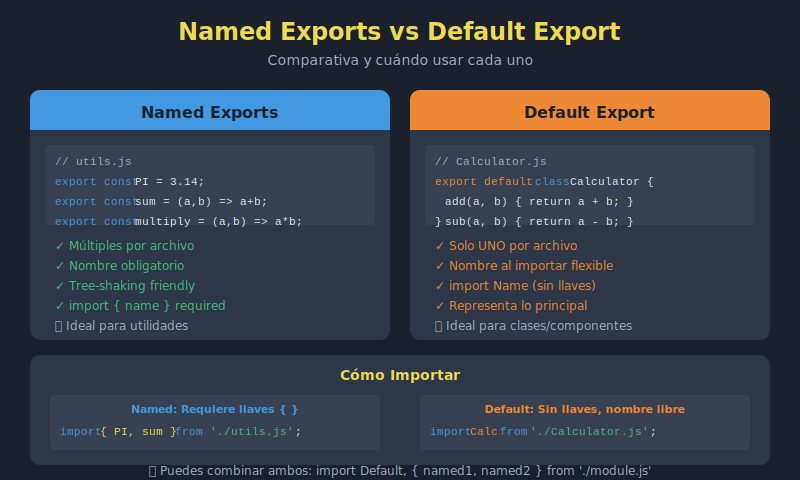

# 📘 Named Exports vs Default Exports

## 🎯 Objetivos

- Diferenciar entre named exports y default exports
- Saber cuándo usar cada tipo de export
- Combinar ambos tipos en un módulo
- Implementar re-exports para organización
- Aplicar patrones comunes de exportación

---

## 🖼️ Diagrama



---

## 📋 Contenido

### 1. Named Exports (Exportaciones Nombradas)

Exportan múltiples valores con nombres específicos:

```javascript
// math.js - Named exports

// Exportar al declarar
export const PI = 3.14159;
export const E = 2.71828;

export const sum = (a, b) => a + b;
export const subtract = (a, b) => a - b;
export const multiply = (a, b) => a * b;
export const divide = (a, b) => a / b;

export class Calculator {
  // ...
}

// O exportar al final
const square = x => x * x;
const cube = x => x * x * x;

export { square, cube };
```

```javascript
// Importar named exports
import { PI, sum, multiply } from './math.js';
import { Calculator } from './math.js';

// Importar todo
import * as Math from './math.js';
console.log(Math.PI);      // 3.14159
console.log(Math.sum(2,3)); // 5
```

### 2. Default Export (Exportación por Defecto)

Cada módulo puede tener **un solo** default export:

```javascript
// User.js - Default export

class User {
  constructor(name, email) {
    this.name = name;
    this.email = email;
  }

  greet() {
    return `Hi, I'm ${this.name}`;
  }

  static create(data) {
    return new User(data.name, data.email);
  }
}

export default User;

// Alternativas de sintaxis
// export default class User { ... }
// export default function myFunc() { ... }
// export default () => { ... }
```

```javascript
// Importar default export
import User from './User.js';

// El nombre puede ser cualquiera
import MyUser from './User.js';
import PersonClass from './User.js';

const user = new User('Ana', 'ana@mail.com');
```

### 3. Comparación Directa

| Aspecto | Named Export | Default Export |
|---------|--------------|----------------|
| Cantidad por módulo | Ilimitados | Solo 1 |
| Nombre al importar | Debe coincidir | Cualquier nombre |
| Sintaxis export | `export const x` | `export default` |
| Sintaxis import | `import { x }` | `import x` |
| Llaves | Sí `{ }` | No |
| Renombrar | `as` keyword | Directo |

```javascript
// named-example.js
export const value = 42;

// default-example.js
const value = 42;
export default value;

// Imports
import { value } from './named-example.js';     // Debe ser "value"
import anyName from './default-example.js';      // Puede ser cualquier nombre
```

### 4. Combinar Named y Default

Un módulo puede tener ambos tipos:

```javascript
// api.js
const API_URL = 'https://api.example.com';

// Named exports
export const get = (endpoint) =>
  fetch(`${API_URL}${endpoint}`).then(r => r.json());

export const post = (endpoint, data) =>
  fetch(`${API_URL}${endpoint}`, {
    method: 'POST',
    body: JSON.stringify(data)
  }).then(r => r.json());

export { API_URL };

// Default export - el objeto API completo
const api = {
  url: API_URL,
  get,
  post,
  put: (endpoint, data) => { /* ... */ },
  delete: (endpoint) => { /* ... */ }
};

export default api;
```

```javascript
// Importar combinado
import api, { get, post, API_URL } from './api.js';

// Usar default
api.get('/users');
api.post('/users', { name: 'Ana' });

// Usar named
get('/products');
console.log(API_URL);
```

### 5. ¿Cuándo Usar Cada Uno?

#### Usar Named Exports cuando:

```javascript
// ✅ Múltiples utilidades relacionadas
// utils/strings.js
export const capitalize = str => str[0].toUpperCase() + str.slice(1);
export const lowercase = str => str.toLowerCase();
export const uppercase = str => str.toUpperCase();
export const trim = str => str.trim();

// ✅ Constantes y configuración
// config.js
export const API_URL = 'https://api.example.com';
export const TIMEOUT = 5000;
export const MAX_RETRIES = 3;

// ✅ Funciones helper independientes
// helpers.js
export const formatDate = date => { /* ... */ };
export const formatCurrency = amount => { /* ... */ };
export const generateId = () => { /* ... */ };
```

#### Usar Default Export cuando:

```javascript
// ✅ Una clase principal por archivo
// User.js
export default class User {
  constructor(name) {
    this.name = name;
  }
}

// ✅ Un componente/módulo principal
// Calculator.js
export default class Calculator {
  add(a, b) { return a + b; }
  subtract(a, b) { return a - b; }
}

// ✅ Una función principal
// fetchData.js
export default async function fetchData(url) {
  const response = await fetch(url);
  return response.json();
}
```

### 6. Re-exports (Barrel Exports)

Centralizar exports de múltiples archivos:

```javascript
// models/User.js
export class User { /* ... */ }

// models/Product.js
export class Product { /* ... */ }

// models/Order.js
export class Order { /* ... */ }

// models/index.js - Barrel file
export { User } from './User.js';
export { Product } from './Product.js';
export { Order } from './Order.js';

// O exportar todo
export * from './User.js';
export * from './Product.js';
export * from './Order.js';
```

```javascript
// Ahora puedes importar desde un solo lugar
import { User, Product, Order } from './models/index.js';
// O simplemente
import { User, Product, Order } from './models';
```

### 7. Re-export con Renombrado

```javascript
// utils/index.js

// Re-export con alias
export { formatDate as dateFormatter } from './dates.js';
export { formatCurrency as currencyFormatter } from './numbers.js';

// Re-export default como named
export { default as StringUtils } from './StringUtils.js';
export { default as ArrayUtils } from './ArrayUtils.js';

// Re-export todo excepto algunos
export * from './helpers.js';
// No hay forma nativa de excluir, pero puedes ser selectivo:
export { helper1, helper2 } from './helpers.js'; // Solo estos
```

### 8. Importar Default y Named Juntos

```javascript
// react-style import pattern
// React exporta default (React) y named (useState, useEffect, etc.)

// Patrón común
import React, { useState, useEffect } from 'react';

// Nuestro ejemplo
// component.js
export const ComponentA = () => { /* ... */ };
export const ComponentB = () => { /* ... */ };
const MainComponent = () => { /* ... */ };
export default MainComponent;

// Importar
import MainComponent, { ComponentA, ComponentB } from './component.js';
```

### 9. Patrones Comunes

#### Patrón: Clase con Helpers

```javascript
// UserService.js
export const validateEmail = email => /^[^\s@]+@[^\s@]+\.[^\s@]+$/.test(email);
export const validatePassword = pass => pass.length >= 8;

class UserService {
  async create(userData) {
    if (!validateEmail(userData.email)) {
      throw new Error('Invalid email');
    }
    // ...
  }

  async findById(id) { /* ... */ }
  async update(id, data) { /* ... */ }
  async delete(id) { /* ... */ }
}

export default UserService;
```

#### Patrón: Factory Functions

```javascript
// logger.js
export const LOG_LEVELS = {
  DEBUG: 0,
  INFO: 1,
  WARN: 2,
  ERROR: 3
};

export const createLogger = (prefix, level = LOG_LEVELS.INFO) => ({
  debug: (msg) => level <= LOG_LEVELS.DEBUG && console.log(`[${prefix}] DEBUG:`, msg),
  info: (msg) => level <= LOG_LEVELS.INFO && console.log(`[${prefix}] INFO:`, msg),
  warn: (msg) => level <= LOG_LEVELS.WARN && console.warn(`[${prefix}] WARN:`, msg),
  error: (msg) => level <= LOG_LEVELS.ERROR && console.error(`[${prefix}] ERROR:`, msg)
});

export default createLogger;
```

```javascript
// Uso
import createLogger, { LOG_LEVELS } from './logger.js';

const logger = createLogger('App', LOG_LEVELS.DEBUG);
logger.info('Application started');
```

#### Patrón: Constantes + Funciones

```javascript
// http.js
export const HTTP_METHODS = {
  GET: 'GET',
  POST: 'POST',
  PUT: 'PUT',
  DELETE: 'DELETE'
};

export const HTTP_STATUS = {
  OK: 200,
  CREATED: 201,
  BAD_REQUEST: 400,
  NOT_FOUND: 404,
  SERVER_ERROR: 500
};

const httpClient = {
  async request(url, method = HTTP_METHODS.GET, body = null) {
    const options = { method };
    if (body) {
      options.body = JSON.stringify(body);
      options.headers = { 'Content-Type': 'application/json' };
    }
    return fetch(url, options);
  },

  get: (url) => httpClient.request(url, HTTP_METHODS.GET),
  post: (url, body) => httpClient.request(url, HTTP_METHODS.POST, body),
  put: (url, body) => httpClient.request(url, HTTP_METHODS.PUT, body),
  delete: (url) => httpClient.request(url, HTTP_METHODS.DELETE)
};

export default httpClient;
```

### 10. Errores Comunes

```javascript
// ❌ Error: Exportar default con llaves
import { default } from './module.js'; // SyntaxError

// ✅ Correcto
import myDefault from './module.js';
import { default as myDefault } from './module.js';

// ❌ Error: Múltiples default exports
export default const a = 1;
export default const b = 2; // SyntaxError

// ❌ Error: Named import de default
// module.js
export default function myFunc() {}

// app.js
import { myFunc } from './module.js'; // ❌ No funciona

// ✅ Correcto
import myFunc from './module.js';
```

---

## 💡 Mejores Prácticas

### ✅ Convenciones Recomendadas

```javascript
// 1. Un default export por archivo (clases, componentes principales)
// User.js
export default class User {}

// 2. Named exports para utilidades y constantes
// utils.js
export const helper1 = () => {};
export const helper2 = () => {};

// 3. Barrel exports para directorios
// models/index.js
export * from './User.js';
export * from './Product.js';

// 4. Nombrar archivos igual que el default export
// Calculator.js
export default class Calculator {}
```

### ❌ Anti-patrones

```javascript
// Evitar default export de objetos anónimos
export default {
  method1: () => {},
  method2: () => {}
}; // Dificulta tree-shaking y autocompletado

// Mejor usar named exports
export const method1 = () => {};
export const method2 = () => {};
```

---

## 📚 Recursos Adicionales

- [MDN - export](https://developer.mozilla.org/es/docs/Web/JavaScript/Reference/Statements/export)
- [MDN - import](https://developer.mozilla.org/es/docs/Web/JavaScript/Reference/Statements/import)
- [JavaScript.info - Export and Import](https://javascript.info/import-export)

---

## ✅ Checklist de Aprendizaje

- [ ] Crear named exports
- [ ] Crear default exports
- [ ] Combinar ambos en un módulo
- [ ] Importar correctamente cada tipo
- [ ] Implementar re-exports (barrel)
- [ ] Renombrar exports e imports
- [ ] Aplicar convenciones de nombres

---

## 🔗 Navegación

| ⬅️ Anterior | 🏠 Índice | ➡️ Siguiente |
|-------------|-----------|--------------|
| [Módulos ES6](./03-modulos-es6.md) | [Semana 4](../README.md) | [Dynamic Imports](./05-dynamic-imports.md) |
