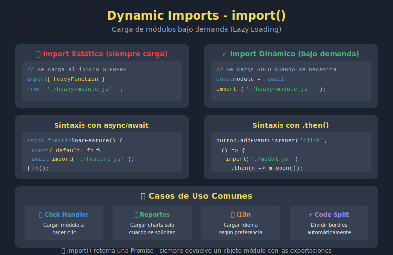

# 📘 Dynamic Imports en JavaScript ES2023

## 🎯 Objetivos

- Comprender qué son los dynamic imports
- Usar `import()` para carga bajo demanda
- Implementar code splitting básico
- Manejar errores en imports dinámicos
- Aplicar lazy loading de módulos

---

## 🖼️ Diagrama



---

## 📋 Contenido

### 1. Static vs Dynamic Imports

#### Static Imports (lo que conocemos)

```javascript
// Se cargan al inicio, ANTES de ejecutar código
import { sum } from './math.js';
import User from './User.js';

// Características:
// - Se resuelven en tiempo de compilación
// - Deben estar al inicio del archivo
// - La ruta debe ser un string literal
// - Todo se carga aunque no se use
```

#### Dynamic Imports (ES2020)

```javascript
// Se cargan cuando se necesitan, EN TIEMPO DE EJECUCIÓN
const mathModule = await import('./math.js');
const { sum } = mathModule;

// Características:
// - Se resuelven en tiempo de ejecución
// - Pueden estar en cualquier parte del código
// - La ruta puede ser dinámica
// - Solo se carga cuando se ejecuta
```

### 2. Sintaxis Básica de `import()`

`import()` retorna una **Promise** que resuelve al módulo:

```javascript
// Con async/await
const loadModule = async () => {
  const module = await import('./myModule.js');
  module.doSomething();
};

// Con .then()
import('./myModule.js')
  .then(module => {
    module.doSomething();
  })
  .catch(error => {
    console.error('Error loading module:', error);
  });

// Acceder a exports
const module = await import('./math.js');
console.log(module.sum(2, 3));        // Named export
console.log(module.default);           // Default export
```

### 3. Cargar Bajo Demanda

El principal beneficio: cargar solo cuando se necesita:

```javascript
// ❌ Sin dynamic import - carga todo al inicio
import { heavyCalculation } from './heavy-module.js';

document.getElementById('calcBtn').addEventListener('click', () => {
  const result = heavyCalculation();
  console.log(result);
});

// ✅ Con dynamic import - carga solo al hacer click
document.getElementById('calcBtn').addEventListener('click', async () => {
  const { heavyCalculation } = await import('./heavy-module.js');
  const result = heavyCalculation();
  console.log(result);
});
```

### 4. Rutas Dinámicas

A diferencia de static imports, la ruta puede ser una variable:

```javascript
// Cargar módulo según configuración
const loadTheme = async (themeName) => {
  const theme = await import(`./themes/${themeName}.js`);
  theme.apply();
};

loadTheme('dark');
loadTheme('light');

// Cargar según idioma
const loadTranslations = async (lang) => {
  const translations = await import(`./i18n/${lang}.js`);
  return translations.default;
};

const texts = await loadTranslations(navigator.language.slice(0, 2));

// Cargar según condición
const modulePath = isAdmin ? './admin.js' : './user.js';
const module = await import(modulePath);
```

### 5. Lazy Loading de Funcionalidades

Cargar features solo cuando el usuario las necesita:

```javascript
// app.js
class App {
  constructor() {
    this.modules = {};
  }

  async loadChart() {
    if (!this.modules.chart) {
      this.modules.chart = await import('./features/chart.js');
    }
    return this.modules.chart;
  }

  async loadEditor() {
    if (!this.modules.editor) {
      this.modules.editor = await import('./features/editor.js');
    }
    return this.modules.editor;
  }

  async showChart(data) {
    const { createChart } = await this.loadChart();
    createChart(data);
  }

  async openEditor(content) {
    const { Editor } = await this.loadEditor();
    const editor = new Editor(content);
    editor.open();
  }
}

const app = new App();

// Los módulos se cargan solo cuando se usan
document.getElementById('showChart').addEventListener('click', () => {
  app.showChart(chartData);
});

document.getElementById('openEditor').addEventListener('click', () => {
  app.openEditor(documentContent);
});
```

### 6. Manejo de Errores

```javascript
// Con try/catch
const loadModule = async (modulePath) => {
  try {
    const module = await import(modulePath);
    return module;
  } catch (error) {
    if (error.message.includes('Failed to fetch')) {
      console.error('Network error - module not found');
    } else if (error.message.includes('not a valid')) {
      console.error('Invalid module format');
    } else {
      console.error('Unknown error loading module:', error);
    }
    return null;
  }
};

// Con fallback
const loadWithFallback = async (primary, fallback) => {
  try {
    return await import(primary);
  } catch {
    console.warn(`Failed to load ${primary}, using fallback`);
    return await import(fallback);
  }
};

const theme = await loadWithFallback(
  './themes/custom.js',
  './themes/default.js'
);
```

### 7. Destructuring en Dynamic Imports

```javascript
// Destructuring directo (Named exports)
const { sum, multiply, divide } = await import('./math.js');

// Default export
const { default: Calculator } = await import('./Calculator.js');

// Combinado
const { default: api, get, post } = await import('./api.js');

// Con alias
const {
  createUser: createNewUser,
  updateUser: modifyUser
} = await import('./userService.js');
```

### 8. Preloading de Módulos

Cargar módulos antes de necesitarlos para mejor UX:

```javascript
// Preload cuando el usuario hace hover
const preloadModule = (modulePath) => {
  // import() devuelve Promise, el navegador empieza a cargar
  return import(modulePath);
};

// Precargar en hover para carga más rápida
const reportBtn = document.getElementById('reports');
let reportsModule = null;

reportBtn.addEventListener('mouseenter', async () => {
  if (!reportsModule) {
    reportsModule = preloadModule('./reports.js');
  }
});

reportBtn.addEventListener('click', async () => {
  const reports = await (reportsModule || import('./reports.js'));
  reports.showDashboard();
});

// Preload durante idle time
if ('requestIdleCallback' in window) {
  requestIdleCallback(() => {
    import('./heavy-feature.js'); // Precarga en tiempo idle
  });
}
```

### 9. Code Splitting por Rutas

Patrón común en SPAs:

```javascript
// router.js
const routes = {
  '/': () => import('./pages/Home.js'),
  '/about': () => import('./pages/About.js'),
  '/products': () => import('./pages/Products.js'),
  '/contact': () => import('./pages/Contact.js'),
  '/admin': () => import('./pages/Admin.js')
};

const loadPage = async (path) => {
  const loader = routes[path] || routes['/'];

  try {
    const page = await loader();
    return page.default;
  } catch (error) {
    console.error('Failed to load page:', error);
    const errorPage = await import('./pages/Error.js');
    return errorPage.default;
  }
};

// Navegación
const navigate = async (path) => {
  document.getElementById('app').innerHTML = '<div>Loading...</div>';

  const Page = await loadPage(path);
  const content = new Page();

  document.getElementById('app').innerHTML = '';
  document.getElementById('app').appendChild(content.render());
};

// Event listener para navegación
window.addEventListener('popstate', () => navigate(location.pathname));
document.querySelectorAll('nav a').forEach(link => {
  link.addEventListener('click', (e) => {
    e.preventDefault();
    history.pushState(null, '', link.href);
    navigate(new URL(link.href).pathname);
  });
});
```

### 10. Conditional Feature Loading

```javascript
// Cargar polyfills solo si es necesario
const loadPolyfills = async () => {
  const polyfills = [];

  if (!('fetch' in window)) {
    polyfills.push(import('./polyfills/fetch.js'));
  }

  if (!('Promise' in window)) {
    polyfills.push(import('./polyfills/promise.js'));
  }

  if (!('IntersectionObserver' in window)) {
    polyfills.push(import('./polyfills/intersection-observer.js'));
  }

  await Promise.all(polyfills);
};

// Cargar features según permisos
const loadAdminFeatures = async (user) => {
  if (user.role !== 'admin') {
    return null;
  }

  const [analytics, userManagement, settings] = await Promise.all([
    import('./admin/analytics.js'),
    import('./admin/user-management.js'),
    import('./admin/settings.js')
  ]);

  return { analytics, userManagement, settings };
};

// Cargar según capacidades del dispositivo
const loadOptimizedImages = async () => {
  if ('connection' in navigator && navigator.connection.saveData) {
    return import('./images/low-quality.js');
  }

  if (window.devicePixelRatio > 1) {
    return import('./images/high-dpi.js');
  }

  return import('./images/standard.js');
};
```

### 11. Pattern: Module Registry

```javascript
// moduleRegistry.js
class ModuleRegistry {
  constructor() {
    this.cache = new Map();
    this.loading = new Map();
  }

  async load(name, path) {
    // Return cached module
    if (this.cache.has(name)) {
      return this.cache.get(name);
    }

    // Return existing loading promise
    if (this.loading.has(name)) {
      return this.loading.get(name);
    }

    // Start loading
    const loadPromise = import(path)
      .then(module => {
        this.cache.set(name, module);
        this.loading.delete(name);
        return module;
      })
      .catch(error => {
        this.loading.delete(name);
        throw error;
      });

    this.loading.set(name, loadPromise);
    return loadPromise;
  }

  isLoaded(name) {
    return this.cache.has(name);
  }

  clear(name) {
    this.cache.delete(name);
  }
}

export const registry = new ModuleRegistry();

// Uso
import { registry } from './moduleRegistry.js';

const charts = await registry.load('charts', './features/charts.js');
const editor = await registry.load('editor', './features/editor.js');

// Segunda vez - usa cache
const chartsAgain = await registry.load('charts', './features/charts.js');
```

### 12. Import Assertions (ES2023)

Para importar JSON y otros tipos:

```javascript
// Importar JSON (con assertion)
const config = await import('./config.json', {
  assert: { type: 'json' }
});

console.log(config.default);

// Importar CSS modules (futuro)
const styles = await import('./styles.css', {
  assert: { type: 'css' }
});
```

---

## ⚠️ Consideraciones

### Performance

```javascript
// ❌ Evitar imports dinámicos en loops críticos
for (const item of items) {
  const module = await import('./processor.js'); // Ineficiente
  module.process(item);
}

// ✅ Cargar una vez, usar muchas
const module = await import('./processor.js');
for (const item of items) {
  module.process(item);
}
```

### Bundle Size

Los dynamic imports permiten "code splitting" automático en bundlers como Webpack, Vite, Rollup:

```javascript
// Webpack/Vite crean chunks separados automáticamente
const AdminPanel = () => import('./AdminPanel.js');
// Genera: AdminPanel.[hash].js

// Con nombres personalizados (Webpack)
const AdminPanel = () => import(
  /* webpackChunkName: "admin" */ './AdminPanel.js'
);
```

---

## 💡 Mejores Prácticas

### ✅ Hacer

```javascript
// Lazy load features pesadas
const loadEditor = async () => import('./heavy-editor.js');

// Precargar en interacción del usuario
element.addEventListener('mouseenter', () => import('./module.js'));

// Manejar errores siempre
try {
  const module = await import('./module.js');
} catch (error) {
  // Fallback
}
```

### ❌ Evitar

```javascript
// No usar para módulos pequeños siempre necesarios
const { sum } = await import('./tiny-util.js'); // Overhead innecesario

// No hacer imports dinámicos síncronos-simulados
const module = null;
import('./module.js').then(m => module = m);
doSomething(module); // ❌ module es null
```

---

## 📚 Recursos Adicionales

- [MDN - Dynamic import()](https://developer.mozilla.org/es/docs/Web/JavaScript/Reference/Operators/import)
- [JavaScript.info - Dynamic imports](https://javascript.info/modules-dynamic-imports)
- [Web.dev - Code splitting](https://web.dev/articles/reduce-javascript-payloads-with-code-splitting)

---

## ✅ Checklist de Aprendizaje

- [ ] Usar `import()` básico
- [ ] Manejar Promise con async/await y .then()
- [ ] Implementar rutas dinámicas
- [ ] Lazy loading de features
- [ ] Manejo de errores en imports
- [ ] Preloading de módulos
- [ ] Code splitting por rutas
- [ ] Conditional feature loading

---

## 🔗 Navegación

| ⬅️ Anterior | 🏠 Índice | ➡️ Siguiente |
|-------------|-----------|--------------|
| [Named vs Default Exports](./04-named-default-exports.md) | [Semana 4](../README.md) | [Ejercicio 1: Destructuring Arrays](../2-practicas/ejercicio-01-destructuring-arrays/README.md) |
