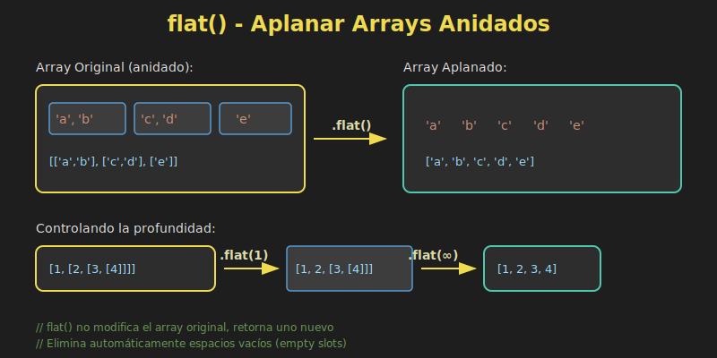
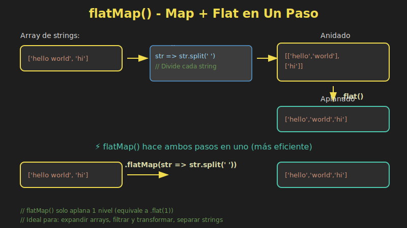

# 📚 flat() y flatMap()

## 🎯 Objetivos

- Comprender qué es un array anidado y por qué aplanarlo
- Dominar el método `flat()` con diferentes niveles de profundidad
- Aplicar `flatMap()` para mapear y aplanar en una sola operación
- Identificar casos de uso prácticos para cada método

---

## 📖 Introducción

En JavaScript moderno, es común trabajar con **arrays anidados** (arrays dentro de arrays). Los métodos `flat()` y `flatMap()` nos permiten **aplanar** estas estructuras de forma elegante y funcional.

```javascript
// Arrays anidados: común en datos del mundo real
const departments = [
  ['Ana', 'Carlos'],      // Marketing
  ['Luis', 'María'],      // Desarrollo
  ['Pedro']               // Diseño
];

// ¿Cómo obtener una lista plana de todos los empleados?
```

### 📊 Diagrama: Aplanamiento con flat()



---

## 1️⃣ El Método `flat()`

### Sintaxis

```javascript
const newArray = array.flat(depth);
```

| Parámetro | Tipo | Descripción |
|-----------|------|-------------|
| `depth` | Number | Nivel de profundidad a aplanar (default: 1) |

### Aplanamiento Básico (Nivel 1)

```javascript
const nested = [[1, 2], [3, 4], [5, 6]];
const flat = nested.flat();

console.log(flat); // [1, 2, 3, 4, 5, 6]
```

### Controlando la Profundidad

```javascript
// Array con múltiples niveles de anidamiento
const deepNested = [1, [2, [3, [4, [5]]]]];

console.log(deepNested.flat(1)); // [1, 2, [3, [4, [5]]]]
console.log(deepNested.flat(2)); // [1, 2, 3, [4, [5]]]
console.log(deepNested.flat(3)); // [1, 2, 3, 4, [5]]
console.log(deepNested.flat(4)); // [1, 2, 3, 4, 5]
```

### Aplanar Completamente con `Infinity`

```javascript
const veryDeep = [1, [2, [3, [4, [5, [6, [7]]]]]]];

// Aplanar sin importar la profundidad
const completelyFlat = veryDeep.flat(Infinity);

console.log(completelyFlat); // [1, 2, 3, 4, 5, 6, 7]
```

### `flat()` Elimina Espacios Vacíos

```javascript
const sparse = [1, , 3, , 5];

console.log(sparse.flat()); // [1, 3, 5]

// También en arrays anidados
const withEmpty = [1, [2, , 4], 5];

console.log(withEmpty.flat()); // [1, 2, 4, 5]
```

---

## 2️⃣ El Método `flatMap()`

### 📊 Diagrama: flatMap() = map() + flat()



### ¿Por qué `flatMap()`?

`flatMap()` combina `map()` + `flat(1)` en una sola operación más eficiente:

```javascript
// Equivalente, pero menos eficiente:
array.map(fn).flat();

// Mejor: una sola pasada
array.flatMap(fn);
```

### Sintaxis

```javascript
const newArray = array.flatMap((element, index, array) => {
  // Return array or value
});
```

### Ejemplo Básico

```javascript
const sentences = ['Hello world', 'How are you'];

// Con map + flat
const words1 = sentences.map(s => s.split(' ')).flat();

// Con flatMap (más eficiente)
const words2 = sentences.flatMap(s => s.split(' '));

console.log(words2); // ['Hello', 'world', 'How', 'are', 'you']
```

### Expandir Elementos

```javascript
const numbers = [1, 2, 3];

// Duplicar cada elemento
const duplicated = numbers.flatMap(n => [n, n]);

console.log(duplicated); // [1, 1, 2, 2, 3, 3]

// Expandir con información adicional
const withSquares = numbers.flatMap(n => [n, n * n]);

console.log(withSquares); // [1, 1, 2, 4, 3, 9]
```

### Filtrar mientras se mapea

```javascript
const values = [1, -2, 3, -4, 5];

// Solo positivos, duplicados
const result = values.flatMap(n => n > 0 ? [n, n] : []);

console.log(result); // [1, 1, 3, 3, 5, 5]
```

### Agregar elementos condicionalmente

```javascript
const items = [
  { name: 'A', featured: true },
  { name: 'B', featured: false },
  { name: 'C', featured: true }
];

// Items destacados aparecen dos veces
const display = items.flatMap(item =>
  item.featured ? [item, item] : [item]
);

console.log(display);
// [
//   { name: 'A', featured: true },
//   { name: 'A', featured: true },
//   { name: 'B', featured: false },
//   { name: 'C', featured: true },
//   { name: 'C', featured: true }
// ]
```

---

## 3️⃣ Casos de Uso Prácticos

### Procesar Datos de API

```javascript
const users = [
  { name: 'Ana', skills: ['JS', 'React'] },
  { name: 'Luis', skills: ['Python', 'Django'] },
  { name: 'María', skills: ['JS', 'Vue', 'Node'] }
];

// Obtener todas las skills únicas
const allSkills = users.flatMap(user => user.skills);

console.log(allSkills);
// ['JS', 'React', 'Python', 'Django', 'JS', 'Vue', 'Node']

// Skills únicas con Set
const uniqueSkills = [...new Set(allSkills)];

console.log(uniqueSkills);
// ['JS', 'React', 'Python', 'Django', 'Vue', 'Node']
```

### Generar Combinaciones

```javascript
const sizes = ['S', 'M', 'L'];
const colors = ['red', 'blue'];

// Todas las combinaciones
const variants = sizes.flatMap(size =>
  colors.map(color => ({ size, color }))
);

console.log(variants);
// [
//   { size: 'S', color: 'red' },
//   { size: 'S', color: 'blue' },
//   { size: 'M', color: 'red' },
//   { size: 'M', color: 'blue' },
//   { size: 'L', color: 'red' },
//   { size: 'L', color: 'blue' }
// ]
```

### Parsear Datos Estructurados

```javascript
const orders = [
  {
    id: 1,
    items: [
      { product: 'Laptop', qty: 1 },
      { product: 'Mouse', qty: 2 }
    ]
  },
  {
    id: 2,
    items: [
      { product: 'Keyboard', qty: 1 }
    ]
  }
];

// Lista plana de todos los items con orderId
const allItems = orders.flatMap(order =>
  order.items.map(item => ({
    orderId: order.id,
    ...item
  }))
);

console.log(allItems);
// [
//   { orderId: 1, product: 'Laptop', qty: 1 },
//   { orderId: 1, product: 'Mouse', qty: 2 },
//   { orderId: 2, product: 'Keyboard', qty: 1 }
// ]
```

### Expandir Rangos

```javascript
const ranges = [
  { start: 1, end: 3 },
  { start: 5, end: 7 }
];

// Expandir cada rango a sus números
const numbers = ranges.flatMap(({ start, end }) => {
  const result = [];
  for (let i = start; i <= end; i++) {
    result.push(i);
  }
  return result;
});

console.log(numbers); // [1, 2, 3, 5, 6, 7]

// Versión más funcional con Array.from
const numbersV2 = ranges.flatMap(({ start, end }) =>
  Array.from({ length: end - start + 1 }, (_, i) => start + i)
);

console.log(numbersV2); // [1, 2, 3, 5, 6, 7]
```

---

## 4️⃣ Comparación: `flat()` vs `flatMap()`

| Característica | `flat()` | `flatMap()` |
|----------------|----------|-------------|
| **Propósito** | Solo aplanar | Mapear + aplanar |
| **Profundidad** | Configurable (1-∞) | Solo nivel 1 |
| **Transformación** | No | Sí |
| **Rendimiento** | N/A | Mejor que `map().flat()` |

### Cuándo usar cada uno

```javascript
// ✅ Usar flat() cuando solo necesitas aplanar
const nested = [[1, 2], [3, 4]];
const result1 = nested.flat();

// ✅ Usar flat(depth) para múltiples niveles
const deep = [1, [2, [3, [4]]]];
const result2 = deep.flat(Infinity);

// ✅ Usar flatMap() cuando mapeas Y aplanas
const sentences = ['hello world', 'goodbye'];
const words = sentences.flatMap(s => s.split(' '));

// ✅ Usar flatMap() para filtrar mientras mapeas
const nums = [1, 2, 3, 4, 5];
const evenDoubled = nums.flatMap(n => n % 2 === 0 ? [n * 2] : []);
```

---

## 5️⃣ Patrones Avanzados

### Recursión con `flat()`

```javascript
// Aplanar y procesar estructura de árbol
const tree = {
  value: 1,
  children: [
    {
      value: 2,
      children: [
        { value: 4, children: [] },
        { value: 5, children: [] }
      ]
    },
    {
      value: 3,
      children: [
        { value: 6, children: [] }
      ]
    }
  ]
};

const flattenTree = node => [
  node.value,
  ...node.children.flatMap(flattenTree)
];

console.log(flattenTree(tree)); // [1, 2, 4, 5, 3, 6]
```

### Pipeline de Transformación

```javascript
const data = [
  'hello-world',
  'foo-bar-baz'
];

const result = data
  .flatMap(s => s.split('-'))     // ['hello', 'world', 'foo', 'bar', 'baz']
  .map(s => s.toUpperCase())      // ['HELLO', 'WORLD', 'FOO', 'BAR', 'BAZ']
  .filter(s => s.length > 3);     // ['HELLO', 'WORLD']

console.log(result);
```

---

## ⚠️ Consideraciones

### `flatMap()` solo aplana 1 nivel

```javascript
const data = [[1, 2], [[3, 4]]];

// flatMap solo aplana 1 nivel
const result = data.flatMap(x => x);

console.log(result); // [1, 2, [3, 4]]

// Si necesitas más niveles, usa flat() después
const deeper = data.flatMap(x => x).flat();

console.log(deeper); // [1, 2, 3, 4]
```

### Inmutabilidad

Ambos métodos **no modifican** el array original:

```javascript
const original = [[1], [2], [3]];
const flattened = original.flat();

console.log(original);  // [[1], [2], [3]] - Sin cambios
console.log(flattened); // [1, 2, 3]
```

---

## 📋 Diagrama Visual


---

## ✅ Checklist de Verificación

Antes de continuar, asegúrate de poder:

- [ ] Explicar qué hace `flat()` y cuándo usarlo
- [ ] Controlar la profundidad de aplanamiento
- [ ] Usar `Infinity` para aplanar completamente
- [ ] Aplicar `flatMap()` para mapear y aplanar
- [ ] Filtrar elementos usando `flatMap()` con arrays vacíos
- [ ] Generar múltiples elementos desde uno con `flatMap()`
- [ ] Elegir entre `flat()` y `flatMap()` según el caso

---

## 🔗 Recursos Adicionales

- 📖 [MDN - Array.prototype.flat()](https://developer.mozilla.org/es/docs/Web/JavaScript/Reference/Global_Objects/Array/flat)
- 📖 [MDN - Array.prototype.flatMap()](https://developer.mozilla.org/es/docs/Web/JavaScript/Reference/Global_Objects/Array/flatMap)
- 📖 [JavaScript.info - Array methods](https://javascript.info/array-methods)

---

## 🧭 Navegación

| ⬅️ Anterior | 🏠 Índice | ➡️ Siguiente |
|-------------|-----------|--------------|
| [README](../README.md) | [Teoría](.) | [Array.from() y Array.of()](02-array-from-of.md) |
