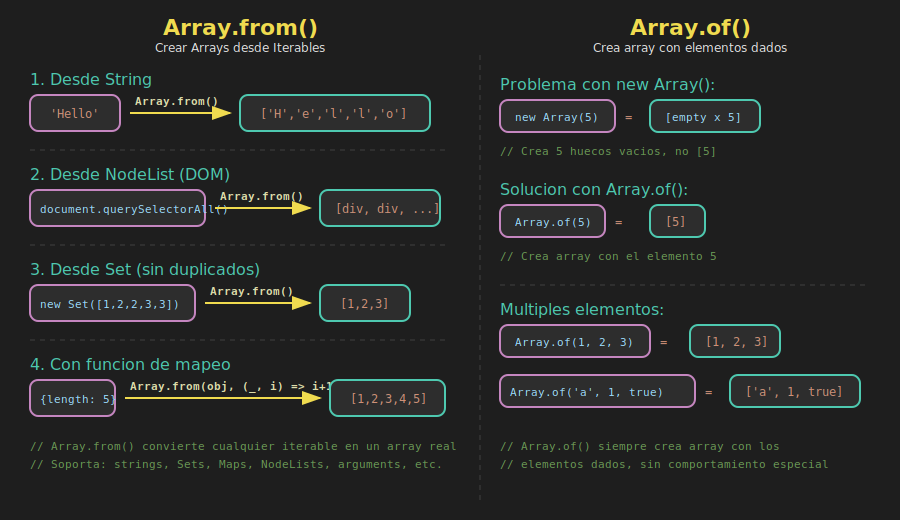

# 📚 Array.from() y Array.of()

## 🎯 Objetivos

- Dominar `Array.from()` para crear arrays desde cualquier iterable
- Usar la función de mapeo integrada en `Array.from()`
- Comprender `Array.of()` y su diferencia con el constructor `Array()`
- Aplicar estos métodos en casos prácticos del mundo real

---

## 📖 Introducción

JavaScript ES6 introdujo dos métodos estáticos muy útiles para crear arrays:

- **`Array.from()`**: Crea arrays desde iterables o array-like objects
- **`Array.of()`**: Crea arrays con los argumentos como elementos

```javascript
// Crear array desde un string
const chars = Array.from('hello');

console.log(chars); // ['h', 'e', 'l', 'l', 'o']

// Crear array con elementos específicos
const nums = Array.of(1, 2, 3);

console.log(nums); // [1, 2, 3]
```

### 📊 Diagrama: Array.from() y Array.of()



---

## 1️⃣ `Array.from()` - Básico

### Sintaxis

```javascript
Array.from(arrayLike, mapFn, thisArg);
```

| Parámetro | Tipo | Descripción |
|-----------|------|-------------|
| `arrayLike` | Iterable/Array-like | Objeto a convertir |
| `mapFn` | Function (opcional) | Función de mapeo |
| `thisArg` | Any (opcional) | Valor de `this` en mapFn |

### Desde Strings

```javascript
const word = 'JavaScript';
const letters = Array.from(word);

console.log(letters);
// ['J', 'a', 'v', 'a', 'S', 'c', 'r', 'i', 'p', 't']

// Útil para manipular caracteres
const upper = Array.from(word).map(c => c.toUpperCase());

console.log(upper.join('')); // 'JAVASCRIPT'
```

### Desde Set

```javascript
const uniqueNumbers = new Set([1, 2, 2, 3, 3, 3]);
const array = Array.from(uniqueNumbers);

console.log(array); // [1, 2, 3]

// También funciona el spread
const array2 = [...uniqueNumbers];

console.log(array2); // [1, 2, 3]
```

### Desde Map

```javascript
const userMap = new Map([
  ['name', 'Ana'],
  ['age', 25],
  ['city', 'Lima']
]);

// Array de entries [key, value]
const entries = Array.from(userMap);

console.log(entries);
// [['name', 'Ana'], ['age', 25], ['city', 'Lima']]

// Solo keys
const keys = Array.from(userMap.keys());

console.log(keys); // ['name', 'age', 'city']

// Solo values
const values = Array.from(userMap.values());

console.log(values); // ['Ana', 25, 'Lima']
```

### Desde NodeList (DOM)

```javascript
// Los métodos del DOM devuelven NodeList, no arrays
const divs = document.querySelectorAll('div');

// NodeList NO tiene todos los métodos de array
// divs.map(...) ❌ Error!

// Convertir a array
const divsArray = Array.from(divs);

// Ahora sí podemos usar métodos de array
const texts = divsArray.map(div => div.textContent);
```

### Desde Arguments

```javascript
// En funciones tradicionales
function sum() {
  // arguments es array-like, no un array real
  const args = Array.from(arguments);
  return args.reduce((a, b) => a + b, 0);
}

console.log(sum(1, 2, 3, 4)); // 10

// Nota: En ES2023 es mejor usar rest parameters
const sumModern = (...nums) => nums.reduce((a, b) => a + b, 0);
```

---

## 2️⃣ `Array.from()` con Función de Mapeo

El segundo argumento permite transformar mientras se crea el array:

### Transformación Básica

```javascript
// Sin mapFn (dos operaciones)
const doubled = Array.from([1, 2, 3]).map(x => x * 2);

// Con mapFn (una operación, más eficiente)
const doubledV2 = Array.from([1, 2, 3], x => x * 2);

console.log(doubledV2); // [2, 4, 6]
```

### Crear Secuencias de Números

```javascript
// Crear array de longitud n con valores
const createRange = (start, end) =>
  Array.from({ length: end - start + 1 }, (_, i) => start + i);

console.log(createRange(1, 5));  // [1, 2, 3, 4, 5]
console.log(createRange(5, 10)); // [5, 6, 7, 8, 9, 10]

// Solo crear un array de longitud n
const zeros = Array.from({ length: 5 }, () => 0);

console.log(zeros); // [0, 0, 0, 0, 0]

// Array de índices
const indices = Array.from({ length: 5 }, (_, i) => i);

console.log(indices); // [0, 1, 2, 3, 4]
```

### Generar Datos Aleatorios

```javascript
// 5 números aleatorios
const random5 = Array.from({ length: 5 }, () => Math.random());

console.log(random5);
// [0.123..., 0.456..., 0.789..., 0.234..., 0.567...]

// 5 números aleatorios entre 1 y 100
const random1to100 = Array.from(
  { length: 5 },
  () => Math.floor(Math.random() * 100) + 1
);

console.log(random1to100); // [42, 87, 13, 56, 91]
```

### Crear Matrices 2D

```javascript
// Matriz 3x3 de ceros
const matrix3x3 = Array.from({ length: 3 }, () =>
  Array.from({ length: 3 }, () => 0)
);

console.log(matrix3x3);
// [
//   [0, 0, 0],
//   [0, 0, 0],
//   [0, 0, 0]
// ]

// Matriz con valores de posición
const posMatrix = Array.from({ length: 3 }, (_, row) =>
  Array.from({ length: 3 }, (_, col) => `${row},${col}`)
);

console.log(posMatrix);
// [
//   ['0,0', '0,1', '0,2'],
//   ['1,0', '1,1', '1,2'],
//   ['2,0', '2,1', '2,2']
// ]
```

---

## 3️⃣ `Array.of()` - Crear Arrays

### El Problema con `Array()`

El constructor `Array()` tiene comportamiento inconsistente:

```javascript
// Un argumento numérico = crea array vacío de esa longitud
const arr1 = Array(3);

console.log(arr1);        // [empty × 3]
console.log(arr1.length); // 3

// Múltiples argumentos = crea array con esos elementos
const arr2 = Array(1, 2, 3);

console.log(arr2); // [1, 2, 3]

// ¡Confuso! ¿Qué hace Array(5)?
```

### `Array.of()` - Comportamiento Consistente

```javascript
// Siempre crea array con los elementos dados
const arr1 = Array.of(3);

console.log(arr1); // [3]

const arr2 = Array.of(1, 2, 3);

console.log(arr2); // [1, 2, 3]

const arr3 = Array.of(5);

console.log(arr3); // [5]
```

### Comparación

```javascript
// Array()
console.log(Array(5));        // [empty × 5]
console.log(Array(1, 2, 3));  // [1, 2, 3]

// Array.of()
console.log(Array.of(5));       // [5]
console.log(Array.of(1, 2, 3)); // [1, 2, 3]

// Array literal (más común)
console.log([5]);       // [5]
console.log([1, 2, 3]); // [1, 2, 3]
```

### Cuándo Usar `Array.of()`

```javascript
// Útil en funciones genéricas
const createArray = Array.of;

const result = createArray(1, 2, 3);

console.log(result); // [1, 2, 3]

// Como callback en funciones de orden superior
const numbers = [1, 2, 3].map(Array.of);

console.log(numbers); // [[1], [2], [3]]
```

---

## 4️⃣ Casos de Uso Prácticos

### Clonar un Array

```javascript
const original = [1, 2, 3];

// Varias formas de clonar
const clone1 = Array.from(original);
const clone2 = [...original];
const clone3 = original.slice();

// Clonar con transformación
const doubled = Array.from(original, x => x * 2);

console.log(doubled); // [2, 4, 6]
```

### Convertir HTMLCollection

```javascript
// getElementsByClassName devuelve HTMLCollection
const items = document.getElementsByClassName('item');

// Convertir para usar métodos de array
const itemsArray = Array.from(items);

// Filtrar y mapear
const activeTexts = Array.from(items)
  .filter(el => el.classList.contains('active'))
  .map(el => el.textContent);
```

### Generar IDs Únicos

```javascript
// Generar n IDs únicos
const generateIds = n =>
  Array.from({ length: n }, () =>
    Math.random().toString(36).substr(2, 9)
  );

console.log(generateIds(3));
// ['x7f2k9m3n', 'a1b2c3d4e', 'q8w9e0r1t']
```

### Crear Alfabeto

```javascript
// Generar array con letras a-z
const alphabet = Array.from(
  { length: 26 },
  (_, i) => String.fromCharCode(97 + i)
);

console.log(alphabet);
// ['a', 'b', 'c', ..., 'z']

// Letras mayúsculas
const upperAlphabet = Array.from(
  { length: 26 },
  (_, i) => String.fromCharCode(65 + i)
);

console.log(upperAlphabet);
// ['A', 'B', 'C', ..., 'Z']
```

### Chunks / Paginación

```javascript
// Dividir array en chunks de tamaño n
const chunk = (array, size) =>
  Array.from(
    { length: Math.ceil(array.length / size) },
    (_, i) => array.slice(i * size, i * size + size)
  );

const numbers = [1, 2, 3, 4, 5, 6, 7, 8, 9, 10];

console.log(chunk(numbers, 3));
// [[1, 2, 3], [4, 5, 6], [7, 8, 9], [10]]

console.log(chunk(numbers, 4));
// [[1, 2, 3, 4], [5, 6, 7, 8], [9, 10]]
```

### Tabla de Multiplicar

```javascript
const multiplicationTable = n =>
  Array.from({ length: 10 }, (_, i) => ({
    operation: `${n} × ${i + 1}`,
    result: n * (i + 1)
  }));

console.log(multiplicationTable(7));
// [
//   { operation: '7 × 1', result: 7 },
//   { operation: '7 × 2', result: 14 },
//   ...
//   { operation: '7 × 10', result: 70 }
// ]
```

---

## 5️⃣ Array-Like Objects

### ¿Qué es Array-Like?

Un objeto "array-like" tiene:
- Propiedad `length`
- Propiedades indexadas (0, 1, 2...)
- **NO** tiene métodos de array

```javascript
// Array-like object manual
const arrayLike = {
  0: 'a',
  1: 'b',
  2: 'c',
  length: 3
};

// No es un array real
console.log(Array.isArray(arrayLike)); // false

// Pero Array.from() funciona
const realArray = Array.from(arrayLike);

console.log(realArray); // ['a', 'b', 'c']
console.log(Array.isArray(realArray)); // true
```

### Ejemplos de Array-Like en JavaScript

```javascript
// arguments (en funciones tradicionales)
function example() {
  console.log(Array.isArray(arguments)); // false
  return Array.from(arguments);
}

// NodeList (del DOM)
const nodes = document.querySelectorAll('p');
console.log(Array.isArray(nodes)); // false

// HTMLCollection
const collection = document.getElementsByTagName('div');
console.log(Array.isArray(collection)); // false

// String (iterable, no array-like exactamente)
console.log(Array.isArray('hello')); // false
```

---

## 📊 Comparación de Métodos

| Método | Entrada | Mapeo | Uso Principal |
|--------|---------|-------|---------------|
| `Array.from()` | Iterable/Array-like | ✅ Sí | Conversión + transformación |
| `Array.of()` | Argumentos | ❌ No | Crear array de elementos |
| `[...spread]` | Iterable | ❌ No | Clonar/expandir |
| `Array()` | Número/Elementos | ❌ No | Evitar (comportamiento confuso) |

---

## 📋 Diagrama Visual


---

## ⚠️ Consideraciones

### `Array.from()` vs Spread

```javascript
const set = new Set([1, 2, 3]);

// Ambos funcionan para iterables
const arr1 = Array.from(set);
const arr2 = [...set];

// Pero Array.from() permite mapeo
const doubled = Array.from(set, x => x * 2);
// Con spread necesitas .map() adicional
const doubled2 = [...set].map(x => x * 2);

// Array.from() funciona con array-like, spread no siempre
const arrayLike = { 0: 'a', 1: 'b', length: 2 };
const arr3 = Array.from(arrayLike); // ✅ Funciona
// const arr4 = [...arrayLike]; // ❌ Error: not iterable
```

### Rendimiento

```javascript
// Para iterables simples, spread suele ser más rápido
const arr1 = [...'hello'];

// Para array-like o cuando necesitas mapeo, usa Array.from()
const arr2 = Array.from('hello', c => c.toUpperCase());
```

---

## ✅ Checklist de Verificación

Antes de continuar, asegúrate de poder:

- [ ] Crear arrays desde strings con `Array.from()`
- [ ] Convertir Set y Map a arrays
- [ ] Usar la función de mapeo en `Array.from()`
- [ ] Crear secuencias de números
- [ ] Generar matrices 2D
- [ ] Explicar la diferencia entre `Array()` y `Array.of()`
- [ ] Convertir array-like objects a arrays
- [ ] Elegir entre `Array.from()` y spread según el caso

---

## 🔗 Recursos Adicionales

- 📖 [MDN - Array.from()](https://developer.mozilla.org/es/docs/Web/JavaScript/Reference/Global_Objects/Array/from)
- 📖 [MDN - Array.of()](https://developer.mozilla.org/es/docs/Web/JavaScript/Reference/Global_Objects/Array/of)
- 📖 [JavaScript.info - Array methods](https://javascript.info/array-methods)

---

## 🧭 Navegación

| ⬅️ Anterior | 🏠 Índice | ➡️ Siguiente |
|-------------|-----------|--------------|
| [flat() y flatMap()](01-flat-flatmap.md) | [Teoría](.) | [Chaining Avanzado](03-chaining-avanzado.md) |
