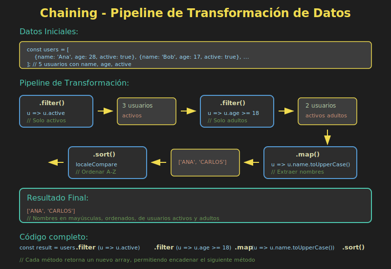

# 📚 Chaining Avanzado

## 🎯 Objetivos

- Dominar el encadenamiento de métodos de array
- Optimizar el orden de operaciones en cadenas
- Escribir código legible y mantenible con chaining
- Evitar errores comunes y mejorar rendimiento

---

## 📖 Introducción

El **chaining** (encadenamiento) es un patrón que permite llamar múltiples métodos en secuencia sobre un array. Cada método devuelve un nuevo array, permitiendo continuar la cadena.

```javascript
const result = data
  .filter(...)
  .map(...)
  .sort(...)
  .slice(...);
```

### 📊 Diagrama: Pipeline de Transformación



---

## 1️⃣ Fundamentos del Chaining

### ¿Por qué funciona?

Los métodos de array que **no mutan** devuelven un nuevo array:

```javascript
const numbers = [1, 2, 3, 4, 5];

// Cada método devuelve un nuevo array
const filtered = numbers.filter(n => n > 2);  // [3, 4, 5]
const mapped = filtered.map(n => n * 2);      // [6, 8, 10]
const sorted = mapped.sort((a, b) => b - a);  // [10, 8, 6]

// Encadenado: mismo resultado, más conciso
const result = numbers
  .filter(n => n > 2)
  .map(n => n * 2)
  .sort((a, b) => b - a);

console.log(result); // [10, 8, 6]
```

### Métodos que Permiten Chaining

| Método | Devuelve | ¿Chainable? |
|--------|----------|-------------|
| `filter()` | Array | ✅ Sí |
| `map()` | Array | ✅ Sí |
| `sort()` | Array (mismo) | ✅ Sí |
| `slice()` | Array | ✅ Sí |
| `concat()` | Array | ✅ Sí |
| `flat()` | Array | ✅ Sí |
| `flatMap()` | Array | ✅ Sí |
| `reverse()` | Array (mismo) | ✅ Sí |
| `reduce()` | Cualquier valor | ⚠️ Depende |
| `find()` | Elemento | ❌ No |
| `findIndex()` | Número | ❌ No |
| `some()` | Boolean | ❌ No |
| `every()` | Boolean | ❌ No |
| `forEach()` | undefined | ❌ No |

---

## 2️⃣ Patrones Comunes de Chaining

### Filter → Map (ETL básico)

```javascript
const users = [
  { name: 'Ana', age: 25, active: true },
  { name: 'Luis', age: 17, active: true },
  { name: 'María', age: 30, active: false },
  { name: 'Carlos', age: 22, active: true }
];

// Nombres de usuarios activos mayores de edad
const adultActiveNames = users
  .filter(user => user.active)
  .filter(user => user.age >= 18)
  .map(user => user.name);

console.log(adultActiveNames); // ['Ana', 'Carlos']
```

### Map → Filter → Sort

```javascript
const products = [
  { name: 'Laptop', price: 1000, stock: 5 },
  { name: 'Mouse', price: 25, stock: 0 },
  { name: 'Keyboard', price: 75, stock: 10 },
  { name: 'Monitor', price: 300, stock: 3 }
];

// Productos disponibles con precio formateado, ordenados por precio
const availableProducts = products
  .filter(p => p.stock > 0)
  .map(p => ({
    name: p.name,
    displayPrice: `$${p.price}`,
    price: p.price
  }))
  .sort((a, b) => a.price - b.price);

console.log(availableProducts);
// [
//   { name: 'Keyboard', displayPrice: '$75', price: 75 },
//   { name: 'Monitor', displayPrice: '$300', price: 300 },
//   { name: 'Laptop', displayPrice: '$1000', price: 1000 }
// ]
```

### FlatMap → Filter → Map

```javascript
const departments = [
  {
    name: 'Engineering',
    employees: [
      { name: 'Ana', salary: 5000 },
      { name: 'Luis', salary: 4500 }
    ]
  },
  {
    name: 'Design',
    employees: [
      { name: 'María', salary: 4000 },
      { name: 'Carlos', salary: 3500 }
    ]
  }
];

// Empleados con salario > 4000, con su departamento
const highEarners = departments
  .flatMap(dept =>
    dept.employees.map(emp => ({
      ...emp,
      department: dept.name
    }))
  )
  .filter(emp => emp.salary > 4000)
  .map(emp => `${emp.name} (${emp.department}): $${emp.salary}`);

console.log(highEarners);
// ['Ana (Engineering): $5000', 'Luis (Engineering): $4500']
```

---

## 3️⃣ Optimización del Orden

### ⚠️ El orden importa para el rendimiento

```javascript
const largeArray = Array.from({ length: 10000 }, (_, i) => ({
  id: i,
  value: Math.random() * 100,
  category: i % 2 === 0 ? 'A' : 'B'
}));

// ❌ INEFICIENTE: map primero procesa TODO, luego filtra
const slow = largeArray
  .map(item => ({ ...item, processed: item.value * 2 }))
  .filter(item => item.category === 'A');

// ✅ EFICIENTE: filter primero reduce el dataset
const fast = largeArray
  .filter(item => item.category === 'A')
  .map(item => ({ ...item, processed: item.value * 2 }));
```

### Reglas de Optimización

| Regla | Descripción |
|-------|-------------|
| **Filter primero** | Reducir el dataset antes de transformar |
| **Combinar filters** | Varios filters seguidos pueden ser uno solo |
| **Evitar múltiples pasadas** | Considerar `reduce()` para operaciones complejas |
| **slice() al final** | Si solo necesitas N elementos, limitar al final |

### Ejemplo: Combinar Filters

```javascript
const data = [/* ... */];

// ❌ Múltiples pasadas
const result1 = data
  .filter(x => x.active)
  .filter(x => x.age >= 18)
  .filter(x => x.country === 'PE');

// ✅ Una sola pasada
const result2 = data.filter(x =>
  x.active &&
  x.age >= 18 &&
  x.country === 'PE'
);
```

### Ejemplo: Limitar Resultados

```javascript
const users = [/* miles de usuarios */];

// ❌ Procesa TODO y luego toma 5
const bad = users
  .filter(u => u.active)
  .map(u => u.name)
  .sort()
  .slice(0, 5);

// ✅ Si no necesitas ordenar todo, considera alternativas
// (En este caso específico, sort requiere todos los elementos)
```

---

## 4️⃣ Legibilidad y Mantenibilidad

### Formateo de Cadenas Largas

```javascript
// ❌ Difícil de leer
const result = data.filter(x => x.active).map(x => x.name).sort().slice(0, 10);

// ✅ Una operación por línea
const result = data
  .filter(x => x.active)
  .map(x => x.name)
  .sort()
  .slice(0, 10);

// ✅ Con comentarios para cadenas complejas
const result = data
  // Solo usuarios activos
  .filter(user => user.active)
  // Extraer información necesaria
  .map(user => ({
    name: user.name,
    email: user.email,
    score: calculateScore(user)
  }))
  // Ordenar por score descendente
  .sort((a, b) => b.score - a.score)
  // Top 10
  .slice(0, 10);
```

### Extraer Funciones con Nombres Descriptivos

```javascript
// Funciones reutilizables y testeables
const isAdult = user => user.age >= 18;
const isActive = user => user.active;
const toDisplayFormat = user => ({
  fullName: `${user.firstName} ${user.lastName}`,
  email: user.email
});
const byNameAsc = (a, b) => a.fullName.localeCompare(b.fullName);

// Cadena muy legible
const displayUsers = users
  .filter(isActive)
  .filter(isAdult)
  .map(toDisplayFormat)
  .sort(byNameAsc);
```

### Cuándo Romper la Cadena

```javascript
// A veces es mejor romper la cadena para claridad
const activeUsers = users.filter(u => u.active);
const adultUsers = activeUsers.filter(u => u.age >= 18);

// Operación compleja separada
const enrichedUsers = adultUsers.map(user => {
  const permissions = calculatePermissions(user);
  const lastActivity = getLastActivity(user.id);
  return { ...user, permissions, lastActivity };
});

// Continuar cadena
const result = enrichedUsers
  .sort((a, b) => b.lastActivity - a.lastActivity)
  .slice(0, 20);
```

---

## 5️⃣ Patrones Avanzados

### Pipeline con Variables Intermedias (Debug)

```javascript
const pipeline = data
  .filter(x => {
    console.log('Filter:', x);
    return x.active;
  })
  .map(x => {
    console.log('Map:', x);
    return x.value * 2;
  });

// Mejor: usar tap helper
const tap = fn => x => (fn(x), x);

const pipeline = data
  .filter(x => x.active)
  .map(tap(x => console.log('Before transform:', x)))
  .map(x => x.value * 2)
  .map(tap(x => console.log('After transform:', x)));
```

### Cadena Condicional

```javascript
const buildQuery = (data, options = {}) => {
  let result = [...data];

  if (options.filterActive) {
    result = result.filter(x => x.active);
  }

  if (options.sortBy) {
    result = result.sort((a, b) =>
      a[options.sortBy] > b[options.sortBy] ? 1 : -1
    );
  }

  if (options.limit) {
    result = result.slice(0, options.limit);
  }

  return result;
};

// Uso
const filtered = buildQuery(users, {
  filterActive: true,
  sortBy: 'name',
  limit: 10
});
```

### Reducir a Objeto mientras Encadenas

```javascript
const transactions = [
  { type: 'income', amount: 1000 },
  { type: 'expense', amount: 200 },
  { type: 'income', amount: 500 },
  { type: 'expense', amount: 300 }
];

// Agrupar y calcular totales
const summary = transactions
  .filter(t => t.amount > 0)
  .reduce((acc, t) => {
    acc[t.type] = (acc[t.type] || 0) + t.amount;
    return acc;
  }, { income: 0, expense: 0 });

console.log(summary); // { income: 1500, expense: 500 }
```

---

## 6️⃣ Anti-patrones a Evitar

### ❌ Mutar en map()

```javascript
const users = [{ name: 'Ana', score: 0 }];

// ❌ MAL: mutando objeto original
users.map(u => {
  u.score = 100; // Muta el original!
  return u;
});

// ✅ BIEN: crear nuevo objeto
users.map(u => ({ ...u, score: 100 }));
```

### ❌ Usar forEach para Transformar

```javascript
const numbers = [1, 2, 3];

// ❌ MAL: forEach no retorna nada útil
const doubled = [];
numbers.forEach(n => doubled.push(n * 2));

// ✅ BIEN: usar map
const doubled = numbers.map(n => n * 2);
```

### ❌ Cadenas Excesivamente Largas

```javascript
// ❌ Demasiado largo, difícil de debuggear
const result = data
  .filter(...)
  .map(...)
  .flatMap(...)
  .filter(...)
  .map(...)
  .sort(...)
  .filter(...)
  .map(...)
  .slice(...);

// ✅ Dividir en pasos lógicos
const cleaned = data
  .filter(...)
  .map(...);

const enriched = cleaned
  .flatMap(...)
  .filter(...);

const result = enriched
  .sort(...)
  .slice(...);
```

---

## 📋 Diagrama Visual


---

## ✅ Checklist de Verificación

Antes de continuar, asegúrate de poder:

- [ ] Encadenar múltiples métodos de array
- [ ] Identificar qué métodos permiten chaining
- [ ] Optimizar el orden de operaciones
- [ ] Combinar filters para mejor rendimiento
- [ ] Escribir cadenas legibles y mantenibles
- [ ] Extraer funciones para mejorar legibilidad
- [ ] Evitar mutaciones dentro de map()
- [ ] Debuggear cadenas con logs intermedios

---

## 🔗 Recursos Adicionales

- 📖 [MDN - Array methods](https://developer.mozilla.org/es/docs/Web/JavaScript/Reference/Global_Objects/Array)
- 📖 [JavaScript.info - Array methods](https://javascript.info/array-methods)

---

## 🧭 Navegación

| ⬅️ Anterior | 🏠 Índice | ➡️ Siguiente |
|-------------|-----------|--------------|
| [Array.from() y Array.of()](02-array-from-of.md) | [Teoría](.) | [Transformaciones de Datos](04-transformaciones-datos.md) |
