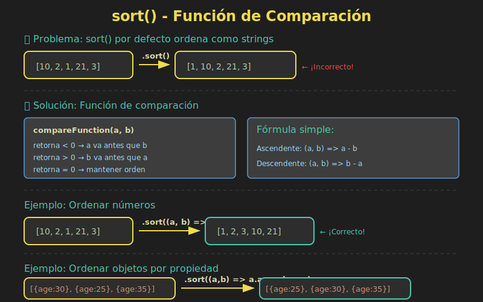

# 📚 Sort Personalizado

## 🎯 Objetivos

- Comprender cómo funciona `sort()` en JavaScript
- Implementar comparadores personalizados
- Ordenar por múltiples criterios
- Manejar ordenamiento de diferentes tipos de datos
- Crear funciones de ordenamiento reutilizables

---

## 📖 Introducción

El método `sort()` es fundamental para ordenar arrays, pero su comportamiento por defecto puede ser sorprendente. Dominar los **comparadores personalizados** es esencial para ordenar datos correctamente.

```javascript
// ⚠️ Comportamiento sorprendente
const numbers = [10, 2, 30, 1];

console.log(numbers.sort()); // [1, 10, 2, 30] ❌

// Por defecto, sort() convierte todo a strings y ordena lexicográficamente
// '1' < '10' < '2' < '30'
```

### 📊 Diagrama: Función de Comparación



---

## 1️⃣ Fundamentos de `sort()`

### El Comparador

```javascript
array.sort((a, b) => {
  // Retornar:
  // < 0  → a va antes que b
  // > 0  → b va antes que a
  // === 0 → mantener orden relativo
});
```

### Ordenamiento Numérico

```javascript
const numbers = [10, 2, 30, 1, 25, 5];

// Ascendente
const asc = [...numbers].sort((a, b) => a - b);

console.log(asc); // [1, 2, 5, 10, 25, 30]

// Descendente
const desc = [...numbers].sort((a, b) => b - a);

console.log(desc); // [30, 25, 10, 5, 2, 1]
```

### Ordenamiento Alfabético

```javascript
const names = ['María', 'ana', 'Carlos', 'luis'];

// Por defecto (case-sensitive)
console.log([...names].sort()); // ['Carlos', 'María', 'ana', 'luis']

// Case-insensitive
const sorted = [...names].sort((a, b) =>
  a.toLowerCase().localeCompare(b.toLowerCase())
);

console.log(sorted); // ['ana', 'Carlos', 'luis', 'María']

// Con locale específico
const spanishSort = [...names].sort((a, b) =>
  a.localeCompare(b, 'es', { sensitivity: 'base' })
);
```

### ⚠️ `sort()` Muta el Array Original

```javascript
const original = [3, 1, 2];
const sorted = original.sort((a, b) => a - b);

console.log(original); // [1, 2, 3] - ¡Mutado!
console.log(sorted);   // [1, 2, 3]
console.log(original === sorted); // true - ¡Misma referencia!

// ✅ Para evitar mutación, copiar primero
const safeSorted = [...original].sort((a, b) => a - b);
// o
const safeSorted2 = original.slice().sort((a, b) => a - b);
// o (ES2023)
const safeSorted3 = original.toSorted((a, b) => a - b);
```

---

## 2️⃣ Ordenar Objetos

### Por una Propiedad

```javascript
const users = [
  { name: 'Ana', age: 25 },
  { name: 'Luis', age: 30 },
  { name: 'María', age: 22 }
];

// Por edad (ascendente)
const byAge = [...users].sort((a, b) => a.age - b.age);

console.log(byAge);
// [
//   { name: 'María', age: 22 },
//   { name: 'Ana', age: 25 },
//   { name: 'Luis', age: 30 }
// ]

// Por nombre (alfabético)
const byName = [...users].sort((a, b) =>
  a.name.localeCompare(b.name)
);

console.log(byName);
// [
//   { name: 'Ana', age: 25 },
//   { name: 'Luis', age: 30 },
//   { name: 'María', age: 22 }
// ]
```

### Por Múltiples Criterios

```javascript
const products = [
  { name: 'Laptop', category: 'Electronics', price: 1000 },
  { name: 'Phone', category: 'Electronics', price: 500 },
  { name: 'Desk', category: 'Furniture', price: 300 },
  { name: 'Chair', category: 'Furniture', price: 200 },
  { name: 'Tablet', category: 'Electronics', price: 500 }
];

// Por categoría, luego por precio
const sorted = [...products].sort((a, b) => {
  // Primero por categoría
  const categoryCompare = a.category.localeCompare(b.category);
  if (categoryCompare !== 0) return categoryCompare;

  // Si misma categoría, por precio
  return a.price - b.price;
});

console.log(sorted);
// [
//   { name: 'Phone', category: 'Electronics', price: 500 },
//   { name: 'Tablet', category: 'Electronics', price: 500 },
//   { name: 'Laptop', category: 'Electronics', price: 1000 },
//   { name: 'Chair', category: 'Furniture', price: 200 },
//   { name: 'Desk', category: 'Furniture', price: 300 }
// ]
```

---

## 3️⃣ Funciones de Ordenamiento Reutilizables

### Comparador Genérico por Propiedad

```javascript
const sortBy = (key, order = 'asc') => (a, b) => {
  const aVal = a[key];
  const bVal = b[key];

  let comparison = 0;

  if (typeof aVal === 'string') {
    comparison = aVal.localeCompare(bVal);
  } else {
    comparison = aVal - bVal;
  }

  return order === 'desc' ? -comparison : comparison;
};

const users = [
  { name: 'Ana', age: 25, score: 85 },
  { name: 'Luis', age: 30, score: 92 },
  { name: 'María', age: 22, score: 78 }
];

// Uso
console.log([...users].sort(sortBy('age')));        // Por edad asc
console.log([...users].sort(sortBy('age', 'desc'))); // Por edad desc
console.log([...users].sort(sortBy('name')));       // Por nombre asc
```

### Comparador Multi-criterio

```javascript
const sortByMultiple = (...criteria) => (a, b) => {
  for (const criterion of criteria) {
    const { key, order = 'asc' } =
      typeof criterion === 'string'
        ? { key: criterion }
        : criterion;

    const aVal = a[key];
    const bVal = b[key];

    let comparison = 0;

    if (typeof aVal === 'string') {
      comparison = aVal.localeCompare(bVal);
    } else if (aVal instanceof Date) {
      comparison = aVal.getTime() - bVal.getTime();
    } else {
      comparison = aVal - bVal;
    }

    if (comparison !== 0) {
      return order === 'desc' ? -comparison : comparison;
    }
  }

  return 0;
};

const data = [
  { dept: 'IT', name: 'Ana', salary: 5000 },
  { dept: 'HR', name: 'Luis', salary: 4000 },
  { dept: 'IT', name: 'Carlos', salary: 5000 },
  { dept: 'HR', name: 'María', salary: 4500 }
];

// Por departamento, luego por salario descendente
const sorted = [...data].sort(sortByMultiple(
  'dept',
  { key: 'salary', order: 'desc' }
));

console.log(sorted);
// [
//   { dept: 'HR', name: 'María', salary: 4500 },
//   { dept: 'HR', name: 'Luis', salary: 4000 },
//   { dept: 'IT', name: 'Ana', salary: 5000 },
//   { dept: 'IT', name: 'Carlos', salary: 5000 }
// ]
```

---

## 4️⃣ Ordenamiento de Tipos Especiales

### Fechas

```javascript
const events = [
  { name: 'Event A', date: new Date('2024-03-15') },
  { name: 'Event B', date: new Date('2024-01-20') },
  { name: 'Event C', date: new Date('2024-06-10') }
];

// Por fecha (más reciente primero)
const byDate = [...events].sort((a, b) => b.date - a.date);

console.log(byDate);
// [Event C, Event A, Event B]

// Por fecha (más antigua primero)
const byDateAsc = [...events].sort((a, b) => a.date - b.date);
```

### Strings con Números

```javascript
const files = ['file10.txt', 'file2.txt', 'file1.txt', 'file20.txt'];

// Ordenamiento lexicográfico (incorrecto para este caso)
console.log([...files].sort());
// ['file1.txt', 'file10.txt', 'file2.txt', 'file20.txt']

// Ordenamiento natural
const naturalSort = [...files].sort((a, b) =>
  a.localeCompare(b, undefined, { numeric: true })
);

console.log(naturalSort);
// ['file1.txt', 'file2.txt', 'file10.txt', 'file20.txt']
```

### Booleanos

```javascript
const tasks = [
  { name: 'Task 1', completed: false },
  { name: 'Task 2', completed: true },
  { name: 'Task 3', completed: false },
  { name: 'Task 4', completed: true }
];

// Pendientes primero
const pendingFirst = [...tasks].sort((a, b) =>
  a.completed - b.completed
);

// Completadas primero
const completedFirst = [...tasks].sort((a, b) =>
  b.completed - a.completed
);
```

### Valores Null/Undefined

```javascript
const data = [
  { name: 'Ana', score: 85 },
  { name: 'Luis', score: null },
  { name: 'María', score: 92 },
  { name: 'Carlos', score: undefined }
];

// Nulls al final
const nullsLast = [...data].sort((a, b) => {
  if (a.score == null) return 1;
  if (b.score == null) return -1;
  return a.score - b.score;
});

console.log(nullsLast);
// [Ana(85), María(92), Luis(null), Carlos(undefined)]

// Nulls al principio
const nullsFirst = [...data].sort((a, b) => {
  if (a.score == null) return -1;
  if (b.score == null) return 1;
  return a.score - b.score;
});
```

---

## 5️⃣ Ordenamiento Personalizado con Prioridades

### Orden Predefinido

```javascript
const statuses = ['pending', 'in-progress', 'review', 'completed', 'cancelled'];

const tasks = [
  { name: 'Task 1', status: 'completed' },
  { name: 'Task 2', status: 'pending' },
  { name: 'Task 3', status: 'in-progress' },
  { name: 'Task 4', status: 'review' }
];

// Ordenar por status según orden predefinido
const byStatus = [...tasks].sort((a, b) =>
  statuses.indexOf(a.status) - statuses.indexOf(b.status)
);

console.log(byStatus);
// [pending, in-progress, review, completed]
```

### Prioridades con Pesos

```javascript
const priorityWeight = {
  critical: 1,
  high: 2,
  medium: 3,
  low: 4
};

const issues = [
  { title: 'Bug A', priority: 'low' },
  { title: 'Bug B', priority: 'critical' },
  { title: 'Bug C', priority: 'high' },
  { title: 'Bug D', priority: 'medium' }
];

const byPriority = [...issues].sort((a, b) =>
  priorityWeight[a.priority] - priorityWeight[b.priority]
);

console.log(byPriority);
// [critical, high, medium, low]
```

### Elementos "Pinned" Primero

```javascript
const items = [
  { name: 'Item 1', pinned: false },
  { name: 'Item 2', pinned: true },
  { name: 'Item 3', pinned: false },
  { name: 'Item 4', pinned: true }
];

// Pinned primero, luego por nombre
const sorted = [...items].sort((a, b) => {
  // Primero los pinned
  if (a.pinned !== b.pinned) {
    return a.pinned ? -1 : 1;
  }
  // Luego por nombre
  return a.name.localeCompare(b.name);
});

console.log(sorted);
// [Item 2 (pinned), Item 4 (pinned), Item 1, Item 3]
```

---

## 6️⃣ `toSorted()` - ES2023

### Ordenamiento Sin Mutación

```javascript
const numbers = [3, 1, 4, 1, 5, 9, 2, 6];

// toSorted() no muta el original
const sorted = numbers.toSorted((a, b) => a - b);

console.log(numbers); // [3, 1, 4, 1, 5, 9, 2, 6] - Sin cambios
console.log(sorted);  // [1, 1, 2, 3, 4, 5, 6, 9] - Nuevo array

// Antes de ES2023, había que hacer:
const sortedOld = [...numbers].sort((a, b) => a - b);
```

### Otros Métodos No Mutantes (ES2023)

```javascript
const arr = [1, 2, 3, 4, 5];

// toReversed() - reverse sin mutar
const reversed = arr.toReversed();
console.log(arr);      // [1, 2, 3, 4, 5]
console.log(reversed); // [5, 4, 3, 2, 1]

// toSpliced() - splice sin mutar
const spliced = arr.toSpliced(2, 1, 'a', 'b');
console.log(arr);     // [1, 2, 3, 4, 5]
console.log(spliced); // [1, 2, 'a', 'b', 4, 5]

// with() - cambiar elemento sin mutar
const changed = arr.with(2, 100);
console.log(arr);     // [1, 2, 3, 4, 5]
console.log(changed); // [1, 2, 100, 4, 5]
```

---

## 7️⃣ Estabilidad del Ordenamiento

### ¿Qué es Sort Estable?

Un ordenamiento es **estable** si elementos con el mismo valor mantienen su orden relativo original.

```javascript
const items = [
  { name: 'A', group: 1 },
  { name: 'B', group: 2 },
  { name: 'C', group: 1 },
  { name: 'D', group: 2 }
];

// Ordenar por grupo
// Estable: A y C mantienen orden (A antes de C)
// No estable: A y C podrían invertirse

const sorted = [...items].sort((a, b) => a.group - b.group);

// En navegadores modernos, sort() es estable
console.log(sorted);
// [
//   { name: 'A', group: 1 }, // A antes de C ✓
//   { name: 'C', group: 1 },
//   { name: 'B', group: 2 }, // B antes de D ✓
//   { name: 'D', group: 2 }
// ]
```

> **Nota**: Desde ECMAScript 2019, `sort()` está garantizado como estable.

---

## 📋 Diagrama Visual


---

## ⚠️ Errores Comunes

### ❌ Olvidar que sort() muta

```javascript
const original = [3, 1, 2];
original.sort((a, b) => a - b); // ¡Muta original!

// ✅ Copiar primero
const sorted = [...original].sort((a, b) => a - b);
```

### ❌ Comparador incorrecto para números

```javascript
// ❌ MAL
[10, 2, 1].sort(); // [1, 10, 2]

// ✅ BIEN
[10, 2, 1].sort((a, b) => a - b); // [1, 2, 10]
```

### ❌ No manejar undefined/null

```javascript
const data = [3, null, 1, undefined, 2];

// ❌ Puede dar resultados inesperados
data.sort((a, b) => a - b);

// ✅ Manejar explícitamente
data.sort((a, b) => {
  if (a == null) return 1;
  if (b == null) return -1;
  return a - b;
});
```

---

## ✅ Checklist de Verificación

Antes de continuar, asegúrate de poder:

- [ ] Explicar por qué `sort()` ordena mal los números por defecto
- [ ] Escribir comparadores para números y strings
- [ ] Ordenar objetos por una propiedad
- [ ] Ordenar por múltiples criterios
- [ ] Manejar fechas, booleanos y valores null
- [ ] Crear comparadores reutilizables
- [ ] Usar ordenamiento con prioridades personalizadas
- [ ] Aplicar `toSorted()` (ES2023) para ordenamiento inmutable

---

## 🔗 Recursos Adicionales

- 📖 [MDN - Array.prototype.sort()](https://developer.mozilla.org/es/docs/Web/JavaScript/Reference/Global_Objects/Array/sort)
- 📖 [MDN - String.prototype.localeCompare()](https://developer.mozilla.org/es/docs/Web/JavaScript/Reference/Global_Objects/String/localeCompare)
- 📖 [MDN - Array.prototype.toSorted()](https://developer.mozilla.org/es/docs/Web/JavaScript/Reference/Global_Objects/Array/toSorted)

---

## 🧭 Navegación

| ⬅️ Anterior | 🏠 Índice | ➡️ Siguiente |
|-------------|-----------|--------------|
| [Transformaciones de Datos](04-transformaciones-datos.md) | [Teoría](.) | [Prácticas](../2-practicas/) |
