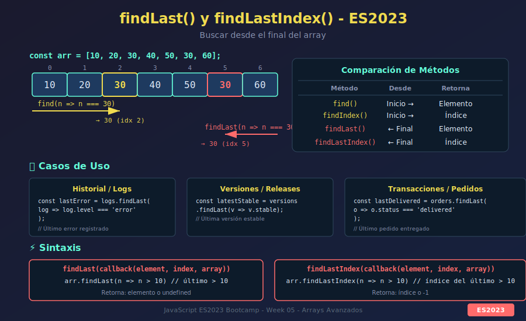

# 📘 findLast() y findLastIndex() - ES2023

## 🎯 Objetivos

- Comprender la necesidad de buscar desde el final del array
- Dominar `findLast()` para obtener el último elemento que cumple una condición
- Usar `findLastIndex()` para obtener el índice del último elemento coincidente
- Comparar con `find()` y `findIndex()` tradicionales
- Aplicar estos métodos en casos de uso reales

---

## 🖼️ Diagrama



---

## 📋 Contenido

### 1. El Problema: Buscar desde el Final

Antes de ES2023, buscar el **último elemento** que cumple una condición era tedioso:

```javascript
const transactions = [
  { id: 1, type: 'deposit', amount: 100 },
  { id: 2, type: 'withdrawal', amount: 50 },
  { id: 3, type: 'deposit', amount: 200 },
  { id: 4, type: 'withdrawal', amount: 75 },
  { id: 5, type: 'deposit', amount: 150 }
];

// ❌ Antes de ES2023 - encontrar el último depósito
// Opción 1: reverse + find (muta si no copias)
const lastDepositOld1 = [...transactions].reverse().find(t => t.type === 'deposit');

// Opción 2: reduceRight (verboso)
const lastDepositOld2 = transactions.reduceRight((found, t) => {
  return found ?? (t.type === 'deposit' ? t : null);
}, null);

// Opción 3: loop manual desde el final
let lastDepositOld3 = null;
for (let i = transactions.length - 1; i >= 0; i--) {
  if (transactions[i].type === 'deposit') {
    lastDepositOld3 = transactions[i];
    break;
  }
}

// ✅ ES2023 - Simple y expresivo
const lastDeposit = transactions.findLast(t => t.type === 'deposit');
// { id: 5, type: 'deposit', amount: 150 }
```

---

### 2. `findLast()` - Sintaxis y Comportamiento

`findLast()` retorna el **último elemento** que cumple la condición del callback.

#### Sintaxis

```javascript
array.findLast(callback(element, index, array), thisArg)
```

**Parámetros:**
- `callback`: Función que se ejecuta para cada elemento (desde el final)
  - `element`: El elemento actual
  - `index`: El índice actual
  - `array`: El array original
- `thisArg` (opcional): Valor a usar como `this` en el callback

**Retorna:** El último elemento que cumple la condición, o `undefined` si ninguno cumple.

#### Ejemplos Básicos

```javascript
const numbers = [1, 2, 3, 4, 5, 6, 7, 8, 9, 10];

// Último número par
const lastEven = numbers.findLast(n => n % 2 === 0);
console.log(lastEven); // 10

// Último número mayor que 5
const lastGreaterThan5 = numbers.findLast(n => n > 5);
console.log(lastGreaterThan5); // 10

// Último número menor que 5
const lastLessThan5 = numbers.findLast(n => n < 5);
console.log(lastLessThan5); // 4

// Sin coincidencias
const notFound = numbers.findLast(n => n > 100);
console.log(notFound); // undefined
```

#### Diferencia con `find()`

```javascript
const scores = [65, 72, 88, 45, 91, 78, 55];

// find() - Primer elemento que cumple
const firstPassing = scores.find(score => score >= 70);
console.log(firstPassing); // 72 (primer aprobado)

// findLast() - Último elemento que cumple
const lastPassing = scores.findLast(score => score >= 70);
console.log(lastPassing); // 78 (último aprobado)
```

---

### 3. `findLastIndex()` - Encontrar la Posición

`findLastIndex()` retorna el **índice del último elemento** que cumple la condición.

#### Sintaxis

```javascript
array.findLastIndex(callback(element, index, array), thisArg)
```

**Retorna:** El índice del último elemento que cumple la condición, o `-1` si ninguno cumple.

#### Ejemplos Básicos

```javascript
const numbers = [5, 12, 8, 130, 44, 8, 22];

// Índice del último 8
const lastIndexOf8 = numbers.findLastIndex(n => n === 8);
console.log(lastIndexOf8); // 5

// Índice del último número > 10
const lastIndexGreater10 = numbers.findLastIndex(n => n > 10);
console.log(lastIndexGreater10); // 6 (22 está en índice 6)

// Sin coincidencias
const notFoundIndex = numbers.findLastIndex(n => n > 200);
console.log(notFoundIndex); // -1
```

#### Diferencia con `findIndex()`

```javascript
const users = [
  { name: 'Alice', role: 'admin' },
  { name: 'Bob', role: 'user' },
  { name: 'Carol', role: 'admin' },
  { name: 'David', role: 'user' },
  { name: 'Eve', role: 'admin' }
];

// findIndex() - Índice del primer admin
const firstAdminIndex = users.findIndex(u => u.role === 'admin');
console.log(firstAdminIndex); // 0 (Alice)

// findLastIndex() - Índice del último admin
const lastAdminIndex = users.findLastIndex(u => u.role === 'admin');
console.log(lastAdminIndex); // 4 (Eve)
```

---

### 4. Comparación con Métodos Tradicionales

| Método | Busca desde | Retorna | Si no encuentra |
|--------|-------------|---------|-----------------|
| `find()` | Inicio | Elemento | `undefined` |
| `findIndex()` | Inicio | Índice | `-1` |
| `findLast()` | Final | Elemento | `undefined` |
| `findLastIndex()` | Final | Índice | `-1` |
| `indexOf()` | Inicio | Índice | `-1` |
| `lastIndexOf()` | Final | Índice | `-1` |

#### `lastIndexOf()` vs `findLastIndex()`

```javascript
const items = [
  { id: 1, name: 'A' },
  { id: 2, name: 'B' },
  { id: 1, name: 'C' }
];

// lastIndexOf() - Solo para valores primitivos y comparación estricta
const numbers = [1, 2, 3, 1, 2, 3];
console.log(numbers.lastIndexOf(2)); // 4

// ❌ No funciona con objetos (compara referencia)
console.log(items.lastIndexOf({ id: 1, name: 'A' })); // -1

// ✅ findLastIndex() - Funciona con cualquier condición
console.log(items.findLastIndex(item => item.id === 1)); // 2
```

---

### 5. Casos de Uso Prácticos

#### 5.1. Historial de Actividad

```javascript
const activityLog = [
  { action: 'login', timestamp: '2024-01-15T08:00:00' },
  { action: 'view_page', timestamp: '2024-01-15T08:05:00' },
  { action: 'edit', timestamp: '2024-01-15T08:10:00' },
  { action: 'save', timestamp: '2024-01-15T08:15:00' },
  { action: 'view_page', timestamp: '2024-01-15T08:20:00' },
  { action: 'logout', timestamp: '2024-01-15T08:30:00' }
];

// Última edición realizada
const lastEdit = activityLog.findLast(log => log.action === 'edit');
console.log(lastEdit);
// { action: 'edit', timestamp: '2024-01-15T08:10:00' }

// Última vez que vio una página
const lastPageView = activityLog.findLast(log => log.action === 'view_page');
console.log(lastPageView);
// { action: 'view_page', timestamp: '2024-01-15T08:20:00' }
```

#### 5.2. Validación de Formulario

```javascript
const validationErrors = [
  { field: 'email', message: 'Invalid email format', severity: 'error' },
  { field: 'name', message: 'Name is required', severity: 'error' },
  { field: 'age', message: 'Should be 18+', severity: 'warning' },
  { field: 'email', message: 'Email already exists', severity: 'error' }
];

// Último error del campo email
const lastEmailError = validationErrors.findLast(
  err => err.field === 'email' && err.severity === 'error'
);
console.log(lastEmailError);
// { field: 'email', message: 'Email already exists', severity: 'error' }
```

#### 5.3. Sistema de Versiones

```javascript
const versions = [
  { version: '1.0.0', stable: true, date: '2023-01-01' },
  { version: '1.1.0', stable: true, date: '2023-03-15' },
  { version: '1.2.0-beta', stable: false, date: '2023-05-01' },
  { version: '2.0.0', stable: true, date: '2023-06-01' },
  { version: '2.1.0-alpha', stable: false, date: '2023-07-15' }
];

// Última versión estable
const latestStable = versions.findLast(v => v.stable);
console.log(latestStable);
// { version: '2.0.0', stable: true, date: '2023-06-01' }

// Índice de la última beta/alpha
const lastPreReleaseIndex = versions.findLastIndex(v => !v.stable);
console.log(lastPreReleaseIndex); // 4
```

#### 5.4. Procesamiento de Pedidos

```javascript
const orders = [
  { id: 1, status: 'delivered', customer: 'Alice' },
  { id: 2, status: 'pending', customer: 'Bob' },
  { id: 3, status: 'shipped', customer: 'Alice' },
  { id: 4, status: 'delivered', customer: 'Alice' },
  { id: 5, status: 'pending', customer: 'Carol' }
];

// Último pedido entregado de Alice
const aliceLastDelivered = orders.findLast(
  order => order.customer === 'Alice' && order.status === 'delivered'
);
console.log(aliceLastDelivered);
// { id: 4, status: 'delivered', customer: 'Alice' }

// Posición del último pedido pendiente
const lastPendingIndex = orders.findLastIndex(order => order.status === 'pending');
console.log(lastPendingIndex); // 4
```

---

### 6. Usando el Índice en el Callback

Tanto `findLast()` como `findLastIndex()` pasan el índice como segundo argumento:

```javascript
const data = [10, 20, 30, 40, 50];

// Encontrar el último elemento en posición par
const lastAtEvenIndex = data.findLast((value, index) => index % 2 === 0);
console.log(lastAtEvenIndex); // 50 (índice 4)

// Encontrar índice del último elemento mayor que su índice
const lastIndex = data.findLastIndex((value, index) => value > index * 10);
console.log(lastIndex); // 4 (50 > 40)
```

---

### 7. Con Arrays de Diferentes Tipos

#### Strings

```javascript
const words = ['apple', 'banana', 'apricot', 'blueberry', 'avocado'];

// Última palabra que empieza con 'a'
const lastAWord = words.findLast(word => word.startsWith('a'));
console.log(lastAWord); // 'avocado'

// Índice de la última palabra con más de 6 letras
const lastLongWordIndex = words.findLastIndex(word => word.length > 6);
console.log(lastLongWordIndex); // 3 ('blueberry')
```

#### Mixtos (con verificación de tipo)

```javascript
const mixed = [1, 'hello', 2, { name: 'obj' }, 3, 'world', 4];

// Último string
const lastString = mixed.findLast(item => typeof item === 'string');
console.log(lastString); // 'world'

// Último número
const lastNumber = mixed.findLast(item => typeof item === 'number');
console.log(lastNumber); // 4

// Último objeto
const lastObject = mixed.findLast(item => typeof item === 'object' && item !== null);
console.log(lastObject); // { name: 'obj' }
```

---

### 8. Patrones Avanzados

#### 8.1. Combinando con Otros Métodos

```javascript
const products = [
  { name: 'Laptop', category: 'electronics', price: 999, inStock: true },
  { name: 'Phone', category: 'electronics', price: 699, inStock: false },
  { name: 'Tablet', category: 'electronics', price: 499, inStock: true },
  { name: 'Headphones', category: 'electronics', price: 199, inStock: true }
];

// Filtrar y luego encontrar el último
const lastExpensiveInStock = products
  .filter(p => p.inStock)
  .findLast(p => p.price > 400);
console.log(lastExpensiveInStock);
// { name: 'Tablet', category: 'electronics', price: 499, inStock: true }

// Obtener solo el nombre del último en stock
const lastName = products
  .filter(p => p.inStock)
  .findLast(() => true)?.name;
console.log(lastName); // 'Headphones'
```

#### 8.2. Eliminar Último que Cumple Condición

```javascript
const tasks = ['task1', 'task2', 'urgent-task', 'task3', 'urgent-task2'];

// Eliminar la última tarea urgente
const lastUrgentIndex = tasks.findLastIndex(t => t.includes('urgent'));
if (lastUrgentIndex !== -1) {
  // Usando toSpliced() (ES2023) para no mutar
  const newTasks = tasks.toSpliced(lastUrgentIndex, 1);
  console.log(newTasks);
  // ['task1', 'task2', 'urgent-task', 'task3']
}
```

#### 8.3. Actualizar Último que Cumple Condición

```javascript
const notifications = [
  { id: 1, read: true, message: 'Welcome!' },
  { id: 2, read: false, message: 'New message' },
  { id: 3, read: false, message: 'Reminder' }
];

// Marcar como leída la última no leída usando with() (ES2023)
const lastUnreadIndex = notifications.findLastIndex(n => !n.read);
if (lastUnreadIndex !== -1) {
  const updated = notifications.with(lastUnreadIndex, {
    ...notifications[lastUnreadIndex],
    read: true
  });
  console.log(updated);
  // [..., { id: 3, read: true, message: 'Reminder' }]
}
```

---

### 9. Rendimiento y Consideraciones

```javascript
// findLast() es más eficiente que reverse + find para arrays grandes

const bigArray = Array.from({ length: 1_000_000 }, (_, i) => i);

// ❌ Ineficiente - crea copia y la invierte
console.time('reverse + find');
[...bigArray].reverse().find(n => n === 999_990);
console.timeEnd('reverse + find');

// ✅ Eficiente - itera directamente desde el final
console.time('findLast');
bigArray.findLast(n => n === 999_990);
console.timeEnd('findLast');

// findLast es significativamente más rápido porque:
// 1. No crea copia del array
// 2. No invierte nada
// 3. Se detiene al encontrar el primer match (desde el final)
```

---

### 10. Soporte y Polyfill

#### Verificar Soporte

```javascript
if (Array.prototype.findLast) {
  console.log('findLast is supported!');
} else {
  console.log('Need polyfill');
}
```

#### Polyfill Simple

```javascript
// Solo para educación - en producción usar core-js
if (!Array.prototype.findLast) {
  Array.prototype.findLast = function(callback, thisArg) {
    for (let i = this.length - 1; i >= 0; i--) {
      if (callback.call(thisArg, this[i], i, this)) {
        return this[i];
      }
    }
    return undefined;
  };
}

if (!Array.prototype.findLastIndex) {
  Array.prototype.findLastIndex = function(callback, thisArg) {
    for (let i = this.length - 1; i >= 0; i--) {
      if (callback.call(thisArg, this[i], i, this)) {
        return i;
      }
    }
    return -1;
  };
}
```

---

## 📊 Resumen

| Método | Desde | Retorna | Caso de Uso |
|--------|-------|---------|-------------|
| `findLast(cb)` | Final | Elemento o `undefined` | Último elemento que cumple |
| `findLastIndex(cb)` | Final | Índice o `-1` | Posición del último que cumple |

```javascript
const arr = [1, 2, 3, 4, 5];

// Resumen en una línea
arr.find(n => n > 2);          // 3 (primero > 2)
arr.findLast(n => n > 2);      // 5 (último > 2)
arr.findIndex(n => n > 2);     // 2 (índice del primero > 2)
arr.findLastIndex(n => n > 2); // 4 (índice del último > 2)
```

---

## ✅ Checklist de Verificación

- [ ] Entender la diferencia entre `find()` y `findLast()`
- [ ] Saber cuándo usar `findLastIndex()` vs `lastIndexOf()`
- [ ] Aplicar estos métodos en escenarios con historial/logs
- [ ] Combinar con otros métodos ES2023 (`with()`, `toSpliced()`)
- [ ] Conocer las ventajas de rendimiento sobre alternativas antiguas

---

## 🔗 Recursos Adicionales

- 📖 [MDN - Array.prototype.findLast()](https://developer.mozilla.org/en-US/docs/Web/JavaScript/Reference/Global_Objects/Array/findLast)
- 📖 [MDN - Array.prototype.findLastIndex()](https://developer.mozilla.org/en-US/docs/Web/JavaScript/Reference/Global_Objects/Array/findLastIndex)
- 📖 [TC39 Proposal - findLast](https://github.com/tc39/proposal-array-find-from-last)
- 📖 [JavaScript.info - Arrays](https://javascript.info/array-methods)

---

**Última actualización**: Enero 2025
