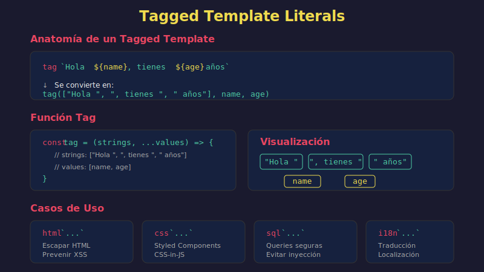

# 🏷️ Template Literals Avanzados



## 🎯 Objetivos

- Entender el mecanismo de tagged templates
- Crear funciones tag personalizadas
- Aplicar tagged templates para casos prácticos
- Conocer tags útiles de la comunidad

## 📋 Contenido

### 1. Repaso de Template Literals

```javascript
// Template literal básico
const name = 'Ana';
const greeting = `Hola, ${name}!`;

// Expresiones
const price = 100;
const total = `Total: $${price * 1.21}`;

// Multilínea
const html = `
  <div>
    <h1>${name}</h1>
  </div>
`;
```

### 2. ¿Qué son los Tagged Templates?

Un **tagged template** es una función que procesa un template literal antes de producir el string final.

```javascript
// Sintaxis
tagFunction`template literal con ${expresiones}`;

// La función recibe:
// 1. Array de strings literales
// 2. Las expresiones interpoladas como argumentos adicionales
```

### 3. Anatomía de una Función Tag

```javascript
const myTag = (strings, ...values) => {
  console.log('Strings:', strings);
  console.log('Values:', values);

  // strings: Array de partes estáticas
  // values: Array de valores interpolados

  return 'resultado procesado';
};

const name = 'Ana';
const age = 25;

myTag`Nombre: ${name}, Edad: ${age}`;
// Strings: ['Nombre: ', ', Edad: ', '']
// Values: ['Ana', 25]
```

### 4. Reconstruir el String

```javascript
// Tag que simplemente reconstruye el string original
const identity = (strings, ...values) => {
  return strings.reduce((result, str, i) => {
    return result + str + (values[i] ?? '');
  }, '');
};

const x = 10;
const y = 20;
console.log(identity`${x} + ${y} = ${x + y}`);
// '10 + 20 = 30'
```

### 5. Ejemplos Prácticos

#### 5.1 Highlight - Resaltar Valores

```javascript
const highlight = (strings, ...values) => {
  return strings.reduce((result, str, i) => {
    const value = values[i] !== undefined ? `**${values[i]}**` : '';
    return result + str + value;
  }, '');
};

const product = 'Laptop';
const price = 999;
console.log(highlight`El ${product} cuesta $${price}`);
// 'El **Laptop** cuesta $**999**'
```

#### 5.2 Currency - Formatear Moneda

```javascript
const currency = (strings, ...values) => {
  return strings.reduce((result, str, i) => {
    let value = values[i];
    if (typeof value === 'number') {
      value = value.toLocaleString('es-ES', {
        style: 'currency',
        currency: 'EUR'
      });
    }
    return result + str + (value ?? '');
  }, '');
};

const price = 1234.5;
const tax = 259.245;
console.log(currency`Precio: ${price}, IVA: ${tax}`);
// 'Precio: 1.234,50 €, IVA: 259,25 €'
```

#### 5.3 HTML Escape - Prevenir XSS

```javascript
const escapeHtml = str => {
  const escapes = {
    '&': '&amp;',
    '<': '&lt;',
    '>': '&gt;',
    '"': '&quot;',
    "'": '&#39;'
  };
  return String(str).replace(/[&<>"']/g, char => escapes[char]);
};

const safeHtml = (strings, ...values) => {
  return strings.reduce((result, str, i) => {
    const value = values[i] !== undefined ? escapeHtml(values[i]) : '';
    return result + str + value;
  }, '');
};

const userInput = '<script>alert("XSS")</script>';
console.log(safeHtml`<div>${userInput}</div>`);
// '<div>&lt;script&gt;alert(&quot;XSS&quot;)&lt;/script&gt;</div>'
```

#### 5.4 SQL - Preparar Queries (Simulado)

```javascript
const sql = (strings, ...values) => {
  const query = strings.reduce((result, str, i) => {
    return result + str + (values[i] !== undefined ? `$${i + 1}` : '');
  }, '');

  return {
    text: query,
    values: values
  };
};

const id = 42;
const name = "O'Reilly"; // Nombre con apóstrofe

const query = sql`SELECT * FROM users WHERE id = ${id} AND name = ${name}`;
console.log(query);
// {
//   text: "SELECT * FROM users WHERE id = $1 AND name = $2",
//   values: [42, "O'Reilly"]
// }
```

#### 5.5 Debug - Logging con Contexto

```javascript
const debug = (strings, ...values) => {
  const timestamp = new Date().toISOString();
  const message = strings.reduce((result, str, i) => {
    const value = values[i];
    const formatted = typeof value === 'object'
      ? JSON.stringify(value, null, 2)
      : value;
    return result + str + (formatted ?? '');
  }, '');

  console.log(`[${timestamp}] ${message}`);
  return message;
};

const user = { name: 'Ana', role: 'admin' };
debug`Usuario conectado: ${user}`;
// [2024-01-15T10:30:00.000Z] Usuario conectado: {
//   "name": "Ana",
//   "role": "admin"
// }
```

### 6. Raw Strings

La propiedad `strings.raw` contiene las cadenas sin procesar escapes.

```javascript
const showRaw = (strings, ...values) => {
  console.log('Processed:', strings[0]);
  console.log('Raw:', strings.raw[0]);
};

showRaw`Line1\nLine2`;
// Processed: 'Line1
// Line2'
// Raw: 'Line1\\nLine2'

// String.raw - tag incorporado
console.log(String.raw`C:\Users\name`);  // 'C:\\Users\\name' (no interpreta \)
console.log(`C:\Users\name`);            // 'C:Usersame' (interpreta \U y \n)
```

### 7. Casos de Uso Avanzados

#### 7.1 i18n - Internacionalización

```javascript
const translations = {
  es: {
    greeting: name => `¡Hola, ${name}!`,
    items: count => `${count} ${count === 1 ? 'artículo' : 'artículos'}`
  },
  en: {
    greeting: name => `Hello, ${name}!`,
    items: count => `${count} ${count === 1 ? 'item' : 'items'}`
  }
};

const createI18n = lang => {
  return (strings, ...keys) => {
    return strings.reduce((result, str, i) => {
      const key = keys[i];
      if (key && translations[lang][key.name]) {
        return result + str + translations[lang][key.name](key.value);
      }
      return result + str + (key?.value ?? key ?? '');
    }, '');
  };
};

const t = createI18n('es');
const name = 'Carlos';
const count = 3;

console.log(t`${{ name: 'greeting', value: name }}`);
// '¡Hola, Carlos!'
```

#### 7.2 CSS-in-JS (Estilo Styled Components)

```javascript
const styled = (strings, ...values) => {
  const css = strings.reduce((result, str, i) => {
    return result + str + (values[i] ?? '');
  }, '');

  return element => {
    const style = document.createElement('style');
    const className = `styled-${Math.random().toString(36).slice(2, 8)}`;
    style.textContent = `.${className} { ${css} }`;
    document.head.appendChild(style);
    element.classList.add(className);
    return element;
  };
};

// Uso (en navegador)
// const makeRed = styled`
//   color: red;
//   font-weight: bold;
// `;
// makeRed(document.querySelector('h1'));
```

### 8. Patrón Común: Crear Tags Reutilizables

```javascript
// Factory de tags
const createTag = transformer => {
  return (strings, ...values) => {
    return strings.reduce((result, str, i) => {
      const value = values[i] !== undefined
        ? transformer(values[i])
        : '';
      return result + str + value;
    }, '');
  };
};

// Tags específicos
const upper = createTag(v => String(v).toUpperCase());
const lower = createTag(v => String(v).toLowerCase());
const json = createTag(v => JSON.stringify(v));

const name = 'Ana García';
console.log(upper`Nombre: ${name}`);  // 'Nombre: ANA GARCÍA'
console.log(lower`Nombre: ${name}`);  // 'Nombre: ana garcía'

const data = { x: 1, y: 2 };
console.log(json`Data: ${data}`);     // 'Data: {"x":1,"y":2}'
```

## 💡 Cuándo Usar Tagged Templates

| Caso de Uso | Beneficio |
|-------------|-----------|
| Sanitización HTML | Prevenir XSS automáticamente |
| SQL queries | Evitar SQL injection |
| Internacionalización | Traducciones dinámicas |
| Logging/Debug | Formato consistente |
| CSS-in-JS | Estilos dinámicos |
| DSLs | Crear mini-lenguajes |

## ⚠️ Consideraciones

```javascript
// Los tagged templates NO son strings normales
const tag = (s, ...v) => ({ strings: s, values: v });

const result = tag`test ${1}`;
console.log(typeof result);  // 'object', no 'string'

// Asegúrate de retornar string si eso es lo esperado
```

## ✅ Checklist de Verificación

- [ ] Entiendo qué recibe una función tag (strings y values)
- [ ] Puedo reconstruir el string original
- [ ] Sé crear un tag que transforme valores
- [ ] Conozco el uso de `String.raw`
- [ ] Puedo aplicar tags para sanitización

## 🔗 Recursos

- [MDN - Tagged templates](https://developer.mozilla.org/es/docs/Web/JavaScript/Reference/Template_literals#plantillas_etiquetadas)

---

[← Anterior: Métodos de Strings](01-string-methods.md) | [Siguiente: Fundamentos de RegExp →](03-regexp-fundamentos.md)
