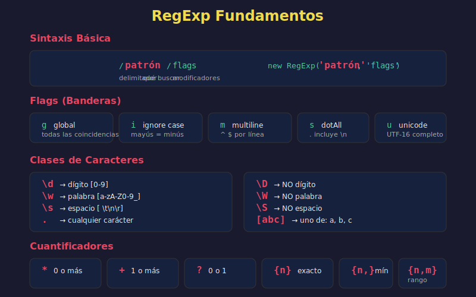

# 🔍 Fundamentos de Expresiones Regulares



## 🎯 Objetivos

- Entender qué son las expresiones regulares
- Aprender la sintaxis básica de RegExp
- Conocer los métodos principales
- Dominar caracteres especiales y cuantificadores

## 📋 Contenido

### 1. ¿Qué son las Expresiones Regulares?

Las **expresiones regulares** (RegExp) son patrones que describen conjuntos de strings. Permiten buscar, validar y manipular texto de forma potente.

```javascript
// Dos formas de crear RegExp
const regex1 = /patrón/flags;           // Literal (preferida)
const regex2 = new RegExp('patrón', 'flags'); // Constructor

// Ejemplo básico
const pattern = /hello/;
console.log(pattern.test('hello world')); // true
console.log(pattern.test('HELLO world')); // false
```

### 2. Métodos Principales

#### `test()` - Verificar si hay match

```javascript
const pattern = /javascript/i;  // 'i' = case insensitive

console.log(pattern.test('JavaScript'));  // true
console.log(pattern.test('JAVASCRIPT'));  // true
console.log(pattern.test('Python'));      // false
```

#### `match()` - Encontrar coincidencias

```javascript
const text = 'Los números 123 y 456 están aquí';

// Sin flag 'g': retorna primer match con detalles
const result1 = text.match(/\d+/);
console.log(result1);
// ['123', index: 12, input: '...', groups: undefined]

// Con flag 'g': retorna todos los matches
const result2 = text.match(/\d+/g);
console.log(result2);  // ['123', '456']
```

#### `exec()` - Búsqueda iterativa

```javascript
const regex = /\d+/g;
const text = 'a1 b2 c3';

let match;
while ((match = regex.exec(text)) !== null) {
  console.log(`Found ${match[0]} at index ${match.index}`);
}
// Found 1 at index 1
// Found 2 at index 4
// Found 3 at index 7
```

#### `replace()` - Reemplazar

```javascript
const text = 'Hello World';

console.log(text.replace(/world/i, 'JavaScript'));
// 'Hello JavaScript'

// Con función de reemplazo
console.log(text.replace(/\w+/g, word => word.toUpperCase()));
// 'HELLO WORLD'
```

#### `search()` - Encontrar índice

```javascript
const text = 'Hello 123 World';

console.log(text.search(/\d+/));  // 6 (índice donde empieza '123')
console.log(text.search(/xyz/));  // -1 (no encontrado)
```

#### `split()` - Dividir con patrón

```javascript
const text = 'one1two2three3four';

console.log(text.split(/\d/));
// ['one', 'two', 'three', 'four']

const csv = 'a, b,  c,   d';
console.log(csv.split(/,\s*/));
// ['a', 'b', 'c', 'd']
```

### 3. Flags (Banderas)

| Flag | Nombre | Descripción |
|------|--------|-------------|
| `i` | ignoreCase | No distingue mayúsculas/minúsculas |
| `g` | global | Busca todas las coincidencias |
| `m` | multiline | `^` y `$` funcionan por línea |
| `s` | dotAll | `.` coincide con saltos de línea |
| `u` | unicode | Habilita soporte Unicode completo |
| `y` | sticky | Busca solo desde lastIndex |
| `d` | hasIndices | Genera índices de grupos (ES2022) |

```javascript
// Combinar flags
const regex = /pattern/gi;  // global + ignoreCase

// Ejemplo de cada flag
console.log(/hello/i.test('HELLO'));     // true

console.log('a1b2c3'.match(/\d/g));      // ['1', '2', '3']

const multiline = `line1
line2`;
console.log(multiline.match(/^line/gm)); // ['line', 'line']

// Flag 'd' (ES2022) - índices de grupos
const match = 'Hello John'.match(/Hello (\w+)/d);
console.log(match.indices);  // [[0, 10], [6, 10]]
// indices[0] = match completo, indices[1] = grupo 1
```

### 4. Caracteres Especiales

#### Clases de Caracteres

| Patrón | Descripción | Equivalente |
|--------|-------------|-------------|
| `\d` | Dígito | `[0-9]` |
| `\D` | No dígito | `[^0-9]` |
| `\w` | Palabra (letra, dígito, _) | `[a-zA-Z0-9_]` |
| `\W` | No palabra | `[^a-zA-Z0-9_]` |
| `\s` | Espacio en blanco | `[ \t\n\r\f\v]` |
| `\S` | No espacio | `[^ \t\n\r\f\v]` |
| `.` | Cualquier carácter (excepto \n) | - |

```javascript
const text = 'ABC 123 def';

console.log(text.match(/\d+/g));  // ['123']
console.log(text.match(/\w+/g));  // ['ABC', '123', 'def']
console.log(text.match(/\s+/g));  // [' ', ' ']
```

#### Anclas

| Patrón | Descripción |
|--------|-------------|
| `^` | Inicio del string (o línea con `m`) |
| `$` | Final del string (o línea con `m`) |
| `\b` | Límite de palabra |
| `\B` | No límite de palabra |

```javascript
console.log(/^hello/.test('hello world'));  // true
console.log(/^hello/.test('say hello'));    // false

console.log(/world$/.test('hello world'));  // true
console.log(/world$/.test('world war'));    // false

// Límite de palabra
console.log(/\bcat\b/.test('cat'));        // true
console.log(/\bcat\b/.test('category'));   // false
console.log(/\bcat\b/.test('the cat sat')); // true
```

### 5. Cuantificadores

| Patrón | Descripción |
|--------|-------------|
| `*` | 0 o más |
| `+` | 1 o más |
| `?` | 0 o 1 (opcional) |
| `{n}` | Exactamente n |
| `{n,}` | n o más |
| `{n,m}` | Entre n y m |

```javascript
// * - cero o más
console.log(/ab*c/.test('ac'));      // true (0 b's)
console.log(/ab*c/.test('abc'));     // true (1 b)
console.log(/ab*c/.test('abbbbc'));  // true (4 b's)

// + - uno o más
console.log(/ab+c/.test('ac'));      // false (necesita al menos 1 b)
console.log(/ab+c/.test('abc'));     // true

// ? - cero o uno
console.log(/colou?r/.test('color'));  // true
console.log(/colou?r/.test('colour')); // true

// {n} - exactamente n
console.log(/\d{3}/.test('123'));    // true
console.log(/\d{3}/.test('12'));     // false

// {n,m} - entre n y m
console.log(/\d{2,4}/.test('1'));    // false
console.log(/\d{2,4}/.test('12'));   // true
console.log(/\d{2,4}/.test('12345')); // true (match '1234')
```

#### Cuantificadores Greedy vs Lazy

```javascript
const html = '<div>content</div>';

// Greedy (por defecto): toma lo máximo posible
console.log(html.match(/<.*>/));     // ['<div>content</div>']

// Lazy (con ?): toma lo mínimo posible
console.log(html.match(/<.*?>/));    // ['<div>']
console.log(html.match(/<.*?>/g));   // ['<div>', '</div>']
```

### 6. Conjuntos y Rangos

```javascript
// Conjunto de caracteres
console.log(/[aeiou]/.test('hello'));   // true (tiene vocales)
console.log(/[xyz]/.test('hello'));     // false

// Rangos
console.log(/[a-z]/.test('Hello'));     // true
console.log(/[A-Z]/.test('hello'));     // false
console.log(/[0-9]/.test('abc123'));    // true

// Negación
console.log(/[^aeiou]/.test('aaa'));    // false (solo vocales)
console.log(/[^0-9]/.test('123'));      // false (solo dígitos)

// Combinaciones
console.log(/[a-zA-Z0-9]/.test('$'));   // false
console.log(/[a-zA-Z0-9_]/.test('_'));  // true (igual que \w)
```

### 7. Alternancia (OR)

```javascript
// Pipe | para alternativas
const pets = /cat|dog|bird/;

console.log(pets.test('I have a cat'));   // true
console.log(pets.test('I have a dog'));   // true
console.log(pets.test('I have a fish'));  // false

// En grupo
const extensions = /\.(jpg|jpeg|png|gif)$/i;

console.log(extensions.test('photo.JPG'));  // true
console.log(extensions.test('doc.pdf'));    // false
```

### 8. Escapar Caracteres Especiales

Los caracteres especiales necesitan `\` para ser literales:

```javascript
// Caracteres que necesitan escape: . * + ? ^ $ { } [ ] ( ) | \

// Buscar punto literal
console.log(/\./.test('file.txt'));    // true
console.log(/./.test('file'));         // true (. es "cualquier carácter")

// Buscar signo de pregunta
console.log(/\?/.test('What?'));       // true

// Buscar paréntesis
console.log(/\(.*\)/.test('(hello)')); // true

// Buscar backslash
console.log(/\\/.test('path\\file'));  // true
```

### 9. Ejemplo Completo

```javascript
// Validar formato de email simple
const emailRegex = /^[a-zA-Z0-9._-]+@[a-zA-Z0-9.-]+\.[a-zA-Z]{2,}$/;

const emails = [
  'user@example.com',
  'user.name@domain.co.uk',
  'invalid@',
  '@invalid.com',
  'spaces not@allowed.com'
];

emails.forEach(email => {
  console.log(`${email}: ${emailRegex.test(email)}`);
});
// user@example.com: true
// user.name@domain.co.uk: true
// invalid@: false
// @invalid.com: false
// spaces not@allowed.com: false
```

## 💡 Tips para RegExp

1. **Usa herramientas visuales**: [regex101.com](https://regex101.com) es tu mejor amigo
2. **Empieza simple**: Construye el patrón paso a paso
3. **Comenta patrones complejos**: Usa el flag `x` o comentarios
4. **Considera alternativas**: A veces métodos de string son más claros

## ✅ Checklist de Verificación

- [ ] Conozco las dos formas de crear RegExp
- [ ] Entiendo los flags más comunes (g, i, m)
- [ ] Domino las clases de caracteres (\d, \w, \s)
- [ ] Sé usar cuantificadores (*, +, ?, {n,m})
- [ ] Puedo escapar caracteres especiales

## 🔗 Recursos

- [MDN - Regular Expressions](https://developer.mozilla.org/es/docs/Web/JavaScript/Guide/Regular_Expressions)
- [Regex101](https://regex101.com) - Probador interactivo

---

[← Anterior: Tagged Templates](02-template-literals-avanzados.md) | [Siguiente: Patrones Comunes →](04-regexp-patterns.md)
