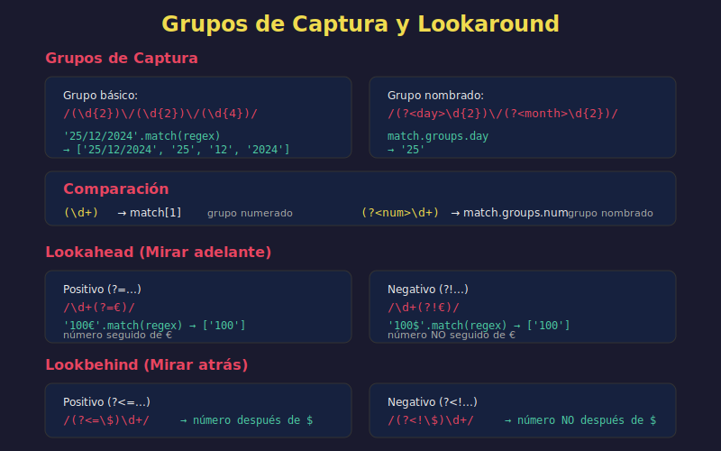

# 🎯 Patrones Comunes de RegExp



## 🎯 Objetivos

- Conocer patrones de validación frecuentes
- Aprender a crear patrones reutilizables
- Dominar grupos de captura
- Aplicar lookahead y lookbehind

## 📋 Contenido

### 1. Grupos de Captura

Los paréntesis `()` crean grupos que capturan coincidencias.

```javascript
// Grupo básico
const dateRegex = /(\d{4})-(\d{2})-(\d{2})/;
const match = '2024-01-15'.match(dateRegex);

console.log(match[0]);  // '2024-01-15' (match completo)
console.log(match[1]);  // '2024' (primer grupo)
console.log(match[2]);  // '01' (segundo grupo)
console.log(match[3]);  // '15' (tercer grupo)

// Grupos nombrados (ES2018)
const namedRegex = /(?<year>\d{4})-(?<month>\d{2})-(?<day>\d{2})/;
const namedMatch = '2024-01-15'.match(namedRegex);

console.log(namedMatch.groups.year);   // '2024'
console.log(namedMatch.groups.month);  // '01'
console.log(namedMatch.groups.day);    // '15'

// Destructuring con grupos nombrados
const { groups: { year, month, day } } = '2024-01-15'.match(namedRegex);
console.log(year, month, day);  // '2024' '01' '15'
```

### 2. Grupos No Capturadores

Usa `(?:)` cuando necesitas agrupar pero no capturar.

```javascript
// Con captura (innecesaria)
const withCapture = /(?:https?:\/\/)?(www\.)?(\w+\.\w+)/;

// Ejemplo
const url = 'https://www.example.com';
const match = url.match(withCapture);
console.log(match[2]);  // 'example.com'

// Útil para alternancia sin capturar
const fileRegex = /\w+\.(?:jpg|png|gif)/;
console.log(fileRegex.test('photo.jpg'));  // true
console.log('photo.jpg'.match(fileRegex)); // ['photo.jpg']
```

### 3. Referencias Hacia Atrás (Backreferences)

Referencia a un grupo capturado anteriormente.

```javascript
// \1 referencia al primer grupo
const repeatedWord = /(\w+)\s+\1/;
console.log(repeatedWord.test('the the'));     // true
console.log(repeatedWord.test('the cat'));     // false

// Encontrar palabras duplicadas
const text = 'This is is a test test string';
const duplicates = text.match(/(\b\w+\b)\s+\1/g);
console.log(duplicates);  // ['is is', 'test test']

// Con grupos nombrados: \k<name>
const namedBackref = /(?<word>\w+)\s+\k<word>/;
console.log(namedBackref.test('hello hello')); // true
```

### 4. Lookahead y Lookbehind

Verifican condiciones sin consumir caracteres.

#### Lookahead Positivo `(?=)`

```javascript
// Encuentra 'foo' solo si es seguido por 'bar'
const lookahead = /foo(?=bar)/;

console.log(lookahead.test('foobar'));   // true
console.log(lookahead.test('foobaz'));   // false
console.log('foobar'.match(lookahead));  // ['foo'] (no incluye 'bar')

// Caso práctico: números seguidos de unidad
const withUnit = /\d+(?=px|em|rem)/g;
const css = '10px 20em 30rem 40';
console.log(css.match(withUnit));  // ['10', '20', '30']
```

#### Lookahead Negativo `(?!)`

```javascript
// Encuentra 'foo' solo si NO es seguido por 'bar'
const negativeLookahead = /foo(?!bar)/;

console.log(negativeLookahead.test('foobar'));  // false
console.log(negativeLookahead.test('foobaz'));  // true

// Caso práctico: encontrar números que no son precios
const notPrice = /\d+(?!\.\d{2})/g;
const text = '100 items at $25.99 each, total 2599';
console.log(text.match(notPrice));  // ['100', '259'] (no captura '25')
```

#### Lookbehind Positivo `(?<=)`

```javascript
// Encuentra texto precedido por patrón
const lookbehind = /(?<=\$)\d+/g;

const prices = 'Items: $100, $200, €300';
console.log(prices.match(lookbehind));  // ['100', '200']

// Extraer valor después de etiqueta
const labelValue = /(?<=price:\s*)\d+/i;
console.log('Price: 500'.match(labelValue));  // ['500']
```

#### Lookbehind Negativo `(?<!)`

```javascript
// Encuentra texto NO precedido por patrón
const negativeLookbehind = /(?<!\$)\d+/g;

const text = '$100 and 200 items';
console.log(text.match(negativeLookbehind));  // ['00', '200']
// Nota: '00' porque '$1' es precedido por $, pero '00' no
```

### 5. Patrones de Validación Comunes

#### Email

```javascript
// Patrón simple pero efectivo
const emailRegex = /^[a-zA-Z0-9._%+-]+@[a-zA-Z0-9.-]+\.[a-zA-Z]{2,}$/;

const testEmails = [
  'user@example.com',      // true
  'user.name@domain.co',   // true
  'user+tag@example.org',  // true
  'invalid@',              // false
  '@nodomain.com',         // false
  'spaces not@ok.com'      // false
];

testEmails.forEach(email => {
  console.log(`${email}: ${emailRegex.test(email)}`);
});
```

#### Teléfono

```javascript
// Formato internacional flexible
const phoneRegex = /^\+?[\d\s-]{10,}$/;

// Formato específico: +XX XXX XXX XXX
const strictPhone = /^\+\d{2}\s\d{3}\s\d{3}\s\d{3}$/;

// Múltiples formatos
const flexPhone = /^(\+\d{1,3}[-.\s]?)?\(?\d{3}\)?[-.\s]?\d{3}[-.\s]?\d{4}$/;

const phones = [
  '+34 612 345 678',
  '612-345-678',
  '(612) 345-6789',
  '+1 555 123 4567'
];

phones.forEach(phone => {
  console.log(`${phone}: ${flexPhone.test(phone)}`);
});
```

#### URL

```javascript
const urlRegex = /^(https?:\/\/)?([\da-z.-]+)\.([a-z.]{2,6})([\/\w .-]*)*\/?$/;

const urls = [
  'https://example.com',
  'http://sub.domain.co.uk/path',
  'example.com',
  'not a url'
];

urls.forEach(url => {
  console.log(`${url}: ${urlRegex.test(url)}`);
});
```

#### Contraseña Fuerte

```javascript
// Requisitos:
// - Mínimo 8 caracteres
// - Al menos una mayúscula
// - Al menos una minúscula
// - Al menos un número
// - Al menos un carácter especial

const passwordRegex = /^(?=.*[a-z])(?=.*[A-Z])(?=.*\d)(?=.*[@$!%*?&])[A-Za-z\d@$!%*?&]{8,}$/;

const passwords = [
  'Abc123!@',      // true
  'weakpass',      // false (sin mayúscula, número, especial)
  'ALLCAPS123!',   // false (sin minúscula)
  'Short1!'        // false (menos de 8)
];

passwords.forEach(pwd => {
  console.log(`${pwd}: ${passwordRegex.test(pwd)}`);
});

// Versión con validaciones individuales (mejor UX)
const hasLowercase = /[a-z]/;
const hasUppercase = /[A-Z]/;
const hasNumber = /\d/;
const hasSpecial = /[@$!%*?&]/;
const hasMinLength = /.{8,}/;

const validatePassword = password => ({
  lowercase: hasLowercase.test(password),
  uppercase: hasUppercase.test(password),
  number: hasNumber.test(password),
  special: hasSpecial.test(password),
  length: hasMinLength.test(password)
});

console.log(validatePassword('Abc123!@'));
// { lowercase: true, uppercase: true, number: true, special: true, length: true }
```

#### Tarjeta de Crédito

```javascript
// Formato: grupos de 4 dígitos
const creditCardRegex = /^\d{4}[-\s]?\d{4}[-\s]?\d{4}[-\s]?\d{4}$/;

// Detectar tipo de tarjeta
const cardPatterns = {
  visa: /^4[0-9]{12}(?:[0-9]{3})?$/,
  mastercard: /^5[1-5][0-9]{14}$/,
  amex: /^3[47][0-9]{13}$/
};

const detectCardType = number => {
  const clean = number.replace(/[\s-]/g, '');
  for (const [type, pattern] of Object.entries(cardPatterns)) {
    if (pattern.test(clean)) return type;
  }
  return 'unknown';
};

console.log(detectCardType('4111 1111 1111 1111')); // 'visa'
console.log(detectCardType('5500 0000 0000 0004')); // 'mastercard'
```

#### Fecha

```javascript
// Formato DD/MM/YYYY o DD-MM-YYYY
const dateRegex = /^(0[1-9]|[12][0-9]|3[01])[\/\-](0[1-9]|1[0-2])[\/\-](\d{4})$/;

// Con validación básica de rangos
const dates = [
  '15/01/2024',   // true
  '31-12-2023',   // true
  '32/01/2024',   // false (día inválido)
  '15/13/2024'    // false (mes inválido)
];

dates.forEach(date => {
  console.log(`${date}: ${dateRegex.test(date)}`);
});
```

### 6. Patrones de Extracción

#### Extraer Hashtags

```javascript
const hashtagRegex = /#\w+/g;

const tweet = 'Learning #JavaScript and #RegExp is fun! #coding';
const hashtags = tweet.match(hashtagRegex);
console.log(hashtags);  // ['#JavaScript', '#RegExp', '#coding']
```

#### Extraer Menciones

```javascript
const mentionRegex = /@\w+/g;

const post = 'Thanks @john and @jane for the help!';
const mentions = post.match(mentionRegex);
console.log(mentions);  // ['@john', '@jane']
```

#### Extraer URLs

```javascript
const urlExtractRegex = /https?:\/\/[^\s]+/g;

const text = 'Visit https://example.com or http://test.org for more';
const urls = text.match(urlExtractRegex);
console.log(urls);  // ['https://example.com', 'http://test.org']
```

### 7. Patrones de Transformación

#### Formatear Teléfono

```javascript
const formatPhone = phone => {
  const clean = phone.replace(/\D/g, '');
  return clean.replace(/(\d{3})(\d{3})(\d{3})/, '$1 $2 $3');
};

console.log(formatPhone('612345678'));    // '612 345 678'
console.log(formatPhone('612-345-678'));  // '612 345 678'
```

#### Formatear Tarjeta de Crédito

```javascript
const formatCard = number => {
  return number
    .replace(/\D/g, '')
    .replace(/(\d{4})(?=\d)/g, '$1 ')
    .trim();
};

console.log(formatCard('4111111111111111')); // '4111 1111 1111 1111'
```

#### Convertir camelCase a kebab-case

```javascript
const toKebabCase = str => {
  return str.replace(/([a-z])([A-Z])/g, '$1-$2').toLowerCase();
};

console.log(toKebabCase('backgroundColor')); // 'background-color'
console.log(toKebabCase('fontSize'));        // 'font-size'
```

## 💡 Tips para Patrones

1. **Sé específico**: Patrones muy generales pueden coincidir con texto no deseado
2. **Usa anclas**: `^` y `$` para validar strings completos
3. **Grupos nombrados**: Mejoran la legibilidad
4. **Lookahead para requisitos**: Valida múltiples condiciones independientes
5. **Prueba exhaustivamente**: Considera casos edge

## ✅ Checklist de Verificación

- [ ] Sé crear y usar grupos de captura
- [ ] Entiendo grupos nombrados vs numerados
- [ ] Conozco la diferencia entre lookahead y lookbehind
- [ ] Puedo crear patrones de validación comunes
- [ ] Sé extraer y transformar texto con RegExp

## 🔗 Recursos

- [Regex101](https://regex101.com) - Probador con explicaciones
- [RegExr](https://regexr.com) - Referencia interactiva

---

[← Anterior: Fundamentos de RegExp](03-regexp-fundamentos.md) | [Siguiente: matchAll y Búsqueda →](05-matchall-search.md)
