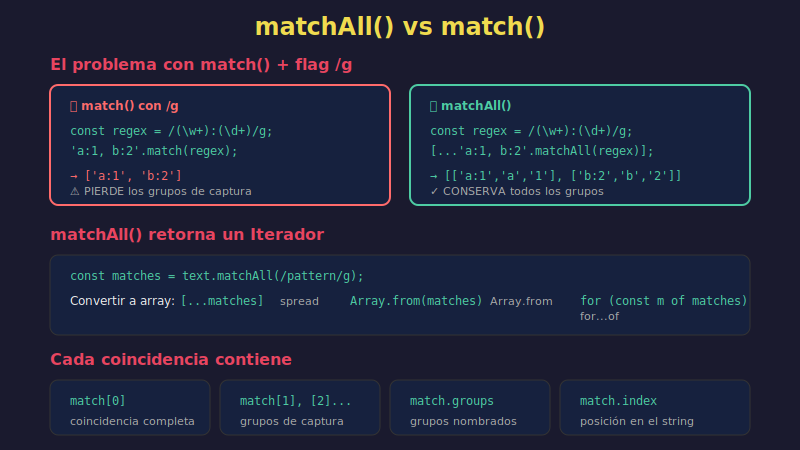

# 🔎 matchAll y Búsqueda Avanzada



## 🎯 Objetivos

- Dominar `String.prototype.matchAll()`
- Entender la iteración sobre coincidencias
- Aplicar búsquedas con grupos de captura
- Conocer técnicas avanzadas de búsqueda

## 📋 Contenido

### 1. El Problema con `match()` Global

```javascript
const text = 'John: 25, Jane: 30, Bob: 28';
const regex = /(\w+):\s*(\d+)/g;

// match() con flag 'g' pierde los grupos de captura
const matches = text.match(regex);
console.log(matches);  // ['John: 25', 'Jane: 30', 'Bob: 28']
// ❌ No podemos acceder a los grupos individuales!
```

### 2. La Solución: `matchAll()`

`matchAll()` retorna un iterador con información completa de cada coincidencia.

```javascript
const text = 'John: 25, Jane: 30, Bob: 28';
const regex = /(\w+):\s*(\d+)/g;  // ⚠️ Requiere flag 'g'

// matchAll retorna un iterador
const matches = text.matchAll(regex);

for (const match of matches) {
  console.log('Full match:', match[0]);
  console.log('Name:', match[1]);
  console.log('Age:', match[2]);
  console.log('Index:', match.index);
  console.log('---');
}
// Full match: John: 25
// Name: John
// Age: 25
// Index: 0
// ---
// Full match: Jane: 30
// Name: Jane
// Age: 30
// Index: 10
// ...
```

### 3. Convertir a Array

```javascript
const text = 'Colors: #ff0000, #00ff00, #0000ff';
const hexRegex = /#([0-9a-f]{6})/gi;

// Spread operator
const matches = [...text.matchAll(hexRegex)];
console.log(matches.length);  // 3

// Array.from()
const matchArray = Array.from(text.matchAll(hexRegex));

// Mapear directamente
const colors = [...text.matchAll(hexRegex)].map(m => m[1]);
console.log(colors);  // ['ff0000', '00ff00', '0000ff']
```

### 4. Grupos Nombrados con matchAll()

```javascript
const log = `
2024-01-15 10:30:00 INFO Server started
2024-01-15 10:30:05 ERROR Connection failed
2024-01-15 10:30:10 WARN High memory usage
`;

const logRegex = /(?<date>\d{4}-\d{2}-\d{2})\s+(?<time>\d{2}:\d{2}:\d{2})\s+(?<level>\w+)\s+(?<message>.+)/g;

const entries = [...log.matchAll(logRegex)].map(match => ({
  date: match.groups.date,
  time: match.groups.time,
  level: match.groups.level,
  message: match.groups.message
}));

console.log(entries);
// [
//   { date: '2024-01-15', time: '10:30:00', level: 'INFO', message: 'Server started' },
//   { date: '2024-01-15', time: '10:30:05', level: 'ERROR', message: 'Connection failed' },
//   { date: '2024-01-15', time: '10:30:10', level: 'WARN', message: 'High memory usage' }
// ]
```

### 5. Caso Práctico: Parser de Markdown Links

```javascript
const markdown = `
Check out [Google](https://google.com) and
[GitHub](https://github.com) for more info.
Also see [MDN](https://developer.mozilla.org).
`;

const linkRegex = /\[(?<text>[^\]]+)\]\((?<url>[^)]+)\)/g;

const links = [...markdown.matchAll(linkRegex)].map(m => ({
  text: m.groups.text,
  url: m.groups.url
}));

console.log(links);
// [
//   { text: 'Google', url: 'https://google.com' },
//   { text: 'GitHub', url: 'https://github.com' },
//   { text: 'MDN', url: 'https://developer.mozilla.org' }
// ]

// Convertir a HTML
const toHtml = markdown.replace(linkRegex, '<a href="$<url>">$<text></a>');
console.log(toHtml);
```

### 6. Extraer Datos Estructurados

#### CSV Simple

```javascript
const csv = `name,age,city
John,25,Madrid
Jane,30,Barcelona
Bob,28,Valencia`;

const rowRegex = /^(.+)$/gm;
const cellRegex = /([^,]+)/g;

const rows = [...csv.matchAll(rowRegex)].slice(1); // Skip header
const data = rows.map(row => {
  const cells = [...row[0].matchAll(cellRegex)].map(m => m[1]);
  return {
    name: cells[0],
    age: parseInt(cells[1]),
    city: cells[2]
  };
});

console.log(data);
// [
//   { name: 'John', age: 25, city: 'Madrid' },
//   { name: 'Jane', age: 30, city: 'Barcelona' },
//   { name: 'Bob', age: 28, city: 'Valencia' }
// ]
```

#### HTML Tags

```javascript
const html = `
<div class="container">
  <p id="intro">Hello World</p>
  <span data-value="42">Info</span>
</div>
`;

const tagRegex = /<(?<tag>\w+)(?<attrs>[^>]*)>(?<content>[^<]*)<\/\1>/g;

const elements = [...html.matchAll(tagRegex)].map(m => ({
  tag: m.groups.tag,
  attrs: m.groups.attrs.trim(),
  content: m.groups.content
}));

console.log(elements);
// [
//   { tag: 'p', attrs: 'id="intro"', content: 'Hello World' },
//   { tag: 'span', attrs: 'data-value="42"', content: 'Info' }
// ]
```

### 7. Búsqueda con Índices

```javascript
const text = 'The quick brown fox jumps over the lazy dog';
const wordRegex = /\b\w{4,}\b/g;  // Palabras de 4+ letras

const wordsWithPositions = [...text.matchAll(wordRegex)].map(m => ({
  word: m[0],
  start: m.index,
  end: m.index + m[0].length
}));

console.log(wordsWithPositions);
// [
//   { word: 'quick', start: 4, end: 9 },
//   { word: 'brown', start: 10, end: 15 },
//   { word: 'jumps', start: 20, end: 25 },
//   { word: 'over', start: 26, end: 30 },
//   { word: 'lazy', start: 35, end: 39 }
// ]
```

### 8. Reemplazo Avanzado con Función

```javascript
// Capitalizar palabras después de punto
const text = 'hello world. this is a test. another sentence.';

const result = text.replace(/\.\s*(\w)/g, (match, letter) => {
  return '. ' + letter.toUpperCase();
});
console.log(result);
// 'hello world. This is a test. Another sentence.'

// Formatear números con separadores
const formatNumber = num => {
  return String(num).replace(/\B(?=(\d{3})+(?!\d))/g, ',');
};
console.log(formatNumber(1234567));  // '1,234,567'

// Template con datos
const template = 'Hello {{name}}, you have {{count}} messages';
const data = { name: 'Ana', count: 5 };

const rendered = template.replace(/\{\{(\w+)\}\}/g, (match, key) => {
  return data[key] ?? match;
});
console.log(rendered);  // 'Hello Ana, you have 5 messages'
```

### 9. Comparación de Métodos

| Método | Retorna | Grupos | Iterativo | Uso |
|--------|---------|--------|-----------|-----|
| `match(/g/)` | Array de matches | ❌ | ❌ | Listar coincidencias |
| `match()` | Array con grupos | ✅ | ❌ | Una coincidencia |
| `matchAll()` | Iterator | ✅ | ✅ | Múltiples con grupos |
| `exec()` | Array con grupos | ✅ | Manual | Control fino |

```javascript
const text = 'a1 b2 c3';
const regex = /(\w)(\d)/g;

// match con 'g' - pierde grupos
console.log(text.match(regex));
// ['a1', 'b2', 'c3']

// matchAll - conserva grupos
console.log([...text.matchAll(regex)].map(m => m[1]));
// ['a', 'b', 'c']

// exec - manual, más control
const results = [];
let m;
while ((m = regex.exec(text)) !== null) {
  results.push({ letter: m[1], digit: m[2] });
}
console.log(results);
// [{ letter: 'a', digit: '1' }, ...]
```

### 10. Patrones de Búsqueda Útiles

#### Encontrar Duplicados

```javascript
const findDuplicateWords = text => {
  const regex = /\b(\w+)\s+\1\b/gi;
  return [...text.matchAll(regex)].map(m => m[1]);
};

console.log(findDuplicateWords('The the quick fox fox jumps'));
// ['The', 'fox']
```

#### Extraer Variables de Template

```javascript
const extractVariables = template => {
  const regex = /\$\{(\w+)\}/g;
  return [...template.matchAll(regex)].map(m => m[1]);
};

const template = 'Hello ${name}, your order ${orderId} is ready';
console.log(extractVariables(template));
// ['name', 'orderId']
```

#### Parsear Query String

```javascript
const parseQueryString = url => {
  const queryRegex = /[?&]([^=]+)=([^&]*)/g;
  const query = url.includes('?') ? url.split('?')[1] : url;

  return Object.fromEntries(
    [...('?' + query).matchAll(queryRegex)].map(m => [m[1], decodeURIComponent(m[2])])
  );
};

console.log(parseQueryString('?name=John&age=25&city=Madrid'));
// { name: 'John', age: '25', city: 'Madrid' }
```

---

## 11. El Flag `/d` - Índices de Grupos (ES2022)

El flag `d` (**hasIndices**) es una característica de ES2022 que añade información de índices para cada grupo de captura.

### El Problema

Sin el flag `d`, solo obtienes el índice del match completo:

```javascript
const text = 'Hello John Smith!';
const regex = /Hello (\w+) (\w+)/;

const match = text.match(regex);
console.log(match.index);  // 0 (índice del match completo)
// ❌ No sabemos dónde empieza 'John' ni 'Smith'
```

### La Solución: Flag `/d`

```javascript
const text = 'Hello John Smith!';
const regex = /Hello (\w+) (\w+)/d;  // ← Flag 'd'

const match = text.match(regex);

console.log(match.indices);
// [
//   [0, 17],    // Match completo: 'Hello John Smith!'
//   [6, 10],    // Grupo 1: 'John' (posiciones 6-10)
//   [11, 16]    // Grupo 2: 'Smith' (posiciones 11-16)
// ]

// Verificar
console.log(text.slice(6, 10));   // 'John'
console.log(text.slice(11, 16));  // 'Smith'
```

### Con Grupos Nombrados

```javascript
const logEntry = '2024-01-15 ERROR: Connection failed';
const regex = /(?<date>\d{4}-\d{2}-\d{2})\s+(?<level>\w+):\s+(?<message>.+)/d;

const match = logEntry.match(regex);

console.log(match.indices.groups);
// {
//   date: [0, 10],
//   level: [11, 16],
//   message: [18, 35]
// }

// Extraer con posiciones exactas
const { date, level, message } = match.indices.groups;
console.log(`Date at [${date}]: ${logEntry.slice(...date)}`);
// 'Date at [0,10]: 2024-01-15'
```

### Caso de Uso: Resaltado de Texto

```javascript
const highlightMatches = (text, pattern) => {
  const regex = new RegExp(pattern, 'gd');
  const matches = [...text.matchAll(regex)];

  let result = '';
  let lastIndex = 0;

  for (const match of matches) {
    const [start, end] = match.indices[0];
    result += text.slice(lastIndex, start);
    result += `<mark>${text.slice(start, end)}</mark>`;
    lastIndex = end;
  }

  result += text.slice(lastIndex);
  return result;
};

const text = 'JavaScript is great. Java is also popular.';
console.log(highlightMatches(text, /Java\w*/));
// '<mark>JavaScript</mark> is great. <mark>Java</mark> is also popular.'
```

### Caso de Uso: Editor de Código (Syntax Highlighting)

```javascript
const tokenize = code => {
  const patterns = {
    keyword: /\b(const|let|var|function|return|if|else)\b/,
    string: /"[^"]*"|'[^']*'/,
    number: /\b\d+\b/,
    identifier: /\b[a-zA-Z_]\w*\b/
  };

  const combined = new RegExp(
    Object.entries(patterns)
      .map(([name, re]) => `(?<${name}>${re.source})`)
      .join('|'),
    'gd'
  );

  const tokens = [];
  for (const match of code.matchAll(combined)) {
    const type = Object.keys(match.groups).find(k => match.groups[k]);
    const [start, end] = match.indices[0];
    tokens.push({ type, value: match[0], start, end });
  }

  return tokens;
};

const code = 'const x = 42';
console.log(tokenize(code));
// [
//   { type: 'keyword', value: 'const', start: 0, end: 5 },
//   { type: 'identifier', value: 'x', start: 6, end: 7 },
//   { type: 'number', value: '42', start: 10, end: 12 }
// ]
```

### Verificar Soporte

```javascript
// El flag 'd' añade la propiedad hasIndices al regex
const regex = /test/d;
console.log(regex.hasIndices);  // true

const regexWithout = /test/;
console.log(regexWithout.hasIndices);  // false
```

---

## 💡 Cuándo Usar matchAll

| Situación | Usar |
|-----------|------|
| Solo verificar existencia | `test()` |
| Listar coincidencias simples | `match(/g/)` |
| Una coincidencia con grupos | `match()` |
| Múltiples coincidencias con grupos | `matchAll()` |
| Necesitas posiciones de grupos | Flag `/d` (ES2022) |
| Control de iteración manual | `exec()` |

## ⚠️ Consideraciones

```javascript
// matchAll REQUIERE flag 'g'
const regex = /\d+/;  // Sin 'g'
// 'a1 b2'.matchAll(regex);  // TypeError!

const regexG = /\d+/g;  // Con 'g'
console.log([...'a1 b2'.matchAll(regexG)]);  // OK

// Flag 'd' puede combinarse con otros flags
const regexWithIndices = /pattern/gid;  // global + ignoreCase + indices
```

## ✅ Checklist de Verificación

- [ ] Entiendo la diferencia entre `match()` y `matchAll()`
- [ ] Sé convertir el iterador de matchAll a array
- [ ] Puedo extraer grupos nombrados con matchAll
- [ ] Uso matchAll para parsear datos estructurados
- [ ] Conozco cuándo usar cada método de búsqueda
- [ ] Sé usar el flag `/d` para obtener índices de grupos (ES2022)

## 🔗 Recursos

- [MDN - String.prototype.matchAll()](https://developer.mozilla.org/es/docs/Web/JavaScript/Reference/Global_Objects/String/matchAll)
- [MDN - RegExp hasIndices](https://developer.mozilla.org/en-US/docs/Web/JavaScript/Reference/Global_Objects/RegExp/hasIndices)
- [TC39 - RegExp Match Indices](https://github.com/tc39/proposal-regexp-match-indices)

---

[← Anterior: Patrones Comunes](04-regexp-patterns.md) | [Ir a Prácticas →](../2-practicas/)
