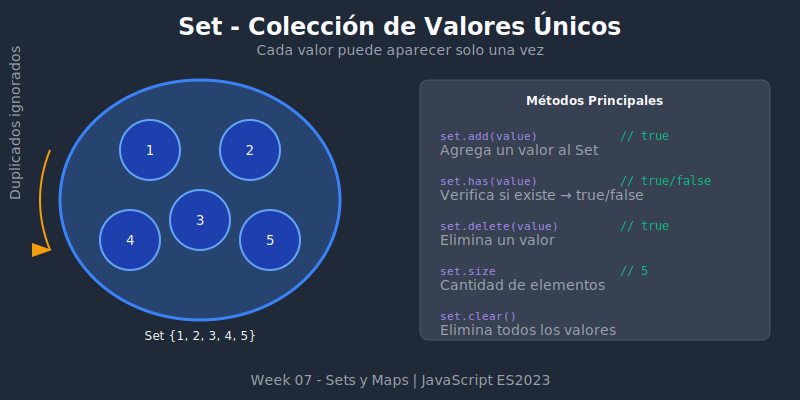

# 📦 Introducción a Set



## 🎯 Objetivos

- Entender qué es un Set y cuándo usarlo
- Dominar los métodos básicos de Set
- Conocer las diferencias con Arrays

## 📋 Contenido

### 1. ¿Qué es un Set?

Un **Set** es una colección de valores **únicos**. A diferencia de los arrays, un Set no permite elementos duplicados.

```javascript
// Crear un Set vacío
const mySet = new Set();

// Crear un Set con valores iniciales
const numbers = new Set([1, 2, 3, 4, 5]);
const letters = new Set('hello'); // Set {'h', 'e', 'l', 'o'} - sin duplicados!

console.log(numbers); // Set(5) {1, 2, 3, 4, 5}
console.log(letters); // Set(4) {'h', 'e', 'l', 'o'}
```

### 2. Agregar Elementos: `add()`

```javascript
const fruits = new Set();

// add() retorna el Set, permitiendo encadenar
fruits.add('apple');
fruits.add('banana');
fruits.add('orange');
fruits.add('apple'); // ¡Ignorado! Ya existe

console.log(fruits); // Set(3) {'apple', 'banana', 'orange'}
console.log(fruits.size); // 3

// Encadenamiento
fruits
  .add('grape')
  .add('mango')
  .add('grape'); // Ignorado

console.log(fruits.size); // 5
```

### 3. Verificar Existencia: `has()`

```javascript
const colors = new Set(['red', 'green', 'blue']);

console.log(colors.has('red'));    // true
console.log(colors.has('yellow')); // false

// Comparación de rendimiento vs Array
const arrayColors = ['red', 'green', 'blue'];

// Array: O(n) - recorre todo el array
arrayColors.includes('blue');

// Set: O(1) - acceso directo (hash)
colors.has('blue');
```

### 4. Eliminar Elementos: `delete()` y `clear()`

```javascript
const animals = new Set(['dog', 'cat', 'bird', 'fish']);

// delete() retorna true si existía, false si no
console.log(animals.delete('cat'));  // true
console.log(animals.delete('lion')); // false

console.log(animals); // Set(3) {'dog', 'bird', 'fish'}

// clear() elimina todos los elementos
animals.clear();
console.log(animals); // Set(0) {}
console.log(animals.size); // 0
```

### 5. Tamaño: `size`

```javascript
const numbers = new Set([1, 2, 3, 4, 5]);

console.log(numbers.size); // 5

// Nota: Es una propiedad, no un método
// ✅ numbers.size
// ❌ numbers.size()

// Comparar con Array
const arr = [1, 2, 3, 4, 5];
console.log(arr.length); // 5
```

### 6. Iterar sobre un Set

```javascript
const techs = new Set(['JavaScript', 'Python', 'Rust']);

// for...of
for (const tech of techs) {
  console.log(tech);
}

// forEach
techs.forEach(tech => {
  console.log(tech);
});

// Destructuring con spread
const techArray = [...techs];
console.log(techArray); // ['JavaScript', 'Python', 'Rust']

// keys(), values(), entries()
// En Set, keys() y values() son idénticos
console.log([...techs.keys()]);   // ['JavaScript', 'Python', 'Rust']
console.log([...techs.values()]); // ['JavaScript', 'Python', 'Rust']

// entries() retorna [valor, valor] (para compatibilidad con Map)
for (const [key, value] of techs.entries()) {
  console.log(key, value); // 'JavaScript' 'JavaScript'
}
```

### 7. Eliminar Duplicados de un Array

El caso de uso más común de Set:

```javascript
const numbersWithDupes = [1, 2, 2, 3, 3, 3, 4, 4, 4, 4];

// Método 1: Spread
const unique1 = [...new Set(numbersWithDupes)];
console.log(unique1); // [1, 2, 3, 4]

// Método 2: Array.from
const unique2 = Array.from(new Set(numbersWithDupes));
console.log(unique2); // [1, 2, 3, 4]

// Con strings
const words = ['hello', 'world', 'hello', 'javascript', 'world'];
const uniqueWords = [...new Set(words)];
console.log(uniqueWords); // ['hello', 'world', 'javascript']
```

### 8. Set vs Array: Cuándo Usar Cada Uno

| Característica | Set | Array |
|----------------|-----|-------|
| Valores duplicados | ❌ No permite | ✅ Permite |
| Orden de inserción | ✅ Mantiene | ✅ Mantiene |
| Acceso por índice | ❌ No | ✅ Sí (`arr[0]`) |
| Verificar existencia | ✅ O(1) `has()` | ⚠️ O(n) `includes()` |
| Métodos de array | ❌ No directos | ✅ map, filter, reduce |

```javascript
// Usar Array cuando:
// - Necesitas duplicados
// - Necesitas acceso por índice
// - Necesitas métodos como map, filter, reduce

// Usar Set cuando:
// - Los valores deben ser únicos
// - La verificación de existencia es frecuente
// - No necesitas acceso por índice
```

### 9. Sets con Objetos

⚠️ **Importante**: Set usa igualdad estricta (`===`) para comparar. Los objetos se comparan por referencia.

```javascript
const obj1 = { name: 'Ana' };
const obj2 = { name: 'Ana' }; // Mismo contenido, diferente referencia

const objectSet = new Set();
objectSet.add(obj1);
objectSet.add(obj2);

console.log(objectSet.size); // 2 (son referencias diferentes)

// Misma referencia
objectSet.add(obj1);
console.log(objectSet.size); // 2 (obj1 ya existe)

// Verificar con la misma referencia
console.log(objectSet.has(obj1)); // true
console.log(objectSet.has({ name: 'Ana' })); // false (nueva referencia)
```

## 💡 Casos de Uso Prácticos

### Tracking de usuarios únicos

```javascript
const uniqueVisitors = new Set();

const trackVisit = userId => {
  uniqueVisitors.add(userId);
  console.log(`Total visitantes únicos: ${uniqueVisitors.size}`);
};

trackVisit('user123'); // Total visitantes únicos: 1
trackVisit('user456'); // Total visitantes únicos: 2
trackVisit('user123'); // Total visitantes únicos: 2 (ya existía)
```

### Tags sin duplicados

```javascript
const tags = new Set();

const addTag = tag => {
  const normalized = tag.toLowerCase().trim();
  tags.add(normalized);
};

addTag('JavaScript');
addTag('javascript'); // Ignorado (normalizado)
addTag(' JAVASCRIPT '); // Ignorado (normalizado)

console.log([...tags]); // ['javascript']
```

## ✅ Resumen

| Método/Propiedad | Descripción | Retorna |
|------------------|-------------|---------|
| `new Set(iterable)` | Crear Set | Set |
| `add(value)` | Agregar valor | Set |
| `has(value)` | Verificar existencia | boolean |
| `delete(value)` | Eliminar valor | boolean |
| `clear()` | Eliminar todos | undefined |
| `size` | Cantidad de elementos | number |
| `forEach(callback)` | Iterar | undefined |
| `keys()` / `values()` | Obtener iterador | Iterator |
| `entries()` | Obtener pares [v, v] | Iterator |

---

⬅️ [Volver al README](../README.md) | [Siguiente: Operaciones con Set](./02-set-operations.md) ➡️
