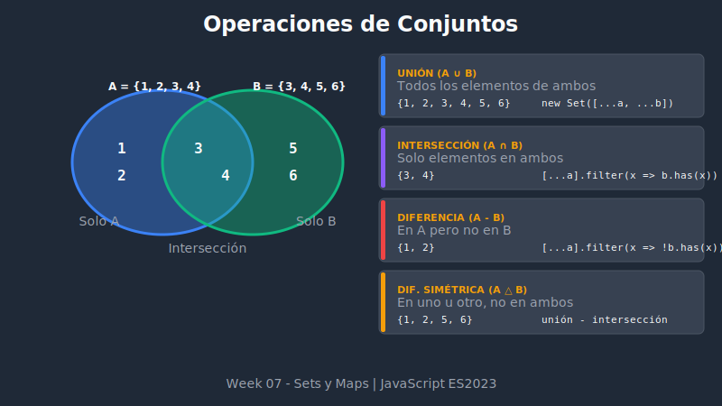

# 🔄 Operaciones con Set



## 🎯 Objetivos

- Implementar operaciones de conjuntos matemáticos
- Combinar y comparar Sets
- Aplicar operaciones en casos reales

## 📋 Contenido

### 1. Operaciones de Conjuntos

JavaScript no incluye métodos nativos para operaciones de conjuntos, pero son fáciles de implementar.

```
A = {1, 2, 3, 4}
B = {3, 4, 5, 6}

Unión:        {1, 2, 3, 4, 5, 6}  (todos)
Intersección: {3, 4}              (comunes)
Diferencia:   {1, 2}              (solo en A)
Diferencia simétrica: {1, 2, 5, 6} (no comunes)
```

### 2. Unión (Union)

Combina todos los elementos de ambos sets (sin duplicados).

```javascript
const setA = new Set([1, 2, 3, 4]);
const setB = new Set([3, 4, 5, 6]);

// Método 1: Spread operator
const union = new Set([...setA, ...setB]);
console.log(union); // Set(6) {1, 2, 3, 4, 5, 6}

// Método 2: Función reutilizable
const setUnion = (a, b) => new Set([...a, ...b]);
console.log(setUnion(setA, setB)); // Set(6) {1, 2, 3, 4, 5, 6}

// Unión de múltiples sets
const setUnionMultiple = (...sets) =>
  new Set(sets.flatMap(set => [...set]));

const setC = new Set([7, 8]);
console.log(setUnionMultiple(setA, setB, setC));
// Set(8) {1, 2, 3, 4, 5, 6, 7, 8}
```

### 3. Intersección (Intersection)

Elementos que existen en ambos sets.

```javascript
const setA = new Set([1, 2, 3, 4]);
const setB = new Set([3, 4, 5, 6]);

// Método 1: filter + has
const intersection = new Set(
  [...setA].filter(x => setB.has(x))
);
console.log(intersection); // Set(2) {3, 4}

// Método 2: Función reutilizable
const setIntersection = (a, b) =>
  new Set([...a].filter(x => b.has(x)));

console.log(setIntersection(setA, setB)); // Set(2) {3, 4}

// Optimización: iterar sobre el set más pequeño
const setIntersectionOptimized = (a, b) => {
  const [smaller, larger] = a.size <= b.size ? [a, b] : [b, a];
  return new Set([...smaller].filter(x => larger.has(x)));
};
```

### 4. Diferencia (Difference)

Elementos en A que no están en B.

```javascript
const setA = new Set([1, 2, 3, 4]);
const setB = new Set([3, 4, 5, 6]);

// Elementos en A pero NO en B
const difference = new Set(
  [...setA].filter(x => !setB.has(x))
);
console.log(difference); // Set(2) {1, 2}

// Función reutilizable
const setDifference = (a, b) =>
  new Set([...a].filter(x => !b.has(x)));

console.log(setDifference(setA, setB)); // Set(2) {1, 2}
console.log(setDifference(setB, setA)); // Set(2) {5, 6}
```

### 5. Diferencia Simétrica (Symmetric Difference)

Elementos que están en A o en B, pero no en ambos.

```javascript
const setA = new Set([1, 2, 3, 4]);
const setB = new Set([3, 4, 5, 6]);

// Método 1: Unión de diferencias
const symmetricDiff = new Set([
  ...[...setA].filter(x => !setB.has(x)),
  ...[...setB].filter(x => !setA.has(x))
]);
console.log(symmetricDiff); // Set(4) {1, 2, 5, 6}

// Método 2: Función compuesta
const setSymmetricDifference = (a, b) => {
  const diffA = [...a].filter(x => !b.has(x));
  const diffB = [...b].filter(x => !a.has(x));
  return new Set([...diffA, ...diffB]);
};

console.log(setSymmetricDifference(setA, setB)); // Set(4) {1, 2, 5, 6}
```

### 6. Subconjunto y Superconjunto

```javascript
const setA = new Set([1, 2]);
const setB = new Set([1, 2, 3, 4]);

// ¿A es subconjunto de B? (todos los elementos de A están en B)
const isSubset = (a, b) =>
  [...a].every(x => b.has(x));

console.log(isSubset(setA, setB)); // true
console.log(isSubset(setB, setA)); // false

// ¿B es superconjunto de A? (B contiene todos los elementos de A)
const isSuperset = (a, b) =>
  [...b].every(x => a.has(x));

console.log(isSuperset(setB, setA)); // true

// Verificar igualdad
const isEqual = (a, b) =>
  a.size === b.size && [...a].every(x => b.has(x));

const setC = new Set([1, 2]);
console.log(isEqual(setA, setC)); // true
console.log(isEqual(setA, setB)); // false
```

### 7. Disjoint Sets

Dos sets son disjuntos si no comparten elementos.

```javascript
const setA = new Set([1, 2, 3]);
const setB = new Set([4, 5, 6]);
const setC = new Set([3, 4, 5]);

const isDisjoint = (a, b) =>
  [...a].every(x => !b.has(x));

console.log(isDisjoint(setA, setB)); // true (no comparten elementos)
console.log(isDisjoint(setA, setC)); // false (comparten el 3)
```

### 8. Clase SetOperations

Encapsular todas las operaciones en una clase:

```javascript
class SetOps {
  static union(a, b) {
    return new Set([...a, ...b]);
  }

  static intersection(a, b) {
    const [smaller, larger] = a.size <= b.size ? [a, b] : [b, a];
    return new Set([...smaller].filter(x => larger.has(x)));
  }

  static difference(a, b) {
    return new Set([...a].filter(x => !b.has(x)));
  }

  static symmetricDifference(a, b) {
    return new Set([
      ...[...a].filter(x => !b.has(x)),
      ...[...b].filter(x => !a.has(x))
    ]);
  }

  static isSubset(a, b) {
    return a.size <= b.size && [...a].every(x => b.has(x));
  }

  static isSuperset(a, b) {
    return SetOps.isSubset(b, a);
  }

  static isEqual(a, b) {
    return a.size === b.size && [...a].every(x => b.has(x));
  }

  static isDisjoint(a, b) {
    const [smaller, larger] = a.size <= b.size ? [a, b] : [b, a];
    return [...smaller].every(x => !larger.has(x));
  }
}

// Uso
const a = new Set([1, 2, 3]);
const b = new Set([2, 3, 4]);

console.log(SetOps.union(a, b));        // Set {1, 2, 3, 4}
console.log(SetOps.intersection(a, b)); // Set {2, 3}
console.log(SetOps.difference(a, b));   // Set {1}
```

## 💡 Casos de Uso Prácticos

### Comparar listas de usuarios

```javascript
const activeUsers = new Set(['alice', 'bob', 'charlie']);
const premiumUsers = new Set(['bob', 'diana', 'eve']);

// Usuarios activos Y premium
const activePremium = SetOps.intersection(activeUsers, premiumUsers);
console.log(activePremium); // Set {'bob'}

// Usuarios activos pero NO premium (upgrade candidates)
const upgradeCandidates = SetOps.difference(activeUsers, premiumUsers);
console.log(upgradeCandidates); // Set {'alice', 'charlie'}

// Usuarios premium pero NO activos (churn risk)
const churnRisk = SetOps.difference(premiumUsers, activeUsers);
console.log(churnRisk); // Set {'diana', 'eve'}
```

### Filtrar tags comunes

```javascript
const article1Tags = new Set(['javascript', 'web', 'frontend']);
const article2Tags = new Set(['javascript', 'nodejs', 'backend']);

// Tags comunes para "relacionados"
const commonTags = SetOps.intersection(article1Tags, article2Tags);
console.log(commonTags); // Set {'javascript'}

// Todos los tags únicos
const allTags = SetOps.union(article1Tags, article2Tags);
console.log(allTags); // Set {'javascript', 'web', 'frontend', 'nodejs', 'backend'}
```

### Permisos de usuario

```javascript
const adminPerms = new Set(['read', 'write', 'delete', 'admin']);
const userPerms = new Set(['read', 'write']);
const guestPerms = new Set(['read']);

// ¿El usuario tiene todos los permisos de guest?
console.log(SetOps.isSuperset(userPerms, guestPerms)); // true

// Permisos que admin tiene pero user no
const adminOnlyPerms = SetOps.difference(adminPerms, userPerms);
console.log(adminOnlyPerms); // Set {'delete', 'admin'}
```

## 🔮 ES2025: Métodos Nativos (Propuesta)

En futuras versiones de JavaScript, estos métodos podrían ser nativos:

```javascript
// Propuesta TC39 (Stage 3)
setA.union(setB);
setA.intersection(setB);
setA.difference(setB);
setA.symmetricDifference(setB);
setA.isSubsetOf(setB);
setA.isSupersetOf(setB);
setA.isDisjointFrom(setB);
```

## ✅ Resumen de Operaciones

| Operación | Fórmula | Resultado |
|-----------|---------|-----------|
| Unión | A ∪ B | Todos los elementos |
| Intersección | A ∩ B | Elementos comunes |
| Diferencia | A - B | En A pero no en B |
| Dif. Simétrica | A △ B | No comunes |
| Subconjunto | A ⊆ B | ¿A dentro de B? |
| Superconjunto | A ⊇ B | ¿B dentro de A? |
| Disjuntos | A ∩ B = ∅ | ¿Sin comunes? |

---

⬅️ [Anterior: Set Básico](./01-set-basics.md) | [Siguiente: Map Básico](./03-map-basics.md) ➡️
