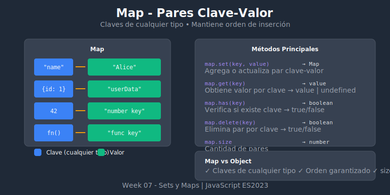

# 🗺️ Introducción a Map



## 🎯 Objetivos

- Entender qué es un Map y cuándo usarlo
- Dominar los métodos básicos de Map
- Conocer las ventajas sobre objetos literales

## 📋 Contenido

### 1. ¿Qué es un Map?

Un **Map** es una colección de pares clave-valor donde las claves pueden ser de **cualquier tipo** (no solo strings como en objetos).

```javascript
// Crear un Map vacío
const myMap = new Map();

// Crear un Map con valores iniciales
const userRoles = new Map([
  ['alice', 'admin'],
  ['bob', 'editor'],
  ['charlie', 'viewer']
]);

console.log(userRoles);
// Map(3) {'alice' => 'admin', 'bob' => 'editor', 'charlie' => 'viewer'}
```

### 2. Map vs Object

| Característica | Map | Object |
|----------------|-----|--------|
| Tipo de claves | Cualquiera | Solo string/Symbol |
| Orden de claves | Garantizado (inserción) | No garantizado* |
| Tamaño | `map.size` | `Object.keys(obj).length` |
| Iteración | Directo (`for...of`) | Necesita `Object.entries()` |
| Rendimiento | Mejor para add/delete frecuentes | Mejor para acceso directo |
| Serialización | No nativo a JSON | Nativo a JSON |

```javascript
// Object: claves solo strings
const objMap = {};
objMap[1] = 'uno';
objMap['1'] = 'one';
console.log(objMap); // {'1': 'one'} - ¡Se sobrescribió!

// Map: claves de cualquier tipo
const realMap = new Map();
realMap.set(1, 'uno');
realMap.set('1', 'one');
console.log(realMap.get(1));   // 'uno'
console.log(realMap.get('1')); // 'one' - ¡Diferentes!
```

### 3. Agregar Elementos: `set()`

```javascript
const config = new Map();

// set() retorna el Map (encadenable)
config.set('theme', 'dark');
config.set('language', 'es');
config.set('notifications', true);

// Encadenamiento
config
  .set('fontSize', 14)
  .set('autoSave', true);

console.log(config.size); // 5

// Sobrescribir valor existente
config.set('theme', 'light');
console.log(config.get('theme')); // 'light'
```

### 4. Obtener Valores: `get()`

```javascript
const scores = new Map([
  ['player1', 100],
  ['player2', 85],
  ['player3', 92]
]);

console.log(scores.get('player1')); // 100
console.log(scores.get('player4')); // undefined (no existe)

// Con valor por defecto
const getScore = player => scores.get(player) ?? 0;
console.log(getScore('player4')); // 0
```

### 5. Verificar Existencia: `has()`

```javascript
const inventory = new Map([
  ['apple', 50],
  ['banana', 30],
  ['orange', 0] // Stock agotado pero existe
]);

console.log(inventory.has('apple'));  // true
console.log(inventory.has('grape'));  // false

// Diferencia entre has() y get()
console.log(inventory.get('orange')); // 0 (existe pero sin stock)
console.log(inventory.get('grape'));  // undefined (no existe)

// has() es más preciso para verificar existencia
if (inventory.has('orange')) {
  console.log('Producto existe, stock:', inventory.get('orange'));
}
```

### 6. Eliminar Elementos: `delete()` y `clear()`

```javascript
const sessions = new Map([
  ['session1', { user: 'alice', active: true }],
  ['session2', { user: 'bob', active: true }],
  ['session3', { user: 'charlie', active: false }]
]);

// delete() retorna true si existía
console.log(sessions.delete('session2')); // true
console.log(sessions.delete('session99')); // false

console.log(sessions.size); // 2

// clear() elimina todo
sessions.clear();
console.log(sessions.size); // 0
```

### 7. Tamaño: `size`

```javascript
const map = new Map([
  ['a', 1],
  ['b', 2],
  ['c', 3]
]);

console.log(map.size); // 3

// Comparar con Object
const obj = { a: 1, b: 2, c: 3 };
console.log(Object.keys(obj).length); // 3 (más verboso)
```

### 8. Iterar sobre un Map

```javascript
const products = new Map([
  ['laptop', 999],
  ['phone', 699],
  ['tablet', 499]
]);

// for...of (obtiene [key, value])
for (const [key, value] of products) {
  console.log(`${key}: $${value}`);
}

// forEach
products.forEach((value, key) => {
  console.log(`${key}: $${value}`);
});

// keys() - solo claves
for (const key of products.keys()) {
  console.log(key); // 'laptop', 'phone', 'tablet'
}

// values() - solo valores
for (const value of products.values()) {
  console.log(value); // 999, 699, 499
}

// entries() - pares [key, value]
for (const [key, value] of products.entries()) {
  console.log(key, value);
}

// Convertir a array
const keysArray = [...products.keys()];
const valuesArray = [...products.values()];
const entriesArray = [...products.entries()];
```

### 9. Claves de Cualquier Tipo

La ventaja principal de Map: claves pueden ser objetos, funciones, etc.

```javascript
const map = new Map();

// Objeto como clave
const userObj = { id: 1, name: 'Alice' };
map.set(userObj, 'metadata for alice');

// Función como clave
const callback = () => console.log('hello');
map.set(callback, 'callback metadata');

// DOM element como clave (en browser)
// const button = document.querySelector('button');
// map.set(button, { clicks: 0 });

// Recuperar valores
console.log(map.get(userObj)); // 'metadata for alice'
console.log(map.get(callback)); // 'callback metadata'

// ⚠️ Cuidado: la referencia debe ser la misma
console.log(map.get({ id: 1, name: 'Alice' })); // undefined (diferente referencia)
```

### 10. Convertir Map ↔ Object ↔ Array

```javascript
// Object → Map
const obj = { a: 1, b: 2, c: 3 };
const mapFromObj = new Map(Object.entries(obj));
console.log(mapFromObj); // Map(3) {'a' => 1, 'b' => 2, 'c' => 3}

// Map → Object
const map = new Map([['x', 10], ['y', 20]]);
const objFromMap = Object.fromEntries(map);
console.log(objFromMap); // {x: 10, y: 20}

// Map → Array de entries
const entriesArray = [...map]; // [['x', 10], ['y', 20]]
const entriesArray2 = Array.from(map);

// Array → Map
const arr = [['name', 'Alice'], ['age', 25]];
const mapFromArr = new Map(arr);
```

### 11. Map con Valores por Defecto

Patrón común: obtener valor o crear si no existe.

```javascript
const wordCount = new Map();

const countWord = word => {
  const current = wordCount.get(word) ?? 0;
  wordCount.set(word, current + 1);
};

const text = 'hello world hello javascript world hello';
text.split(' ').forEach(countWord);

console.log(wordCount);
// Map(3) {'hello' => 3, 'world' => 2, 'javascript' => 1}
```

## 💡 Casos de Uso Prácticos

### Cache simple

```javascript
const cache = new Map();

const fetchData = async url => {
  if (cache.has(url)) {
    console.log('From cache');
    return cache.get(url);
  }

  console.log('Fetching...');
  const response = await fetch(url);
  const data = await response.json();
  cache.set(url, data);
  return data;
};
```

### Contador de elementos

```javascript
const countOccurrences = arr => {
  const counts = new Map();

  for (const item of arr) {
    counts.set(item, (counts.get(item) ?? 0) + 1);
  }

  return counts;
};

const letters = ['a', 'b', 'a', 'c', 'b', 'a'];
console.log(countOccurrences(letters));
// Map(3) {'a' => 3, 'b' => 2, 'c' => 1}
```

### Relaciones entre objetos

```javascript
const users = [
  { id: 1, name: 'Alice' },
  { id: 2, name: 'Bob' }
];

const userPosts = new Map();

// Asociar posts a cada usuario (objeto como clave)
userPosts.set(users[0], ['Post 1', 'Post 2']);
userPosts.set(users[1], ['Post 3']);

// Obtener posts de un usuario
console.log(userPosts.get(users[0])); // ['Post 1', 'Post 2']
```

## ✅ Resumen

| Método/Propiedad | Descripción | Retorna |
|------------------|-------------|---------|
| `new Map(entries)` | Crear Map | Map |
| `set(key, value)` | Agregar/actualizar | Map |
| `get(key)` | Obtener valor | value / undefined |
| `has(key)` | Verificar existencia | boolean |
| `delete(key)` | Eliminar entrada | boolean |
| `clear()` | Eliminar todo | undefined |
| `size` | Cantidad de entradas | number |
| `keys()` | Iterador de claves | Iterator |
| `values()` | Iterador de valores | Iterator |
| `entries()` | Iterador de [k, v] | Iterator |
| `forEach(callback)` | Iterar | undefined |

---

⬅️ [Anterior: Operaciones con Set](./02-set-operations.md) | [Siguiente: Map Avanzado](./04-map-advanced.md) ➡️
