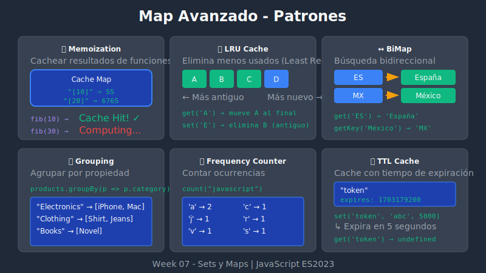

# 🎯 Map Avanzado



## 🎯 Objetivos

- Dominar patrones avanzados con Map
- Implementar estructuras de datos complejas
- Aplicar Map en casos de uso del mundo real

## 📋 Contenido

### 1. Map como Caché (Memoization)

Almacenar resultados de funciones costosas:

```javascript
const memoize = fn => {
  const cache = new Map();

  return (...args) => {
    const key = JSON.stringify(args);

    if (cache.has(key)) {
      console.log('Cache hit!');
      return cache.get(key);
    }

    console.log('Computing...');
    const result = fn(...args);
    cache.set(key, result);
    return result;
  };
};

// Función costosa
const fibonacci = n => {
  if (n <= 1) return n;
  return fibonacci(n - 1) + fibonacci(n - 2);
};

const memoizedFib = memoize(fibonacci);

console.log(memoizedFib(10)); // Computing... 55
console.log(memoizedFib(10)); // Cache hit! 55
```

### 2. Map con TTL (Time To Live)

Caché con expiración:

```javascript
class CacheWithTTL {
  #cache = new Map();
  #defaultTTL;

  constructor(defaultTTL = 60000) { // 1 minuto
    this.#defaultTTL = defaultTTL;
  }

  set(key, value, ttl = this.#defaultTTL) {
    const expiresAt = Date.now() + ttl;
    this.#cache.set(key, { value, expiresAt });
    return this;
  }

  get(key) {
    const item = this.#cache.get(key);

    if (!item) return undefined;

    if (Date.now() > item.expiresAt) {
      this.#cache.delete(key);
      return undefined;
    }

    return item.value;
  }

  has(key) {
    return this.get(key) !== undefined;
  }

  delete(key) {
    return this.#cache.delete(key);
  }

  clear() {
    this.#cache.clear();
  }

  // Limpiar entradas expiradas
  cleanup() {
    const now = Date.now();
    for (const [key, item] of this.#cache) {
      if (now > item.expiresAt) {
        this.#cache.delete(key);
      }
    }
  }
}

// Uso
const cache = new CacheWithTTL(5000); // 5 segundos
cache.set('token', 'abc123');
console.log(cache.get('token')); // 'abc123'

// Después de 5 segundos
// console.log(cache.get('token')); // undefined
```

### 3. Map Bidireccional

Buscar por clave o por valor:

```javascript
class BiMap {
  #keyToValue = new Map();
  #valueToKey = new Map();

  set(key, value) {
    // Eliminar mapeos anteriores si existen
    if (this.#keyToValue.has(key)) {
      this.#valueToKey.delete(this.#keyToValue.get(key));
    }
    if (this.#valueToKey.has(value)) {
      this.#keyToValue.delete(this.#valueToKey.get(value));
    }

    this.#keyToValue.set(key, value);
    this.#valueToKey.set(value, key);
    return this;
  }

  get(key) {
    return this.#keyToValue.get(key);
  }

  getKey(value) {
    return this.#valueToKey.get(value);
  }

  hasKey(key) {
    return this.#keyToValue.has(key);
  }

  hasValue(value) {
    return this.#valueToKey.has(value);
  }

  delete(key) {
    const value = this.#keyToValue.get(key);
    this.#keyToValue.delete(key);
    this.#valueToKey.delete(value);
  }

  get size() {
    return this.#keyToValue.size;
  }
}

// Uso: códigos de país
const countryCodes = new BiMap();
countryCodes.set('ES', 'España');
countryCodes.set('MX', 'México');
countryCodes.set('AR', 'Argentina');

console.log(countryCodes.get('ES'));        // 'España'
console.log(countryCodes.getKey('México')); // 'MX'
```

### 4. Map Anidado (Multi-nivel)

```javascript
// Map de Maps para datos multidimensionales
const salesData = new Map();

const addSale = (year, month, amount) => {
  if (!salesData.has(year)) {
    salesData.set(year, new Map());
  }

  const yearMap = salesData.get(year);
  const current = yearMap.get(month) ?? 0;
  yearMap.set(month, current + amount);
};

addSale(2024, 'Jan', 1000);
addSale(2024, 'Jan', 500);
addSale(2024, 'Feb', 2000);
addSale(2023, 'Dec', 3000);

// Obtener ventas
console.log(salesData.get(2024)?.get('Jan')); // 1500

// Iterar
for (const [year, months] of salesData) {
  console.log(`Año ${year}:`);
  for (const [month, total] of months) {
    console.log(`  ${month}: $${total}`);
  }
}
```

### 5. Map con Valores Complejos

Usar objetos como valores estructurados:

```javascript
const userSessions = new Map();

const createSession = (userId, metadata = {}) => {
  const session = {
    id: crypto.randomUUID(),
    userId,
    createdAt: new Date(),
    lastActivity: new Date(),
    metadata,
    isActive: true
  };

  userSessions.set(session.id, session);
  return session;
};

const updateActivity = sessionId => {
  const session = userSessions.get(sessionId);
  if (session) {
    session.lastActivity = new Date();
  }
};

const getActiveSessions = () => {
  return [...userSessions.values()].filter(s => s.isActive);
};

// Uso
const session1 = createSession('user123', { browser: 'Chrome' });
const session2 = createSession('user456', { browser: 'Firefox' });

console.log(getActiveSessions().length); // 2
```

### 6. Grouping con Map

Agrupar elementos por una propiedad:

```javascript
const groupBy = (items, keyFn) => {
  const groups = new Map();

  for (const item of items) {
    const key = keyFn(item);

    if (!groups.has(key)) {
      groups.set(key, []);
    }

    groups.get(key).push(item);
  }

  return groups;
};

// Ejemplo: agrupar productos por categoría
const products = [
  { name: 'iPhone', category: 'Electronics', price: 999 },
  { name: 'Shirt', category: 'Clothing', price: 29 },
  { name: 'MacBook', category: 'Electronics', price: 1999 },
  { name: 'Jeans', category: 'Clothing', price: 59 },
  { name: 'Book', category: 'Books', price: 15 }
];

const byCategory = groupBy(products, p => p.category);

console.log(byCategory.get('Electronics'));
// [{name: 'iPhone'...}, {name: 'MacBook'...}]

// Agrupar por rango de precio
const byPriceRange = groupBy(products, p => {
  if (p.price < 50) return 'Budget';
  if (p.price < 500) return 'Mid-range';
  return 'Premium';
});

console.log([...byPriceRange.keys()]); // ['Premium', 'Budget', 'Mid-range']
```

### 7. Map para Conteo de Frecuencias

```javascript
const countFrequency = iterable => {
  const freq = new Map();

  for (const item of iterable) {
    freq.set(item, (freq.get(item) ?? 0) + 1);
  }

  return freq;
};

// Contar caracteres
const charFreq = countFrequency('javascript');
console.log(charFreq);
// Map(8) {'j' => 1, 'a' => 2, 'v' => 1, 's' => 1, 'c' => 1, 'r' => 1, 'i' => 1, 'p' => 1, 't' => 1}

// Top N más frecuentes
const topN = (freq, n) => {
  return [...freq.entries()]
    .sort((a, b) => b[1] - a[1])
    .slice(0, n);
};

console.log(topN(charFreq, 3)); // [['a', 2], ['j', 1], ['v', 1]]
```

### 8. Map para LRU Cache

Least Recently Used cache (aprovecha orden de inserción):

```javascript
class LRUCache {
  #cache = new Map();
  #maxSize;

  constructor(maxSize = 100) {
    this.#maxSize = maxSize;
  }

  get(key) {
    if (!this.#cache.has(key)) {
      return undefined;
    }

    // Mover al final (más reciente)
    const value = this.#cache.get(key);
    this.#cache.delete(key);
    this.#cache.set(key, value);

    return value;
  }

  set(key, value) {
    // Si existe, eliminar para actualizar posición
    if (this.#cache.has(key)) {
      this.#cache.delete(key);
    }
    // Si está lleno, eliminar el más antiguo (primero)
    else if (this.#cache.size >= this.#maxSize) {
      const oldestKey = this.#cache.keys().next().value;
      this.#cache.delete(oldestKey);
    }

    this.#cache.set(key, value);
    return this;
  }

  has(key) {
    return this.#cache.has(key);
  }

  get size() {
    return this.#cache.size;
  }
}

// Uso
const lru = new LRUCache(3);
lru.set('a', 1);
lru.set('b', 2);
lru.set('c', 3);

lru.get('a'); // Acceder a 'a' lo mueve al final

lru.set('d', 4); // 'b' es eliminado (más antiguo sin acceso)

console.log(lru.has('b')); // false
console.log(lru.has('a')); // true
```

### 9. Serialización de Map

```javascript
// Map → JSON
const mapToJSON = map => {
  return JSON.stringify([...map]);
};

// JSON → Map
const jsonToMap = json => {
  return new Map(JSON.parse(json));
};

// Ejemplo
const original = new Map([
  ['name', 'Alice'],
  ['age', 30],
  ['active', true]
]);

const json = mapToJSON(original);
console.log(json); // '[["name","Alice"],["age",30],["active",true]]'

const restored = jsonToMap(json);
console.log(restored.get('name')); // 'Alice'

// Para Maps anidados
const deepMapToJSON = map => {
  return JSON.stringify([...map], (key, value) => {
    if (value instanceof Map) {
      return { __type: 'Map', data: [...value] };
    }
    return value;
  });
};

const deepJSONToMap = json => {
  return new Map(JSON.parse(json, (key, value) => {
    if (value?.__type === 'Map') {
      return new Map(value.data);
    }
    return value;
  }));
};
```

## 💡 Patrones Comunes

### Event Handlers por Elemento

```javascript
const elementHandlers = new Map();

const addHandler = (element, event, handler) => {
  if (!elementHandlers.has(element)) {
    elementHandlers.set(element, new Map());
  }
  elementHandlers.get(element).set(event, handler);
  element.addEventListener(event, handler);
};

const removeHandler = (element, event) => {
  const handlers = elementHandlers.get(element);
  if (handlers?.has(event)) {
    element.removeEventListener(event, handlers.get(event));
    handlers.delete(event);
  }
};
```

### State Management

```javascript
const createStore = (initialState = {}) => {
  const state = new Map(Object.entries(initialState));
  const subscribers = new Set();

  return {
    get: key => state.get(key),
    set: (key, value) => {
      state.set(key, value);
      subscribers.forEach(fn => fn(key, value));
    },
    subscribe: fn => {
      subscribers.add(fn);
      return () => subscribers.delete(fn);
    },
    getState: () => Object.fromEntries(state)
  };
};

const store = createStore({ count: 0 });
store.subscribe((key, value) => console.log(`${key} changed to ${value}`));
store.set('count', 1); // "count changed to 1"
```

## ✅ Resumen

| Patrón | Uso |
|--------|-----|
| Memoization | Cachear resultados de funciones |
| TTL Cache | Caché con expiración |
| BiMap | Búsqueda bidireccional |
| Nested Map | Datos multidimensionales |
| Grouping | Agrupar por propiedad |
| LRU Cache | Caché con límite de tamaño |
| Frequency Counter | Contar ocurrencias |

---

⬅️ [Anterior: Map Básico](./03-map-basics.md) | [Siguiente: WeakSet y WeakMap](./05-weak-collections.md) ➡️
