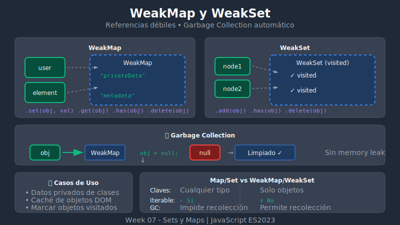

# 🔗 WeakSet y WeakMap



## 🎯 Objetivos

- Entender las referencias débiles
- Conocer cuándo usar WeakSet y WeakMap
- Aplicar en casos de privacidad y caché

## 📋 Contenido

### 1. ¿Qué son las Referencias Débiles?

Las colecciones "weak" mantienen **referencias débiles** a sus claves/valores. Esto significa que **no impiden la recolección de basura** (garbage collection).

```javascript
// Con Map normal
let obj = { name: 'Alice' };
const normalMap = new Map();
normalMap.set(obj, 'metadata');

obj = null; // El objeto NO es recolectado porque Map lo referencia

// Con WeakMap
let obj2 = { name: 'Bob' };
const weakMap = new WeakMap();
weakMap.set(obj2, 'metadata');

obj2 = null; // El objeto PUEDE ser recolectado, WeakMap no lo impide
```

### 2. WeakMap

Un **WeakMap** es como Map pero:
- Las claves **deben ser objetos o Symbols** (no primitivos como strings o números)
- Las claves son **referencias débiles**
- **No es iterable** (no tiene `keys()`, `values()`, `entries()`)
- **No tiene `size`**

```javascript
const weakMap = new WeakMap();

// ✅ Objetos como claves
const user = { id: 1 };
const element = document.createElement('div');

weakMap.set(user, 'user data');
weakMap.set(element, { clicks: 0 });

// ❌ Primitivos string/number NO permitidos como claves
// weakMap.set('string', 'value'); // TypeError
// weakMap.set(123, 'value');      // TypeError

// Métodos disponibles (solo 4)
weakMap.get(user);     // 'user data'
weakMap.has(user);     // true
weakMap.delete(user);  // true
weakMap.set(user, 'new data');

// ❌ NO disponibles
// weakMap.keys()
// weakMap.values()
// weakMap.entries()
// weakMap.forEach()
// weakMap.size
// weakMap.clear()
```

---

### 2.1. Symbols como Claves en WeakMap (ES2023)

Desde **ES2023**, los **Symbols** también pueden usarse como claves en WeakMap:

```javascript
const weakMap = new WeakMap();

// ✅ ES2023: Symbols permitidos como claves
const secretKey = Symbol('secret');
const configKey = Symbol('config');

weakMap.set(secretKey, 'valor secreto');
weakMap.set(configKey, { debug: true });

console.log(weakMap.get(secretKey));  // 'valor secreto'
console.log(weakMap.has(configKey));  // true

// ⚠️ Nota: Solo Symbols NO registrados funcionan
// Symbols creados con Symbol.for() NO son válidos porque son globales
const globalSymbol = Symbol.for('global');
// weakMap.set(globalSymbol, 'value'); // TypeError - símbolos globales no permitidos
```

#### ¿Por Qué Symbols en WeakMap?

```javascript
// Caso de uso: Claves privadas sin riesgo de colisión
const privateDataKey = Symbol('privateData');
const metadataKey = Symbol('metadata');

const registry = new WeakMap();

class SecureStorage {
  constructor(data) {
    // Usar Symbol como clave garantiza unicidad
    registry.set(privateDataKey, new Map());
    registry.get(privateDataKey).set(this, data);
  }

  getData() {
    return registry.get(privateDataKey).get(this);
  }
}

// Otro caso: Metadatos sin exponer la referencia del objeto
const addMetadata = (symbolKey, value) => {
  if (typeof symbolKey !== 'symbol') {
    throw new TypeError('Key must be a Symbol');
  }
  registry.set(symbolKey, value);
};

const mySymbol = Symbol('myData');
addMetadata(mySymbol, { timestamp: Date.now() });
console.log(registry.get(mySymbol));  // { timestamp: ... }
```

#### Comparación de Claves Válidas

```javascript
const weakMap = new WeakMap();

// ✅ Objetos - siempre válidos
weakMap.set({}, 'object');
weakMap.set([], 'array');
weakMap.set(function() {}, 'function');
weakMap.set(new Date(), 'date');

// ✅ Symbols (ES2023) - válidos si no son globales
weakMap.set(Symbol('local'), 'local symbol');
weakMap.set(Symbol.iterator, 'well-known symbol'); // ✅ Well-known symbols OK

// ❌ Symbols globales - NO válidos
// weakMap.set(Symbol.for('global'), 'value'); // TypeError

// ❌ Primitivos - nunca válidos
// weakMap.set('string', 'value');   // TypeError
// weakMap.set(123, 'value');        // TypeError
// weakMap.set(true, 'value');       // TypeError
// weakMap.set(null, 'value');       // TypeError
// weakMap.set(undefined, 'value');  // TypeError
```

---

### 3. Caso de Uso: Datos Privados

WeakMap es perfecto para almacenar datos privados asociados a objetos:

```javascript
// Patrón de datos privados con WeakMap
const privateData = new WeakMap();

class Person {
  constructor(name, age, ssn) {
    // Datos públicos
    this.name = name;
    this.age = age;

    // Datos privados (no accesibles desde fuera)
    privateData.set(this, {
      ssn,
      createdAt: new Date()
    });
  }

  getSSN(authorized = false) {
    if (!authorized) {
      return '***-**-****';
    }
    return privateData.get(this).ssn;
  }

  getCreationDate() {
    return privateData.get(this).createdAt;
  }
}

const person = new Person('Alice', 30, '123-45-6789');

console.log(person.name);           // 'Alice'
console.log(person.ssn);            // undefined (no existe como propiedad)
console.log(person.getSSN());       // '***-**-****'
console.log(person.getSSN(true));   // '123-45-6789'

// Cuando person se elimina, los datos privados también se limpian
// No hay memory leak
```

### 4. Caso de Uso: Caché sin Memory Leak

```javascript
const cache = new WeakMap();

const processObject = obj => {
  // Verificar si ya procesamos este objeto
  if (cache.has(obj)) {
    console.log('Returning cached result');
    return cache.get(obj);
  }

  // Proceso costoso
  console.log('Processing...');
  const result = {
    ...obj,
    processed: true,
    timestamp: Date.now()
  };

  cache.set(obj, result);
  return result;
};

let myObj = { name: 'test' };

processObject(myObj); // Processing...
processObject(myObj); // Returning cached result

// Cuando myObj se elimina, el caché también se limpia automáticamente
myObj = null;
// El garbage collector limpiará tanto myObj como su entrada en cache
```

### 5. Caso de Uso: Metadata de Elementos DOM

```javascript
const elementData = new WeakMap();

const trackElement = element => {
  elementData.set(element, {
    addedAt: Date.now(),
    clickCount: 0,
    lastInteraction: null
  });
};

const recordClick = element => {
  const data = elementData.get(element);
  if (data) {
    data.clickCount++;
    data.lastInteraction = Date.now();
  }
};

const getElementStats = element => {
  return elementData.get(element);
};

// Uso
const button = document.createElement('button');
trackElement(button);

button.addEventListener('click', () => {
  recordClick(button);
  console.log(getElementStats(button));
});

// Cuando el elemento se remueve del DOM y no hay más referencias,
// los datos asociados se limpian automáticamente
```

### 6. WeakSet

Un **WeakSet** es como Set pero:
- Los valores **deben ser objetos**
- Los valores son **referencias débiles**
- **No es iterable**
- **No tiene `size`**

```javascript
const weakSet = new WeakSet();

const obj1 = { id: 1 };
const obj2 = { id: 2 };

// Métodos disponibles (solo 3)
weakSet.add(obj1);
weakSet.add(obj2);
weakSet.has(obj1);    // true
weakSet.delete(obj1); // true

// ❌ Primitivos NO permitidos
// weakSet.add('string'); // TypeError

// ❌ NO disponibles
// weakSet.keys()
// weakSet.values()
// weakSet.forEach()
// weakSet.size
// weakSet.clear()
```

### 7. Caso de Uso: Marcar Objetos como "Visitados"

```javascript
const visited = new WeakSet();

const processTree = node => {
  // Evitar ciclos infinitos
  if (visited.has(node)) {
    console.log('Already visited:', node.name);
    return;
  }

  visited.add(node);
  console.log('Processing:', node.name);

  // Procesar hijos
  if (node.children) {
    node.children.forEach(processTree);
  }
};

// Árbol con referencia circular
const nodeA = { name: 'A', children: [] };
const nodeB = { name: 'B', children: [] };
const nodeC = { name: 'C', children: [] };

nodeA.children.push(nodeB, nodeC);
nodeB.children.push(nodeC);
nodeC.children.push(nodeA); // ¡Referencia circular!

processTree(nodeA);
// Processing: A
// Processing: B
// Processing: C
// Already visited: A (evita ciclo infinito)
```

### 8. Caso de Uso: Validar Objetos "Branded"

```javascript
const validUsers = new WeakSet();

class User {
  constructor(name, email) {
    this.name = name;
    this.email = email;
    // Marcar como válido
    validUsers.add(this);
  }
}

const isValidUser = obj => validUsers.has(obj);

const performAction = user => {
  if (!isValidUser(user)) {
    throw new Error('Invalid user object');
  }
  console.log(`Action performed for ${user.name}`);
};

const realUser = new User('Alice', 'alice@example.com');
const fakeUser = { name: 'Fake', email: 'fake@example.com' };

performAction(realUser); // Action performed for Alice
performAction(fakeUser); // Error: Invalid user object
```

### 9. Comparación: Map/Set vs WeakMap/WeakSet

| Característica | Map/Set | WeakMap/WeakSet |
|----------------|---------|-----------------|
| Claves/Valores | Cualquier tipo | Solo objetos |
| Referencias | Fuertes | Débiles |
| Iterable | ✅ Sí | ❌ No |
| `size` | ✅ Sí | ❌ No |
| `clear()` | ✅ Sí | ❌ No |
| `keys()`, `values()` | ✅ Sí | ❌ No |
| Memory leak risk | ⚠️ Posible | ✅ No |
| Garbage collection | Manual | Automático |

### 10. Cuándo Usar Cada Uno

```javascript
// ✅ Usar Map cuando:
// - Necesitas iterar sobre las entradas
// - Necesitas saber el tamaño
// - Las claves son primitivos
// - Necesitas serializar (JSON)

// ✅ Usar WeakMap cuando:
// - Almacenas metadata de objetos
// - No quieres impedir garbage collection
// - No necesitas iterar
// - Datos privados de clases

// ✅ Usar Set cuando:
// - Necesitas valores únicos de cualquier tipo
// - Necesitas iterar o conocer el tamaño
// - Necesitas operaciones de conjuntos

// ✅ Usar WeakSet cuando:
// - Necesitas marcar objetos (visitados, válidos, etc.)
// - No quieres impedir garbage collection
// - No necesitas iterar ni conocer el tamaño
```

## 💡 Patrón Completo: Clase con Datos Privados

```javascript
// Almacén privado
const _private = new WeakMap();

class BankAccount {
  constructor(owner, initialBalance = 0) {
    this.owner = owner;

    // Datos privados
    _private.set(this, {
      balance: initialBalance,
      transactions: [],
      pin: Math.floor(1000 + Math.random() * 9000)
    });
  }

  deposit(amount) {
    if (amount <= 0) throw new Error('Amount must be positive');

    const data = _private.get(this);
    data.balance += amount;
    data.transactions.push({ type: 'deposit', amount, date: new Date() });

    return this;
  }

  withdraw(amount, pin) {
    const data = _private.get(this);

    if (pin !== data.pin) throw new Error('Invalid PIN');
    if (amount > data.balance) throw new Error('Insufficient funds');

    data.balance -= amount;
    data.transactions.push({ type: 'withdraw', amount, date: new Date() });

    return this;
  }

  getBalance(pin) {
    const data = _private.get(this);
    if (pin !== data.pin) throw new Error('Invalid PIN');
    return data.balance;
  }

  getTransactionCount() {
    return _private.get(this).transactions.length;
  }
}

const account = new BankAccount('Alice', 1000);
account.deposit(500);

// Los datos privados no son accesibles
console.log(account.balance);      // undefined
console.log(account.pin);          // undefined
console.log(account.transactions); // undefined

// Solo mediante métodos autorizados
// console.log(account.getBalance(1234)); // Error: Invalid PIN
```

## ✅ Resumen

| Método | WeakMap | WeakSet |
|--------|---------|---------|
| Agregar | `set(key, value)` | `add(value)` |
| Verificar | `has(key)` | `has(value)` |
| Obtener | `get(key)` | - |
| Eliminar | `delete(key)` | `delete(value)` |

**Casos de uso principales:**
- **WeakMap**: Datos privados, caché de objetos, metadata de elementos
- **WeakSet**: Marcar objetos visitados/válidos, tracking sin memory leak

---

⬅️ [Anterior: Map Avanzado](./04-map-advanced.md) | [Ir a Prácticas](../2-practicas/) ➡️
