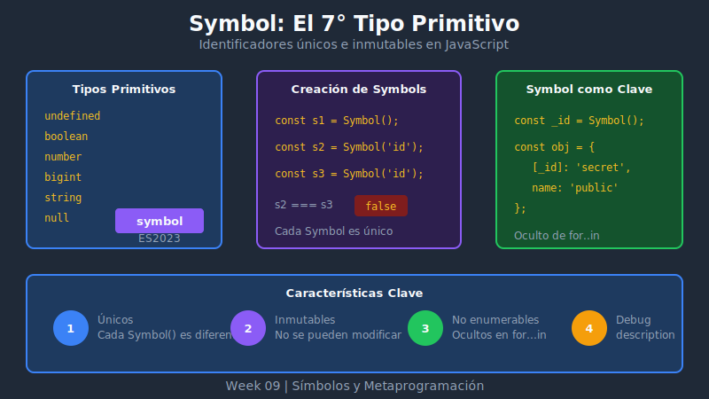

# 🔷 Introducción a Symbols



## 🎯 Objetivos

- Comprender qué son los Symbols y por qué existen
- Crear símbolos únicos con descripción
- Entender la inmutabilidad y unicidad de los símbolos
- Conocer las propiedades básicas de Symbol

---

## 📖 ¿Qué es un Symbol?

**Symbol** es un tipo de dato primitivo introducido en ES2023 que representa un identificador **único e inmutable**.

```javascript
// Crear un símbolo
const mySymbol = Symbol();

// Crear un símbolo con descripción (recomendado)
const id = Symbol('id');
const name = Symbol('name');

console.log(typeof id); // 'symbol'
```

### El Séptimo Tipo Primitivo

JavaScript tiene 7 tipos primitivos:

| Tipo | Ejemplo | Introducido |
|------|---------|-------------|
| `undefined` | `undefined` | ES1 |
| `null` | `null` | ES1 |
| `boolean` | `true`, `false` | ES1 |
| `number` | `42`, `3.14` | ES1 |
| `string` | `'hello'` | ES1 |
| `bigint` | `9007199254740991n` | ES2020 |
| **`symbol`** | `Symbol('id')` | **ES6** |

---

## 🔑 Unicidad Garantizada

La característica principal de los símbolos es que **cada símbolo es único**, incluso si tienen la misma descripción:

```javascript
const sym1 = Symbol('id');
const sym2 = Symbol('id');

console.log(sym1 === sym2); // false
console.log(sym1 == sym2);  // false

// La descripción es solo para debugging, no afecta la identidad
console.log(sym1.description); // 'id'
console.log(sym2.description); // 'id'
```

### ¿Por qué es útil la unicidad?

```javascript
// Problema sin símbolos: colisiones de nombres
const user = {
  id: 1,
  name: 'Alice'
};

// Si una librería externa también usa 'id'...
user.id = 'library-internal-id'; // ¡Sobrescribe nuestro id!

// Solución con símbolos: sin colisiones
const USER_ID = Symbol('user.id');
const LIBRARY_ID = Symbol('library.id');

const safeUser = {
  [USER_ID]: 1,
  [LIBRARY_ID]: 'lib-123',
  name: 'Alice'
};

// Cada símbolo es único, no hay colisión
console.log(safeUser[USER_ID]);    // 1
console.log(safeUser[LIBRARY_ID]); // 'lib-123'
```

---

## 📝 Crear Símbolos

### Sintaxis Básica

```javascript
// Sin descripción (no recomendado)
const sym = Symbol();

// Con descripción (recomendado para debugging)
const id = Symbol('identifier');
const secret = Symbol('secret key');

// La descripción es accesible
console.log(id.description);     // 'identifier'
console.log(secret.description); // 'secret key'
```

### ⚠️ Symbol NO es un Constructor

```javascript
// ❌ ERROR - Symbol no se puede usar con 'new'
const sym = new Symbol('id'); // TypeError!

// ✅ CORRECTO - Llamar como función
const sym = Symbol('id');
```

### Descripción como Herramienta de Debug

```javascript
const _password = Symbol('user.password');
const _token = Symbol('auth.token');

const user = {
  name: 'Alice',
  [_password]: 'secret123',
  [_token]: 'jwt-abc-123'
};

// En la consola, la descripción ayuda a identificar
console.log(_password); // Symbol(user.password)
console.log(_token);    // Symbol(auth.token)
```

---

## 🔧 Símbolos como Claves de Objeto

Los símbolos pueden usarse como claves de propiedades en objetos:

```javascript
const COLOR = Symbol('color');
const SIZE = Symbol('size');

const product = {
  name: 'T-Shirt',
  price: 29.99,
  [COLOR]: 'blue',
  [SIZE]: 'M'
};

// Acceder con el símbolo
console.log(product[COLOR]); // 'blue'
console.log(product[SIZE]);  // 'M'

// ⚠️ No funciona con notación de punto
console.log(product.COLOR); // undefined (busca string 'COLOR')
```

### Propiedades Simbólicas son "Ocultas"

```javascript
const _internal = Symbol('internal');

const obj = {
  visible: 'puedes verme',
  [_internal]: 'soy oculto'
};

// Los símbolos NO aparecen en:
console.log(Object.keys(obj));           // ['visible']
console.log(Object.values(obj));         // ['puedes verme']
console.log(Object.entries(obj));        // [['visible', 'puedes verme']]
console.log(JSON.stringify(obj));        // '{"visible":"puedes verme"}'

// Tampoco en for...in
for (const key in obj) {
  console.log(key); // Solo 'visible'
}

// PERO siguen siendo accesibles
console.log(obj[_internal]); // 'soy oculto'
```

---

## 🔍 Acceder a Propiedades Simbólicas

Aunque los símbolos no aparecen en las enumeraciones normales, **no son privados**:

```javascript
const _secret = Symbol('secret');

const data = {
  public: 'visible',
  [_secret]: 'hidden but accessible'
};

// Object.getOwnPropertySymbols() - obtiene símbolos
const symbols = Object.getOwnPropertySymbols(data);
console.log(symbols); // [Symbol(secret)]
console.log(data[symbols[0]]); // 'hidden but accessible'

// Reflect.ownKeys() - obtiene TODO (strings + symbols)
console.log(Reflect.ownKeys(data)); // ['public', Symbol(secret)]
```

---

## 📊 Symbol vs String como Clave

| Característica | String | Symbol |
|---------------|--------|--------|
| Unicidad | No garantizada | Siempre única |
| Colisión posible | Sí | No |
| En Object.keys() | Sí | No |
| En for...in | Sí | No |
| En JSON.stringify() | Sí | No |
| Uso típico | Propiedades públicas | Propiedades "ocultas" |

```javascript
// String: puede colisionar
const obj1 = { id: 1 };
const obj2 = { id: 2 };
// Si mezclamos, uno sobrescribe al otro

// Symbol: nunca colisiona
const ID_A = Symbol('id');
const ID_B = Symbol('id');
const obj3 = {
  [ID_A]: 1,
  [ID_B]: 2
};
console.log(obj3[ID_A]); // 1
console.log(obj3[ID_B]); // 2
```

---

## 💡 Casos de Uso Comunes

### 1. Evitar Colisiones en Librerías

```javascript
// En tu librería
const INTERNAL_STATE = Symbol('mylib.state');

const createWidget = () => ({
  [INTERNAL_STATE]: { initialized: false },

  init() {
    this[INTERNAL_STATE].initialized = true;
  }
});

// El usuario no puede sobrescribir accidentalmente
const widget = createWidget();
widget.state = 'user state'; // No afecta INTERNAL_STATE
```

### 2. Propiedades "Semi-privadas"

```javascript
const _balance = Symbol('balance');

const createAccount = (initialBalance) => ({
  [_balance]: initialBalance,

  deposit(amount) {
    this[_balance] += amount;
  },

  getBalance() {
    return this[_balance];
  }
});

const account = createAccount(100);
account.deposit(50);
console.log(account.getBalance()); // 150

// No visible en iteraciones normales
console.log(Object.keys(account)); // ['deposit', 'getBalance']
```

### 3. Constantes Únicas (Enum-like)

```javascript
const Status = {
  PENDING: Symbol('pending'),
  APPROVED: Symbol('approved'),
  REJECTED: Symbol('rejected')
};

const processRequest = (status) => {
  switch (status) {
    case Status.PENDING:
      return 'Waiting...';
    case Status.APPROVED:
      return 'Done!';
    case Status.REJECTED:
      return 'Failed';
    default:
      throw new Error('Invalid status');
  }
};

// No puede confundirse con strings
processRequest(Status.APPROVED); // 'Done!'
processRequest('approved');       // Error: Invalid status
```

---

## ⚠️ Limitaciones

### No se Pueden Convertir Automáticamente a String

```javascript
const sym = Symbol('test');

// ❌ ERROR
console.log('Symbol: ' + sym); // TypeError!

// ✅ Conversión explícita
console.log('Symbol: ' + sym.toString());       // 'Symbol: Symbol(test)'
console.log('Symbol: ' + String(sym));          // 'Symbol: Symbol(test)'
console.log(`Symbol: ${sym.description}`);      // 'Symbol: test'
```

### No se Serializan en JSON

```javascript
const data = {
  name: 'Test',
  [Symbol('secret')]: 'hidden'
};

console.log(JSON.stringify(data)); // '{"name":"Test"}'
// El símbolo desaparece
```

---

## ✅ Checklist de Verificación

- [ ] Comprendo que Symbol es un tipo primitivo único
- [ ] Sé crear símbolos con descripción
- [ ] Entiendo que `Symbol('a') !== Symbol('a')`
- [ ] Puedo usar símbolos como claves de objeto
- [ ] Sé que los símbolos no aparecen en Object.keys() ni for...in
- [ ] Conozco Object.getOwnPropertySymbols() para acceder a ellos

---

## 📚 Recursos Adicionales

- [MDN: Symbol](https://developer.mozilla.org/es/docs/Web/JavaScript/Reference/Global_Objects/Symbol)
- [JavaScript.info: Symbol type](https://javascript.info/symbol)

---

[← Volver al índice](../README.md) | [Siguiente: Symbol.for y Registro Global →](02-symbol-for-registry.md)
