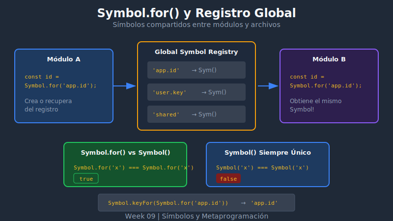

# 🌐 Symbol.for y Registro Global



## 🎯 Objetivos

- Entender la diferencia entre Symbol() y Symbol.for()
- Conocer el registro global de símbolos
- Usar Symbol.keyFor() para obtener claves
- Saber cuándo usar cada tipo de símbolo

---

## 📖 El Problema: Símbolos entre Módulos

Con `Symbol()` cada símbolo es único, pero ¿qué pasa si necesitas compartir un símbolo entre diferentes partes de tu aplicación?

```javascript
// moduleA.js
export const ID = Symbol('id');

// moduleB.js
export const ID = Symbol('id');

// main.js
import { ID as ID_A } from './moduleA.js';
import { ID as ID_B } from './moduleB.js';

console.log(ID_A === ID_B); // false ❌
// Son símbolos diferentes aunque tengan la misma descripción
```

---

## 🔑 Symbol.for(): Símbolos Compartidos

`Symbol.for(key)` crea o recupera un símbolo del **registro global**:

```javascript
// Primera llamada: crea el símbolo y lo registra
const sym1 = Symbol.for('app.id');

// Segunda llamada: recupera el mismo símbolo
const sym2 = Symbol.for('app.id');

console.log(sym1 === sym2); // true ✅
```

### ¿Cómo Funciona?

```
Symbol.for('key')
       │
       ▼
┌─────────────────────────┐
│   Registro Global       │
│   ─────────────────     │
│   'app.id' → Symbol(1)  │
│   'user.token' → Symbol(2) │
└─────────────────────────┘
       │
       ▼
  ¿Existe 'key'?
   /         \
  Sí          No
  │           │
  ▼           ▼
Retorna    Crea nuevo,
existente  registra y retorna
```

---

## 📝 Sintaxis

```javascript
// Crear/obtener símbolo del registro
const sym = Symbol.for('mi.clave');

// Obtener la clave de un símbolo registrado
const key = Symbol.keyFor(sym); // 'mi.clave'
```

---

## 🔄 Symbol() vs Symbol.for()

| Característica | Symbol() | Symbol.for() |
|---------------|----------|--------------|
| Unicidad | Siempre único | Compartido por clave |
| Registro | No registrado | Registro global |
| Acceso | Solo con referencia | Con Symbol.for(key) |
| Uso típico | Privacidad local | Compartir entre módulos |

```javascript
// Symbol() - siempre crea nuevo
const a = Symbol('test');
const b = Symbol('test');
console.log(a === b); // false

// Symbol.for() - reutiliza si existe
const x = Symbol.for('test');
const y = Symbol.for('test');
console.log(x === y); // true
```

---

## 🗝️ Symbol.keyFor()

Obtiene la clave de registro de un símbolo creado con `Symbol.for()`:

```javascript
// Símbolos registrados
const registered = Symbol.for('my.key');
console.log(Symbol.keyFor(registered)); // 'my.key'

// Símbolos NO registrados (Symbol())
const local = Symbol('local');
console.log(Symbol.keyFor(local)); // undefined

// Well-known symbols tampoco están registrados
console.log(Symbol.keyFor(Symbol.iterator)); // undefined
```

---

## 🌍 El Registro es Global

El registro de `Symbol.for()` es **global para todo el runtime**:

```javascript
// En el navegador: compartido entre frames
// En Node.js: compartido entre módulos

// moduleA.js
export const CONFIG = Symbol.for('app.config');

// moduleB.js
const CONFIG = Symbol.for('app.config');
// Es el MISMO símbolo que en moduleA

// Incluso en iframes (navegador)
const sym = Symbol.for('shared');
iframe.contentWindow.Symbol.for('shared') === sym; // true
```

### Convención de Namespacing

Para evitar colisiones en el registro global, usa namespaces:

```javascript
// ✅ BIEN - con namespace
const USER_ID = Symbol.for('myapp.user.id');
const AUTH_TOKEN = Symbol.for('myapp.auth.token');
const CACHE_KEY = Symbol.for('mylib.cache.key');

// ❌ MAL - claves genéricas
const ID = Symbol.for('id');           // Puede colisionar
const TOKEN = Symbol.for('token');     // Muy genérico
```

---

## 💻 Ejemplo Práctico: Plugin System

```javascript
// Sistema de plugins que comparten símbolos

// plugin-system.js
export const PLUGIN_NAME = Symbol.for('plugins.name');
export const PLUGIN_INIT = Symbol.for('plugins.init');
export const PLUGIN_DESTROY = Symbol.for('plugins.destroy');

// my-plugin.js
const PLUGIN_NAME = Symbol.for('plugins.name');
const PLUGIN_INIT = Symbol.for('plugins.init');

export const myPlugin = {
  [PLUGIN_NAME]: 'MyAwesomePlugin',

  [PLUGIN_INIT]() {
    console.log('Plugin initialized!');
  }
};

// app.js
import { PLUGIN_NAME, PLUGIN_INIT } from './plugin-system.js';
import { myPlugin } from './my-plugin.js';

// Funciona porque los símbolos son los mismos
console.log(myPlugin[PLUGIN_NAME]); // 'MyAwesomePlugin'
myPlugin[PLUGIN_INIT]();            // 'Plugin initialized!'
```

---

## 🔍 Cuándo Usar Cada Uno

### Usa `Symbol()` cuando:

```javascript
// 1. Propiedades privadas de un módulo
const _privateState = Symbol('private');

class MyClass {
  constructor() {
    this[_privateState] = {};
  }
}

// 2. Evitar colisiones dentro de un archivo
const ID = Symbol('id');
const NAME = Symbol('name');

// 3. Crear identificadores únicos locales
const createId = () => Symbol('unique.id');
```

### Usa `Symbol.for()` cuando:

```javascript
// 1. Compartir entre módulos sin exportar
// config.js
globalThis.configSymbol = Symbol.for('app.config');

// anywhere.js
const CONFIG = Symbol.for('app.config');

// 2. Protocolos/interfaces de plugins
const SERIALIZABLE = Symbol.for('mylib.serializable');

const isSerializable = obj =>
  typeof obj[SERIALIZABLE] === 'function';

// 3. Comunicación entre iframes/workers
const MESSAGE_TYPE = Symbol.for('app.message.type');
```

---

## ⚠️ Precauciones con Symbol.for()

### El Registro es Persistente

```javascript
// Una vez registrado, permanece en memoria
Symbol.for('key'); // Creado

// No hay forma de "des-registrar" un símbolo
// El registro crece indefinidamente
```

### Evita Claves Dinámicas Ilimitadas

```javascript
// ❌ MAL - crea infinitos símbolos registrados
const getSymbol = (userId) => Symbol.for(`user.${userId}`);
getSymbol(1);    // Registra 'user.1'
getSymbol(2);    // Registra 'user.2'
// ... memory leak potencial

// ✅ BIEN - usa símbolos fijos
const USER_DATA = Symbol.for('app.user.data');
const users = new Map();
users.set(1, { [USER_DATA]: 'data1' });
users.set(2, { [USER_DATA]: 'data2' });
```

---

## 📊 Resumen Visual

```
┌─────────────────────────────────────────────────────────┐
│                    SÍMBOLOS EN JS                        │
├─────────────────────┬───────────────────────────────────┤
│    Symbol()         │        Symbol.for()               │
├─────────────────────┼───────────────────────────────────┤
│ Único cada vez      │ Compartido por clave              │
│ No registrado       │ Registro global                   │
│ keyFor → undefined  │ keyFor → 'clave'                  │
│ Privacidad local    │ Comunicación entre módulos        │
└─────────────────────┴───────────────────────────────────┘

Ejemplo:
  Symbol('a') ≠ Symbol('a')         // Diferentes
  Symbol.for('a') === Symbol.for('a') // Mismos
```

---

## 💡 Pattern: Feature Detection

```javascript
// Definir capacidad con símbolo global
const SUPPORTS_STREAMING = Symbol.for('mylib.supports.streaming');

// Implementación que soporta streaming
const streamingAdapter = {
  [SUPPORTS_STREAMING]: true,
  stream(data) { /* ... */ }
};

// Implementación sin streaming
const basicAdapter = {
  [SUPPORTS_STREAMING]: false,
  fetch(data) { /* ... */ }
};

// Código consumidor
const processData = (adapter, data) => {
  if (adapter[Symbol.for('mylib.supports.streaming')]) {
    return adapter.stream(data);
  }
  return adapter.fetch(data);
};
```

---

## ✅ Checklist de Verificación

- [ ] Entiendo que Symbol.for() usa un registro global
- [ ] Sé que Symbol.for('a') === Symbol.for('a')
- [ ] Puedo usar Symbol.keyFor() para obtener la clave
- [ ] Conozco cuándo usar Symbol() vs Symbol.for()
- [ ] Uso namespacing en las claves de Symbol.for()

---

## 📚 Recursos Adicionales

- [MDN: Symbol.for()](https://developer.mozilla.org/es/docs/Web/JavaScript/Reference/Global_Objects/Symbol/for)
- [MDN: Symbol.keyFor()](https://developer.mozilla.org/es/docs/Web/JavaScript/Reference/Global_Objects/Symbol/keyFor)

---

[← Anterior: Introducción a Symbols](01-symbols-intro.md) | [Siguiente: Well-known Symbols →](03-well-known-symbols.md)
