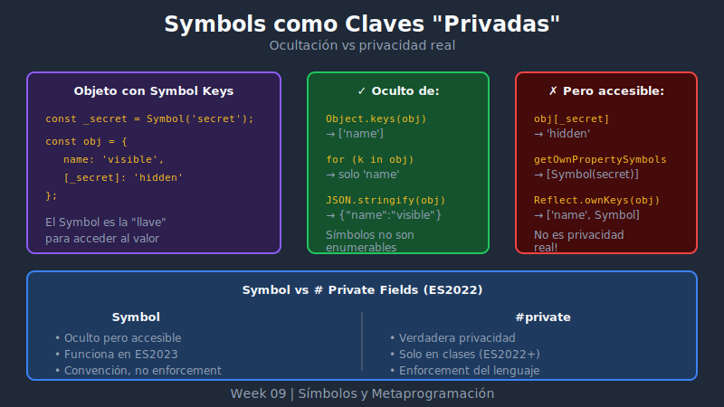

# 🔒 Símbolos como Claves Privadas



## 🎯 Objetivos

- Usar símbolos para crear propiedades "ocultas"
- Entender las limitaciones de la "privacidad" con símbolos
- Comparar símbolos vs # (private fields) vs convención _
- Implementar patrones de encapsulación con símbolos

---

## 📖 El Problema de la Privacidad en JavaScript

JavaScript tradicionalmente no tenía propiedades privadas reales:

```javascript
// Convención con underscore (no es privado)
class User {
  constructor(name) {
    this._name = name;     // "Privado" por convención
    this._password = null; // Cualquiera puede acceder
  }
}

const user = new User('Alice');
console.log(user._password); // Accesible ❌
```

---

## 🔷 Símbolos como Solución Parcial

Los símbolos proporcionan **ocultación**, no privacidad real:

```javascript
// Símbolo definido en el módulo
const _password = Symbol('password');
const _validate = Symbol('validate');

class User {
  constructor(name, password) {
    this.name = name;
    this[_password] = password;
  }

  [_validate](input) {
    return input === this[_password];
  }

  checkPassword(input) {
    return this[_validate](input);
  }
}

const user = new User('Alice', 'secret123');

// Propiedades simbólicas NO aparecen en:
console.log(Object.keys(user));        // ['name']
console.log(JSON.stringify(user));     // '{"name":"Alice"}'

for (const key in user) {
  console.log(key); // Solo 'name'
}

// Pero SI son accesibles si tienes el símbolo
console.log(user[_password]); // 'secret123' (si tienes _password)
```

---

## 🔍 ¿Qué Ocultan los Símbolos?

### Ocultos de:

```javascript
const _secret = Symbol('secret');
const obj = { public: 1, [_secret]: 2 };

// ✅ Oculto de Object.keys()
Object.keys(obj);         // ['public']

// ✅ Oculto de Object.values()
Object.values(obj);       // [1]

// ✅ Oculto de Object.entries()
Object.entries(obj);      // [['public', 1]]

// ✅ Oculto de for...in
for (const k in obj) {}   // Solo 'public'

// ✅ Oculto de JSON.stringify()
JSON.stringify(obj);      // '{"public":1}'

// ✅ Oculto de Object.assign() parcialmente
const copy = Object.assign({}, obj);
Object.keys(copy);        // ['public']
// PERO los símbolos SÍ se copian!
copy[_secret];            // 2
```

### NO Ocultos de:

```javascript
const _secret = Symbol('secret');
const obj = { public: 1, [_secret]: 2 };

// ❌ Visible con Object.getOwnPropertySymbols()
Object.getOwnPropertySymbols(obj); // [Symbol(secret)]

// ❌ Visible con Reflect.ownKeys()
Reflect.ownKeys(obj);              // ['public', Symbol(secret)]

// ❌ Accesible si tienes la referencia
obj[_secret];                      // 2
```

---

## 📊 Comparativa: Métodos de "Privacidad"

| Método | Oculto de keys/for-in | Realmente privado | Soporte |
|--------|----------------------|-------------------|---------|
| `_underscore` | ❌ No | ❌ No | Todos |
| `Symbol()` | ✅ Sí | ❌ No | ES6 |
| `#privateField` | ✅ Sí | ✅ Sí | ES2022+ |
| `WeakMap` | ✅ Sí | ✅ Sí | ES6* |
| Closures | ✅ Sí | ✅ Sí | Todos |

> *Nota: WeakMap es ES6, pero usar **Symbols como claves de WeakMap** es ES2023.

```javascript
// 1. Convención underscore
class A {
  _private = 'visible everywhere';
}

// 2. Símbolos (ocultación)
const _sym = Symbol('private');
class B {
  [_sym] = 'hidden from enumeration';
}

// 3. Private fields (verdadera privacidad)
class C {
  #private = 'truly private';
}

// 4. WeakMap (privacidad por módulo)
const privateData = new WeakMap();
class D {
  constructor() {
    privateData.set(this, { secret: 'truly private' });
  }
}
```

---

## 💻 Patrón: Módulo con Símbolos Privados

```javascript
// user.js
const _id = Symbol('id');
const _createdAt = Symbol('createdAt');
const _generateId = Symbol('generateId');

export class User {
  constructor(name, email) {
    this.name = name;
    this.email = email;
    this[_id] = this[_generateId]();
    this[_createdAt] = new Date();
  }

  [_generateId]() {
    return Math.random().toString(36).substr(2, 9);
  }

  // Métodos públicos que usan datos privados
  getId() {
    return this[_id];
  }

  getAge() {
    return Date.now() - this[_createdAt].getTime();
  }

  toJSON() {
    // Controlamos qué se serializa
    return {
      name: this.name,
      email: this.email
    };
  }
}

// main.js
import { User } from './user.js';

const user = new User('Alice', 'alice@example.com');

// API pública
console.log(user.getId());  // 'abc123xyz'
console.log(user.name);     // 'Alice'

// Datos internos ocultos
console.log(Object.keys(user)); // ['name', 'email']
console.log(JSON.stringify(user)); // '{"name":"Alice","email":"alice@example.com"}'

// No hay forma de acceder a _id sin el símbolo
// (a menos que uses Object.getOwnPropertySymbols)
```

---

## 🔧 Patrón: Factory con Símbolos

```javascript
// Símbolos en el scope del módulo
const _balance = Symbol('balance');
const _transactions = Symbol('transactions');
const _validate = Symbol('validate');

export const createAccount = (initialBalance = 0) => {
  const account = {
    // Datos "privados"
    [_balance]: initialBalance,
    [_transactions]: [],

    // Método "privado"
    [_validate](amount) {
      if (typeof amount !== 'number' || amount <= 0) {
        throw new Error('Invalid amount');
      }
    },

    // API pública
    deposit(amount) {
      this[_validate](amount);
      this[_balance] += amount;
      this[_transactions].push({ type: 'deposit', amount, date: new Date() });
    },

    withdraw(amount) {
      this[_validate](amount);
      if (amount > this[_balance]) {
        throw new Error('Insufficient funds');
      }
      this[_balance] -= amount;
      this[_transactions].push({ type: 'withdraw', amount, date: new Date() });
    },

    getBalance() {
      return this[_balance];
    },

    getTransactionCount() {
      return this[_transactions].length;
    }
  };

  return account;
};

// Uso
const myAccount = createAccount(100);
myAccount.deposit(50);
myAccount.withdraw(30);

console.log(myAccount.getBalance());         // 120
console.log(myAccount.getTransactionCount()); // 2
console.log(Object.keys(myAccount));
// ['deposit', 'withdraw', 'getBalance', 'getTransactionCount']
```

---

## ⚠️ Advertencias Importantes

### 1. No es Seguridad Real

```javascript
const _secret = Symbol('secret');
const obj = { [_secret]: 'hidden' };

// Cualquiera puede descubrir y acceder
const symbols = Object.getOwnPropertySymbols(obj);
console.log(obj[symbols[0]]); // 'hidden'
```

### 2. Los Símbolos se Copian

```javascript
const _data = Symbol('data');
const original = { [_data]: 'sensitive' };

// Object.assign copia símbolos
const copy = Object.assign({}, original);
console.log(copy[_data]); // 'sensitive'

// Spread también copia símbolos
const spread = { ...original };
console.log(spread[_data]); // 'sensitive'
```

### 3. Accesibles en Herencia

```javascript
const _internal = Symbol('internal');

class Parent {
  constructor() {
    this[_internal] = 'parent data';
  }
}

class Child extends Parent {
  showInternal() {
    // Accesible si Child conoce el símbolo
    return this[_internal];
  }
}
```

---

## ✅ Cuándo Usar Símbolos para "Privacidad"

### ✅ Buenos Casos de Uso

```javascript
// 1. Ocultar detalles de implementación de enumeraciones
const _cache = Symbol('cache');
const obj = {
  data: [1, 2, 3],
  [_cache]: null,

  getProcessed() {
    if (!this[_cache]) {
      this[_cache] = this.data.map(x => x * 2);
    }
    return this[_cache];
  }
};

// 2. Evitar colisiones en librerías
const LIBRARY_STATE = Symbol('mylib.internal.state');

// 3. Metadatos que no deben serializarse
const _metadata = Symbol('metadata');
const record = {
  name: 'Product',
  price: 100,
  [_metadata]: { lastUpdated: Date.now() }
};
JSON.stringify(record); // '{"name":"Product","price":100}'
```

### ❌ No Usar Cuando Necesitas Seguridad Real

```javascript
// Para datos sensibles, usa #privateFields
class SecureUser {
  #password;
  #ssn;

  constructor(password, ssn) {
    this.#password = password;
    this.#ssn = ssn;
  }

  // Verdaderamente privados - no hay forma de acceder desde fuera
}
```

---

## 💡 Best Practices

```javascript
// 1. Usa prefijo descriptivo
const _userId = Symbol('user.id');
const _accountBalance = Symbol('account.balance');

// 2. Agrupa símbolos relacionados
const UserSymbols = {
  id: Symbol('user.id'),
  createdAt: Symbol('user.createdAt'),
  validate: Symbol('user.validate')
};

// 3. Documenta el propósito
/**
 * Internal state symbol - stores cached computations
 * @private
 */
const _cache = Symbol('internal.cache');

// 4. Considera exportar para testing
export const __testing__ = {
  _password: _password // Solo en desarrollo
};
```

---

## ✅ Checklist de Verificación

- [ ] Entiendo que los símbolos ocultan pero no son privados
- [ ] Sé de qué están ocultas las propiedades simbólicas
- [ ] Conozco las alternativas (_, #, WeakMap, closures)
- [ ] Puedo implementar el patrón de módulo con símbolos
- [ ] Sé cuándo usar símbolos vs private fields

---

## 📚 Recursos Adicionales

- [MDN: Private class features](https://developer.mozilla.org/en-US/docs/Web/JavaScript/Reference/Classes/Private_class_fields)
- [JavaScript.info: Property flags and descriptors](https://javascript.info/property-descriptors)

---

[← Anterior: Well-known Symbols](03-well-known-symbols.md) | [Siguiente: Object.getOwnPropertySymbols →](05-get-own-property-symbols.md)
