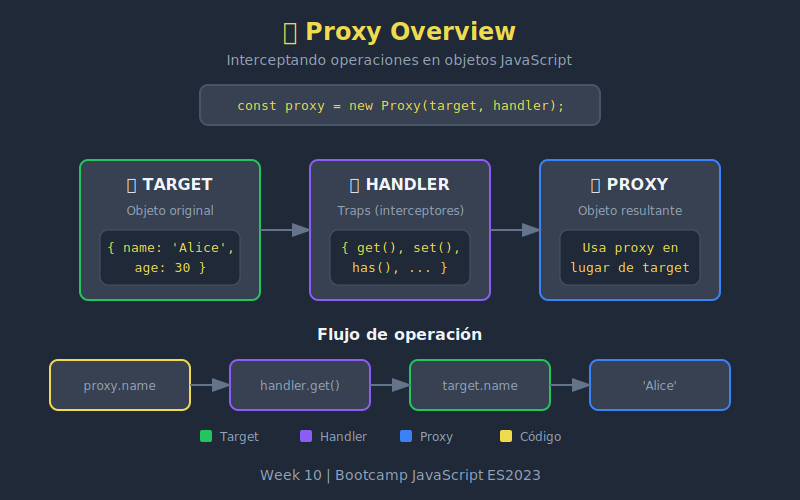

# 🎭 Introducción a Proxy



## 🎯 Objetivos

- Comprender qué es un Proxy y para qué sirve
- Crear Proxies básicos con target y handler
- Entender el concepto de intercepción de operaciones
- Conocer los casos de uso más comunes

---

## 📖 ¿Qué es un Proxy?

Un **Proxy** es un objeto que envuelve otro objeto (llamado **target**) y permite interceptar y redefinir operaciones fundamentales como leer propiedades, escribir, enumerar, etc.

```javascript
// Sintaxis básica
const proxy = new Proxy(target, handler);
```

### Componentes

| Componente | Descripción |
|------------|-------------|
| `target` | El objeto original que se envuelve |
| `handler` | Objeto con "traps" (funciones interceptoras) |
| `proxy` | El objeto resultante que usamos |

---

## 🔧 Tu Primer Proxy

### Proxy Vacío (Transparente)

```javascript
const user = {
  name: 'Alice',
  age: 30
};

// Handler vacío = proxy transparente
const proxy = new Proxy(user, {});

// Se comporta exactamente como el original
console.log(proxy.name); // 'Alice'
proxy.age = 31;
console.log(user.age);   // 31 - el target también cambia
```

### Proxy con Intercepción

```javascript
const user = {
  name: 'Alice',
  age: 30
};

const handler = {
  get(target, property) {
    console.log(`Leyendo propiedad: ${property}`);
    return target[property];
  }
};

const proxy = new Proxy(user, handler);

console.log(proxy.name);
// Log: "Leyendo propiedad: name"
// Retorna: 'Alice'
```

---

## 🎯 Casos de Uso

### 1. Logging y Debugging

```javascript
const createLogger = obj => {
  return new Proxy(obj, {
    get(target, prop) {
      console.log(`[GET] ${prop}`);
      return target[prop];
    },
    set(target, prop, value) {
      console.log(`[SET] ${prop} = ${value}`);
      target[prop] = value;
      return true;
    }
  });
};

const user = createLogger({ name: 'Bob', score: 0 });
user.score = 100;  // [SET] score = 100
console.log(user.score); // [GET] score → 100
```

### 2. Validación de Datos

```javascript
const createValidated = obj => {
  return new Proxy(obj, {
    set(target, prop, value) {
      if (prop === 'age' && typeof value !== 'number') {
        throw new TypeError('age must be a number');
      }
      if (prop === 'age' && value < 0) {
        throw new RangeError('age must be positive');
      }
      target[prop] = value;
      return true;
    }
  });
};

const user = createValidated({ name: 'Alice', age: 30 });
user.age = 31;      // ✅ OK
user.age = -5;      // ❌ RangeError
user.age = 'thirty'; // ❌ TypeError
```

### 3. Valores por Defecto

```javascript
const withDefaults = (obj, defaults) => {
  return new Proxy(obj, {
    get(target, prop) {
      if (prop in target) {
        return target[prop];
      }
      return defaults[prop];
    }
  });
};

const config = withDefaults(
  { theme: 'dark' },
  { theme: 'light', language: 'es', timeout: 5000 }
);

console.log(config.theme);    // 'dark' (del objeto)
console.log(config.language); // 'es' (del default)
console.log(config.timeout);  // 5000 (del default)
```

### 4. Propiedades Computadas

```javascript
const rectangle = new Proxy(
  { width: 10, height: 5 },
  {
    get(target, prop) {
      if (prop === 'area') {
        return target.width * target.height;
      }
      if (prop === 'perimeter') {
        return 2 * (target.width + target.height);
      }
      return target[prop];
    }
  }
);

console.log(rectangle.width);     // 10
console.log(rectangle.area);      // 50 (computado)
console.log(rectangle.perimeter); // 30 (computado)
```

---

## 🔄 Proxy vs Target

### Identidad

```javascript
const target = { x: 1 };
const proxy = new Proxy(target, {});

console.log(proxy === target); // false
console.log(proxy.x === target.x); // true
```

### Modificaciones

```javascript
const target = { count: 0 };
const proxy = new Proxy(target, {});

proxy.count = 5;
console.log(target.count); // 5 - target modificado

target.count = 10;
console.log(proxy.count);  // 10 - proxy refleja cambios
```

---

## 🚫 Proxy Revocable

Puedes crear un Proxy que se puede "desactivar":

```javascript
const target = { secret: 'password123' };

const { proxy, revoke } = Proxy.revocable(target, {
  get(target, prop) {
    return target[prop];
  }
});

console.log(proxy.secret); // 'password123'

// Revocar el proxy
revoke();

// Cualquier operación lanzará error
console.log(proxy.secret); // TypeError: Cannot perform 'get' on a proxy that has been revoked
```

### Caso de Uso: Acceso Temporal

```javascript
const createTemporaryAccess = (data, duration) => {
  const { proxy, revoke } = Proxy.revocable(data, {});

  setTimeout(() => {
    console.log('Access revoked');
    revoke();
  }, duration);

  return proxy;
};

const sensitiveData = { apiKey: 'sk-123' };
const tempAccess = createTemporaryAccess(sensitiveData, 5000);

// Funciona por 5 segundos
console.log(tempAccess.apiKey); // 'sk-123'

// Después de 5 segundos, cualquier acceso falla
```

---

## 📊 Proxy con Arrays

Los Proxies también funcionan con arrays:

```javascript
const numbers = [1, 2, 3];

const proxy = new Proxy(numbers, {
  get(target, prop) {
    // Permitir índices negativos
    const index = Number(prop);
    if (index < 0) {
      return target[target.length + index];
    }
    return target[prop];
  }
});

console.log(proxy[0]);   // 1
console.log(proxy[-1]);  // 3 (último elemento)
console.log(proxy[-2]);  // 2 (penúltimo)
```

### Array con Validación de Tipo

```javascript
const typedArray = (type) => {
  return new Proxy([], {
    set(target, prop, value) {
      if (prop !== 'length' && typeof value !== type) {
        throw new TypeError(`Expected ${type}, got ${typeof value}`);
      }
      target[prop] = value;
      return true;
    }
  });
};

const numbers = typedArray('number');
numbers.push(1);    // ✅
numbers.push(2);    // ✅
numbers.push('3');  // ❌ TypeError
```

---

## ⚠️ Consideraciones

### Rendimiento

```javascript
// Los Proxies tienen overhead
// Úsalos cuando el beneficio justifique el costo

// ❌ Evitar en hot paths
for (let i = 0; i < 1000000; i++) {
  proxy.value; // Cada acceso pasa por el trap
}

// ✅ Mejor para operaciones menos frecuentes
const config = new Proxy(settings, handler);
// Accesos ocasionales están bien
```

### Invariantes

Algunos comportamientos no se pueden cambiar:

```javascript
const obj = {};
Object.defineProperty(obj, 'fixed', {
  value: 42,
  writable: false,
  configurable: false
});

const proxy = new Proxy(obj, {
  get(target, prop) {
    return 'intercepted';
  }
});

// El proxy debe respetar la propiedad no-configurable
console.log(proxy.fixed); // 42, NO 'intercepted'
```

---

## 💡 Buenas Prácticas

### 1. Usa Reflect en los Traps

```javascript
// ✅ BIEN - usar Reflect
const handler = {
  get(target, prop, receiver) {
    console.log(`Getting ${prop}`);
    return Reflect.get(target, prop, receiver);
  }
};

// ❌ MAL - acceso directo
const handler = {
  get(target, prop) {
    console.log(`Getting ${prop}`);
    return target[prop]; // Puede fallar con getters
  }
};
```

### 2. Retorna `true` en `set`

```javascript
// ✅ BIEN
set(target, prop, value) {
  target[prop] = value;
  return true; // Indica éxito
}

// ❌ MAL - puede causar TypeError en strict mode
set(target, prop, value) {
  target[prop] = value;
  // Sin return = undefined = false
}
```

### 3. Documenta el Comportamiento

```javascript
/**
 * Creates a proxy that logs all property access
 * @param {Object} obj - The target object
 * @returns {Proxy} Logged proxy
 */
const createLoggedProxy = obj => {
  return new Proxy(obj, {
    get(target, prop, receiver) {
      console.log(`[${new Date().toISOString()}] GET ${String(prop)}`);
      return Reflect.get(target, prop, receiver);
    }
  });
};
```

---

## 🧪 Ejercicio Rápido

Crea un Proxy que:
1. Haga todas las propiedades de solo lectura
2. Registre intentos de escritura

```javascript
const createReadOnly = obj => {
  return new Proxy(obj, {
    set(target, prop, value) {
      console.warn(`Attempt to set ${prop} to ${value} blocked`);
      return true; // No lanzar error, solo ignorar
    },
    deleteProperty(target, prop) {
      console.warn(`Attempt to delete ${prop} blocked`);
      return true;
    }
  });
};

const config = createReadOnly({ apiUrl: 'https://api.com' });
config.apiUrl = 'hacked'; // Warning: Attempt to set apiUrl...
console.log(config.apiUrl); // 'https://api.com' (sin cambios)
```

---

## 📚 Resumen

| Concepto | Descripción |
|----------|-------------|
| `new Proxy(target, handler)` | Crea un proxy |
| `target` | Objeto original envuelto |
| `handler` | Objeto con traps |
| `trap` | Función que intercepta operación |
| `Proxy.revocable()` | Proxy que se puede desactivar |

---

## 🔗 Recursos

- [MDN: Proxy](https://developer.mozilla.org/es/docs/Web/JavaScript/Reference/Global_Objects/Proxy)
- [JavaScript.info: Proxy](https://javascript.info/proxy)

---

_Week 10 | Bootcamp JavaScript ES2023_
