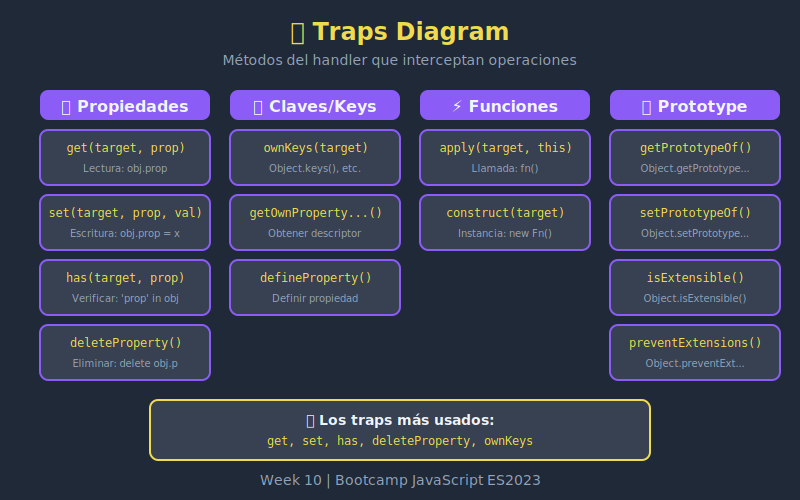

# 🪤 Traps Básicos



## 🎯 Objetivos

- Dominar los traps más utilizados (get, set, has)
- Implementar deleteProperty y ownKeys
- Conocer apply y construct para funciones
- Entender los parámetros de cada trap

---

## 📖 ¿Qué son los Traps?

Los **traps** son métodos del handler que interceptan operaciones específicas sobre el proxy. Cada operación fundamental tiene su trap correspondiente.

```javascript
const handler = {
  get(target, prop, receiver) { /* ... */ },
  set(target, prop, value, receiver) { /* ... */ },
  has(target, prop) { /* ... */ },
  // ... más traps
};
```

---

## 🔍 Trap: `get`

Intercepta la lectura de propiedades.

### Sintaxis

```javascript
get(target, property, receiver)
```

| Parámetro | Descripción |
|-----------|-------------|
| `target` | Objeto original |
| `property` | Nombre de la propiedad (string o Symbol) |
| `receiver` | El proxy o un objeto que hereda del proxy |

### Ejemplos

#### Básico

```javascript
const user = { name: 'Alice', age: 30 };

const proxy = new Proxy(user, {
  get(target, prop, receiver) {
    console.log(`Accediendo a "${prop}"`);
    return target[prop];
  }
});

proxy.name; // Log: Accediendo a "name" → 'Alice'
proxy.age;  // Log: Accediendo a "age" → 30
```

#### Propiedades No Existentes

```javascript
const proxy = new Proxy({}, {
  get(target, prop) {
    if (!(prop in target)) {
      throw new ReferenceError(`Property "${prop}" does not exist`);
    }
    return target[prop];
  }
});

proxy.name; // ReferenceError: Property "name" does not exist
```

#### Propiedades Negativas en Arrays

```javascript
const negativeArray = arr => new Proxy(arr, {
  get(target, prop, receiver) {
    const index = Number(prop);

    if (!isNaN(index) && index < 0) {
      return target[target.length + index];
    }

    return Reflect.get(target, prop, receiver);
  }
});

const arr = negativeArray([1, 2, 3, 4, 5]);
console.log(arr[-1]); // 5
console.log(arr[-2]); // 4
```

---

## ✏️ Trap: `set`

Intercepta la escritura de propiedades.

### Sintaxis

```javascript
set(target, property, value, receiver)
```

| Parámetro | Descripción |
|-----------|-------------|
| `target` | Objeto original |
| `property` | Nombre de la propiedad |
| `value` | Valor a asignar |
| `receiver` | El proxy |

**⚠️ Debe retornar `true` si la asignación fue exitosa, `false` si no.**

### Ejemplos

#### Validación de Tipos

```javascript
const typed = (obj, schema) => new Proxy(obj, {
  set(target, prop, value) {
    const expectedType = schema[prop];

    if (expectedType && typeof value !== expectedType) {
      throw new TypeError(
        `${prop} must be ${expectedType}, got ${typeof value}`
      );
    }

    target[prop] = value;
    return true;
  }
});

const user = typed({}, {
  name: 'string',
  age: 'number',
  active: 'boolean'
});

user.name = 'Alice';   // ✅
user.age = 30;         // ✅
user.age = 'thirty';   // ❌ TypeError
```

#### Validación de Rango

```javascript
const rangeValidator = (min, max) => ({
  set(target, prop, value) {
    if (typeof value === 'number') {
      if (value < min || value > max) {
        throw new RangeError(`Value must be between ${min} and ${max}`);
      }
    }
    target[prop] = value;
    return true;
  }
});

const score = new Proxy({}, rangeValidator(0, 100));
score.math = 85;  // ✅
score.math = 150; // ❌ RangeError
```

#### Notificación de Cambios

```javascript
const observable = obj => {
  const listeners = [];

  const proxy = new Proxy(obj, {
    set(target, prop, value) {
      const oldValue = target[prop];
      target[prop] = value;

      // Notificar a todos los listeners
      listeners.forEach(fn => fn(prop, value, oldValue));

      return true;
    }
  });

  proxy.subscribe = fn => listeners.push(fn);
  return proxy;
};

const user = observable({ name: 'Alice' });

user.subscribe((prop, newVal, oldVal) => {
  console.log(`${prop}: ${oldVal} → ${newVal}`);
});

user.name = 'Bob'; // Log: name: Alice → Bob
```

---

## ❓ Trap: `has`

Intercepta el operador `in`.

### Sintaxis

```javascript
has(target, property)
```

**Debe retornar `true` o `false`.**

### Ejemplos

#### Ocultar Propiedades Privadas

```javascript
const hidePrivate = obj => new Proxy(obj, {
  has(target, prop) {
    if (prop.startsWith('_')) {
      return false; // Ocultar propiedades que empiezan con _
    }
    return prop in target;
  }
});

const user = hidePrivate({
  name: 'Alice',
  _password: 'secret123'
});

console.log('name' in user);      // true
console.log('_password' in user); // false (oculto)
```

#### Verificación en Rango

```javascript
const range = (min, max) => new Proxy({}, {
  has(target, prop) {
    const num = Number(prop);
    return num >= min && num <= max;
  }
});

const validAge = range(18, 65);

console.log(25 in validAge);  // true
console.log(10 in validAge);  // false
console.log(70 in validAge);  // false
```

---

## 🗑️ Trap: `deleteProperty`

Intercepta el operador `delete`.

### Sintaxis

```javascript
deleteProperty(target, property)
```

**Debe retornar `true` si se eliminó, `false` si no.**

### Ejemplos

#### Propiedades No Eliminables

```javascript
const protect = (obj, protectedProps) => new Proxy(obj, {
  deleteProperty(target, prop) {
    if (protectedProps.includes(prop)) {
      console.warn(`Cannot delete protected property: ${prop}`);
      return false;
    }
    return delete target[prop];
  }
});

const config = protect(
  { apiUrl: 'https://api.com', debug: true },
  ['apiUrl']
);

delete config.debug;  // ✅ Eliminado
delete config.apiUrl; // ⚠️ Warning, no eliminado
```

#### Logging de Eliminaciones

```javascript
const logDeletes = obj => new Proxy(obj, {
  deleteProperty(target, prop) {
    console.log(`[DELETE] Removing property: ${prop}`);
    return delete target[prop];
  }
});
```

---

## 🔑 Trap: `ownKeys`

Intercepta `Object.keys()`, `Object.getOwnPropertyNames()`, etc.

### Sintaxis

```javascript
ownKeys(target)
```

**Debe retornar un array de strings/symbols.**

### Ejemplos

#### Filtrar Propiedades Privadas

```javascript
const hidePrivate = obj => new Proxy(obj, {
  ownKeys(target) {
    return Object.keys(target).filter(key => !key.startsWith('_'));
  }
});

const user = hidePrivate({
  name: 'Alice',
  email: 'alice@test.com',
  _password: 'secret',
  _token: 'abc123'
});

console.log(Object.keys(user)); // ['name', 'email']
```

#### Ordenar Claves

```javascript
const sortedKeys = obj => new Proxy(obj, {
  ownKeys(target) {
    return Object.keys(target).sort();
  }
});

const obj = sortedKeys({ zebra: 1, apple: 2, mango: 3 });
console.log(Object.keys(obj)); // ['apple', 'mango', 'zebra']
```

---

## 📞 Trap: `apply`

Intercepta llamadas a funciones.

### Sintaxis

```javascript
apply(target, thisArg, argumentsList)
```

| Parámetro | Descripción |
|-----------|-------------|
| `target` | La función original |
| `thisArg` | El valor de `this` |
| `argumentsList` | Array de argumentos |

### Ejemplos

#### Logging de Llamadas

```javascript
const logCalls = fn => new Proxy(fn, {
  apply(target, thisArg, args) {
    console.log(`Calling ${target.name} with args:`, args);
    const result = target.apply(thisArg, args);
    console.log(`Result:`, result);
    return result;
  }
});

const add = (a, b) => a + b;
const loggedAdd = logCalls(add);

loggedAdd(2, 3);
// Log: Calling add with args: [2, 3]
// Log: Result: 5
```

#### Memoización

```javascript
const memoize = fn => {
  const cache = new Map();

  return new Proxy(fn, {
    apply(target, thisArg, args) {
      const key = JSON.stringify(args);

      if (cache.has(key)) {
        console.log('Cache hit!');
        return cache.get(key);
      }

      const result = target.apply(thisArg, args);
      cache.set(key, result);
      return result;
    }
  });
};

const slowFn = n => {
  // Simular operación costosa
  let result = 0;
  for (let i = 0; i < n * 1000000; i++) result += i;
  return result;
};

const fastFn = memoize(slowFn);
fastFn(10); // Lento (primera vez)
fastFn(10); // Rápido (cache hit!)
```

---

## 🏗️ Trap: `construct`

Intercepta el operador `new`.

### Sintaxis

```javascript
construct(target, argumentsList, newTarget)
```

**Debe retornar un objeto.**

### Ejemplos

#### Singleton Pattern

```javascript
const singleton = Class => {
  let instance = null;

  return new Proxy(Class, {
    construct(target, args) {
      if (!instance) {
        instance = new target(...args);
      }
      return instance;
    }
  });
};

class Database {
  constructor(url) {
    this.url = url;
    console.log('Creating database connection...');
  }
}

const SingletonDB = singleton(Database);

const db1 = new SingletonDB('localhost');
const db2 = new SingletonDB('remote'); // No crea nueva instancia

console.log(db1 === db2); // true
```

#### Validación de Constructor

```javascript
const validateConstruct = (Class, validator) => {
  return new Proxy(Class, {
    construct(target, args) {
      if (!validator(...args)) {
        throw new Error('Invalid constructor arguments');
      }
      return new target(...args);
    }
  });
};

class User {
  constructor(name, age) {
    this.name = name;
    this.age = age;
  }
}

const ValidatedUser = validateConstruct(User, (name, age) => {
  return typeof name === 'string' && typeof age === 'number' && age > 0;
});

const user1 = new ValidatedUser('Alice', 30); // ✅
const user2 = new ValidatedUser('Bob', -5);   // ❌ Error
```

---

## 📋 Resumen de Traps

| Trap | Intercepta | Retorna |
|------|------------|---------|
| `get` | Lectura de propiedad | Cualquier valor |
| `set` | Escritura de propiedad | `boolean` |
| `has` | Operador `in` | `boolean` |
| `deleteProperty` | Operador `delete` | `boolean` |
| `ownKeys` | `Object.keys()`, etc. | `Array` |
| `apply` | Llamada a función | Cualquier valor |
| `construct` | Operador `new` | `Object` |

---

## 🔗 Otros Traps

| Trap | Intercepta |
|------|------------|
| `getPrototypeOf` | `Object.getPrototypeOf()` |
| `setPrototypeOf` | `Object.setPrototypeOf()` |
| `isExtensible` | `Object.isExtensible()` |
| `preventExtensions` | `Object.preventExtensions()` |
| `getOwnPropertyDescriptor` | `Object.getOwnPropertyDescriptor()` |
| `defineProperty` | `Object.defineProperty()` |

---

## 📚 Recursos

- [MDN: Proxy handler](https://developer.mozilla.org/es/docs/Web/JavaScript/Reference/Global_Objects/Proxy/Proxy)
- [Lista completa de traps](https://developer.mozilla.org/es/docs/Web/JavaScript/Reference/Global_Objects/Proxy#m%C3%A9todos_del_objeto_handler)

---

_Week 10 | Bootcamp JavaScript ES2023_
