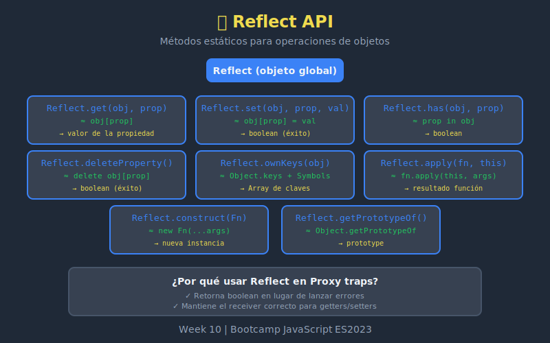

# 🪞 API Reflect



## 🎯 Objetivos

- Comprender qué es Reflect y por qué existe
- Usar métodos Reflect dentro de traps
- Entender el parámetro `receiver`
- Comparar Reflect vs operaciones directas

---

## 📖 ¿Qué es Reflect?

**Reflect** es un objeto global que proporciona métodos para operaciones interceptables. No es un constructor (no se usa con `new`).

```javascript
// Reflect no es una función
typeof Reflect; // 'object'

// Tiene métodos estáticos
Reflect.get(obj, 'prop');
Reflect.set(obj, 'prop', value);
```

### ¿Por qué Reflect?

1. **Consistencia**: Métodos unificados para operaciones de objetos
2. **Retornos claros**: Retorna `true`/`false` en lugar de lanzar errores
3. **Proxy companion**: Diseñado para usarse dentro de traps
4. **Receiver correcto**: Mantiene el `this` apropiado en getters/setters

---

## 🔧 Métodos de Reflect

### Reflect.get()

Lee una propiedad de un objeto.

```javascript
const user = {
  name: 'Alice',
  get greeting() {
    return `Hello, ${this.name}`;
  }
};

// Equivalente a user.name
Reflect.get(user, 'name'); // 'Alice'

// Con receiver (importante para getters)
Reflect.get(user, 'greeting'); // 'Hello, Alice'
```

#### Sintaxis Completa

```javascript
Reflect.get(target, propertyKey, receiver?)
```

#### El Parámetro `receiver`

```javascript
const parent = {
  get value() {
    return this.multiplier * 10;
  }
};

const child = {
  multiplier: 5
};

Object.setPrototypeOf(child, parent);

// Sin receiver - this es parent
Reflect.get(parent, 'value'); // NaN (parent.multiplier es undefined)

// Con receiver - this es child
Reflect.get(parent, 'value', child); // 50
```

---

### Reflect.set()

Escribe una propiedad en un objeto.

```javascript
const user = { name: 'Alice' };

// Equivalente a user.age = 30
Reflect.set(user, 'age', 30); // true
console.log(user.age); // 30

// Retorna false si no se puede asignar
const frozen = Object.freeze({ x: 1 });
Reflect.set(frozen, 'x', 2); // false (no lanza error)
```

#### Sintaxis Completa

```javascript
Reflect.set(target, propertyKey, value, receiver?)
```

#### Retorno Booleano

```javascript
// Reflect.set retorna boolean, no lanza errores
const obj = {};
Object.defineProperty(obj, 'readonly', {
  value: 42,
  writable: false
});

// Operador = en strict mode lanzaría error
// Reflect.set solo retorna false
const success = Reflect.set(obj, 'readonly', 100);
console.log(success); // false
console.log(obj.readonly); // 42
```

---

### Reflect.has()

Verifica si una propiedad existe (operador `in`).

```javascript
const user = { name: 'Alice' };

// Equivalente a 'name' in user
Reflect.has(user, 'name'); // true
Reflect.has(user, 'age');  // false

// También verifica la cadena de prototipos
Reflect.has(user, 'toString'); // true (heredado de Object)
```

---

### Reflect.deleteProperty()

Elimina una propiedad (operador `delete`).

```javascript
const user = { name: 'Alice', age: 30 };

// Equivalente a delete user.age
Reflect.deleteProperty(user, 'age'); // true
console.log(user); // { name: 'Alice' }

// Retorna true incluso si no existe
Reflect.deleteProperty(user, 'nonexistent'); // true

// Retorna false si no se puede eliminar
const frozen = Object.freeze({ x: 1 });
Reflect.deleteProperty(frozen, 'x'); // false
```

---

### Reflect.ownKeys()

Retorna todas las claves propias (strings + symbols).

```javascript
const sym = Symbol('id');
const obj = {
  name: 'Alice',
  [sym]: 123
};

Reflect.ownKeys(obj); // ['name', Symbol(id)]

// Comparación
Object.keys(obj);                    // ['name']
Object.getOwnPropertyNames(obj);     // ['name']
Object.getOwnPropertySymbols(obj);   // [Symbol(id)]
Reflect.ownKeys(obj);                // ['name', Symbol(id)]
```

---

### Reflect.apply()

Llama una función con argumentos.

```javascript
const greet = function(greeting) {
  return `${greeting}, ${this.name}!`;
};

const user = { name: 'Alice' };

// Equivalente a greet.apply(user, ['Hello'])
Reflect.apply(greet, user, ['Hello']); // 'Hello, Alice!'
```

#### Ventaja sobre Function.prototype.apply

```javascript
// Más seguro que greet.apply()
// No depende de que greet tenga el método apply

const malicious = {
  apply: () => 'hacked!'
};

// Function.prototype.apply.call es verboso
Function.prototype.apply.call(greet, user, ['Hi']);

// Reflect.apply es más limpio
Reflect.apply(greet, user, ['Hi']);
```

---

### Reflect.construct()

Crea una instancia (operador `new`).

```javascript
class User {
  constructor(name) {
    this.name = name;
  }
}

// Equivalente a new User('Alice')
const user = Reflect.construct(User, ['Alice']);
console.log(user.name); // 'Alice'
console.log(user instanceof User); // true
```

#### Con `newTarget`

```javascript
class Base {
  constructor() {
    console.log(new.target.name);
  }
}

class Derived extends Base {}

// new.target será Derived
Reflect.construct(Base, [], Derived);
// Log: 'Derived'
```

---

## 🎭 Reflect + Proxy

### Patrón Recomendado

Siempre usa Reflect dentro de traps para el comportamiento por defecto:

```javascript
const handler = {
  get(target, prop, receiver) {
    console.log(`Getting ${prop}`);
    return Reflect.get(target, prop, receiver); // ✅
  },

  set(target, prop, value, receiver) {
    console.log(`Setting ${prop} = ${value}`);
    return Reflect.set(target, prop, value, receiver); // ✅
  },

  has(target, prop) {
    console.log(`Checking ${prop}`);
    return Reflect.has(target, prop); // ✅
  },

  deleteProperty(target, prop) {
    console.log(`Deleting ${prop}`);
    return Reflect.deleteProperty(target, prop); // ✅
  }
};
```

### ¿Por qué No Acceso Directo?

```javascript
// ❌ PROBLEMA con acceso directo
const obj = {
  _value: 100,
  get value() {
    return this._value * 2;
  }
};

const proxy = new Proxy(obj, {
  get(target, prop) {
    console.log(`Getting ${prop}`);
    return target[prop]; // ❌ this será target, no proxy
  }
});

// Si el getter usa this, no funcionará con propiedades proxy
```

```javascript
// ✅ SOLUCIÓN con Reflect y receiver
const proxy = new Proxy(obj, {
  get(target, prop, receiver) {
    console.log(`Getting ${prop}`);
    return Reflect.get(target, prop, receiver); // ✅ this será proxy
  }
});
```

### Ejemplo Completo

```javascript
const user = {
  firstName: 'Alice',
  lastName: 'Smith',
  get fullName() {
    return `${this.firstName} ${this.lastName}`;
  }
};

// Con Reflect.get y receiver correcto
const proxy = new Proxy(user, {
  get(target, prop, receiver) {
    const value = Reflect.get(target, prop, receiver);
    console.log(`${prop} = ${value}`);
    return value;
  }
});

proxy.fullName;
// Log: firstName = Alice
// Log: lastName = Smith
// Log: fullName = Alice Smith
```

---

## 📊 Reflect vs Operaciones Directas

| Operación | Reflect | Directo | Diferencia |
|-----------|---------|---------|------------|
| Leer | `Reflect.get(o, k)` | `o[k]` | Receiver, retorno consistente |
| Escribir | `Reflect.set(o, k, v)` | `o[k] = v` | Retorna boolean |
| Verificar | `Reflect.has(o, k)` | `k in o` | Función vs operador |
| Eliminar | `Reflect.deleteProperty(o, k)` | `delete o[k]` | Retorna boolean |
| Claves | `Reflect.ownKeys(o)` | `Object.keys(o)` | Incluye symbols |
| Llamar | `Reflect.apply(f, t, a)` | `f.apply(t, a)` | No depende del prototype |
| Construir | `Reflect.construct(C, a)` | `new C(...a)` | newTarget opcional |

---

## 🧪 Ejemplo Práctico: Logger Completo

```javascript
const createLogger = (obj, name = 'Object') => {
  return new Proxy(obj, {
    get(target, prop, receiver) {
      const value = Reflect.get(target, prop, receiver);
      console.log(`[GET] ${name}.${String(prop)} → ${JSON.stringify(value)}`);
      return value;
    },

    set(target, prop, value, receiver) {
      console.log(`[SET] ${name}.${String(prop)} = ${JSON.stringify(value)}`);
      return Reflect.set(target, prop, value, receiver);
    },

    has(target, prop) {
      const result = Reflect.has(target, prop);
      console.log(`[HAS] "${String(prop)}" in ${name} → ${result}`);
      return result;
    },

    deleteProperty(target, prop) {
      console.log(`[DELETE] ${name}.${String(prop)}`);
      return Reflect.deleteProperty(target, prop);
    },

    ownKeys(target) {
      const keys = Reflect.ownKeys(target);
      console.log(`[KEYS] ${name} → [${keys.join(', ')}]`);
      return keys;
    }
  });
};

// Uso
const user = createLogger({ name: 'Alice', age: 30 }, 'user');

user.name;          // [GET] user.name → "Alice"
user.age = 31;      // [SET] user.age = 31
'name' in user;     // [HAS] "name" in user → true
Object.keys(user);  // [KEYS] user → [name, age]
delete user.age;    // [DELETE] user.age
```

---

## 📋 Todos los Métodos Reflect

| Método | Descripción |
|--------|-------------|
| `Reflect.get()` | Lee propiedad |
| `Reflect.set()` | Escribe propiedad |
| `Reflect.has()` | Operador `in` |
| `Reflect.deleteProperty()` | Operador `delete` |
| `Reflect.ownKeys()` | Todas las claves propias |
| `Reflect.apply()` | Llama función |
| `Reflect.construct()` | Operador `new` |
| `Reflect.getPrototypeOf()` | Obtiene prototype |
| `Reflect.setPrototypeOf()` | Establece prototype |
| `Reflect.isExtensible()` | Verifica extensibilidad |
| `Reflect.preventExtensions()` | Previene extensiones |
| `Reflect.getOwnPropertyDescriptor()` | Obtiene descriptor |
| `Reflect.defineProperty()` | Define propiedad |

---

## 💡 Buenas Prácticas

### 1. Siempre Usa Reflect en Traps

```javascript
// ✅ BIEN
get(target, prop, receiver) {
  return Reflect.get(target, prop, receiver);
}

// ❌ MAL
get(target, prop) {
  return target[prop];
}
```

### 2. Pasa el Receiver

```javascript
// ✅ BIEN - mantiene this correcto
set(target, prop, value, receiver) {
  return Reflect.set(target, prop, value, receiver);
}

// ❌ MAL - puede romper setters
set(target, prop, value) {
  target[prop] = value;
  return true;
}
```

### 3. Maneja los Retornos

```javascript
set(target, prop, value, receiver) {
  // Validar primero
  if (prop === 'age' && value < 0) {
    return false; // Indica fallo
  }

  // Delegar a Reflect
  return Reflect.set(target, prop, value, receiver);
}
```

---

## 📚 Recursos

- [MDN: Reflect](https://developer.mozilla.org/es/docs/Web/JavaScript/Reference/Global_Objects/Reflect)
- [JavaScript.info: Proxy and Reflect](https://javascript.info/proxy#reflect)

---

_Week 10 | Bootcamp JavaScript ES2023_
