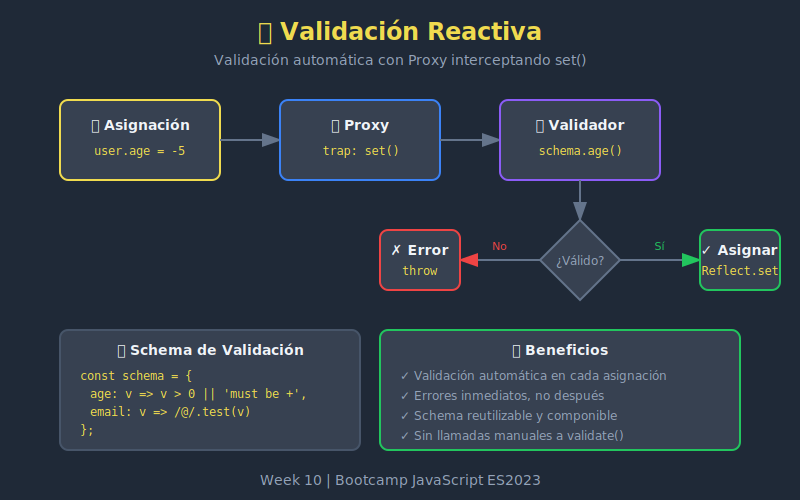

# ✅ Validación Reactiva



## 🎯 Objetivos

- Implementar validación automática con Proxies
- Crear esquemas de validación reutilizables
- Manejar errores de validación de forma elegante
- Combinar múltiples validadores

---

## 📖 ¿Qué es la Validación Reactiva?

La **validación reactiva** usa Proxies para validar datos automáticamente cada vez que se modifican, sin necesidad de llamar funciones de validación manualmente.

```javascript
// Sin validación reactiva
user.age = -5; // Se acepta el valor inválido
if (!isValid(user)) {
  // Validar después...
}

// Con validación reactiva
user.age = -5; // ❌ Error inmediato: age must be positive
```

---

## 🔧 Validador Básico

### Estructura

```javascript
const createValidator = (schema) => {
  return (obj) => new Proxy(obj, {
    set(target, prop, value, receiver) {
      const validator = schema[prop];

      if (validator) {
        const result = validator(value, prop);
        if (result !== true) {
          throw new Error(result);
        }
      }

      return Reflect.set(target, prop, value, receiver);
    }
  });
};
```

### Uso

```javascript
const userSchema = {
  name: (value) => {
    if (typeof value !== 'string') return 'name must be a string';
    if (value.length < 2) return 'name must be at least 2 characters';
    return true;
  },
  age: (value) => {
    if (typeof value !== 'number') return 'age must be a number';
    if (value < 0) return 'age must be positive';
    if (value > 150) return 'age must be realistic';
    return true;
  },
  email: (value) => {
    if (typeof value !== 'string') return 'email must be a string';
    if (!value.includes('@')) return 'email must be valid';
    return true;
  }
};

const createUser = createValidator(userSchema);

const user = createUser({ name: 'Alice', age: 30, email: 'alice@test.com' });

user.name = 'Bob';      // ✅ OK
user.age = 25;          // ✅ OK
user.age = -5;          // ❌ Error: age must be positive
user.email = 'invalid'; // ❌ Error: email must be valid
```

---

## 🏗️ Validadores Reutilizables

### Fábrica de Validadores

```javascript
const validators = {
  string: (minLength = 0, maxLength = Infinity) => (value, prop) => {
    if (typeof value !== 'string') {
      return `${prop} must be a string`;
    }
    if (value.length < minLength) {
      return `${prop} must be at least ${minLength} characters`;
    }
    if (value.length > maxLength) {
      return `${prop} must be at most ${maxLength} characters`;
    }
    return true;
  },

  number: (min = -Infinity, max = Infinity) => (value, prop) => {
    if (typeof value !== 'number' || isNaN(value)) {
      return `${prop} must be a number`;
    }
    if (value < min) {
      return `${prop} must be at least ${min}`;
    }
    if (value > max) {
      return `${prop} must be at most ${max}`;
    }
    return true;
  },

  boolean: () => (value, prop) => {
    if (typeof value !== 'boolean') {
      return `${prop} must be a boolean`;
    }
    return true;
  },

  email: () => (value, prop) => {
    const emailRegex = /^[^\s@]+@[^\s@]+\.[^\s@]+$/;
    if (!emailRegex.test(value)) {
      return `${prop} must be a valid email`;
    }
    return true;
  },

  oneOf: (options) => (value, prop) => {
    if (!options.includes(value)) {
      return `${prop} must be one of: ${options.join(', ')}`;
    }
    return true;
  },

  array: (itemValidator) => (value, prop) => {
    if (!Array.isArray(value)) {
      return `${prop} must be an array`;
    }
    for (let i = 0; i < value.length; i++) {
      const result = itemValidator(value[i], `${prop}[${i}]`);
      if (result !== true) return result;
    }
    return true;
  }
};
```

### Uso de Validadores

```javascript
const productSchema = {
  name: validators.string(1, 100),
  price: validators.number(0, 999999),
  category: validators.oneOf(['electronics', 'clothing', 'food']),
  inStock: validators.boolean(),
  tags: validators.array(validators.string(1, 20))
};

const createProduct = createValidator(productSchema);

const product = createProduct({
  name: 'Laptop',
  price: 999,
  category: 'electronics',
  inStock: true,
  tags: ['tech', 'computer']
});

product.price = 1500;      // ✅ OK
product.category = 'cars'; // ❌ Error: category must be one of...
product.tags = 'single';   // ❌ Error: tags must be an array
```

---

## 🔗 Combinar Validadores

### Validador Compuesto

```javascript
const compose = (...validators) => (value, prop) => {
  for (const validator of validators) {
    const result = validator(value, prop);
    if (result !== true) return result;
  }
  return true;
};

// Uso
const passwordSchema = {
  password: compose(
    validators.string(8, 100),
    (value, prop) => {
      if (!/[A-Z]/.test(value)) {
        return `${prop} must contain uppercase letter`;
      }
      return true;
    },
    (value, prop) => {
      if (!/[0-9]/.test(value)) {
        return `${prop} must contain a number`;
      }
      return true;
    },
    (value, prop) => {
      if (!/[!@#$%^&*]/.test(value)) {
        return `${prop} must contain special character`;
      }
      return true;
    }
  )
};
```

### Validador Opcional

```javascript
const optional = (validator) => (value, prop) => {
  if (value === undefined || value === null) {
    return true; // Permite valores vacíos
  }
  return validator(value, prop);
};

const profileSchema = {
  name: validators.string(1, 50),
  bio: optional(validators.string(0, 500)),
  website: optional(validators.string(5, 200))
};
```

---

## 📊 Validación con Errores Detallados

### Colector de Errores

```javascript
const createValidatorWithErrors = (schema) => {
  return (obj) => {
    const errors = [];

    const proxy = new Proxy(obj, {
      set(target, prop, value, receiver) {
        const validator = schema[prop];

        if (validator) {
          const result = validator(value, prop);
          if (result !== true) {
            errors.push({ property: prop, message: result, value });
            return false; // No asignar valor inválido
          }
        }

        return Reflect.set(target, prop, value, receiver);
      }
    });

    // Método para obtener errores
    proxy.getErrors = () => [...errors];
    proxy.clearErrors = () => errors.length = 0;
    proxy.hasErrors = () => errors.length > 0;

    return proxy;
  };
};

// Uso
const user = createValidatorWithErrors(userSchema)({});

user.name = '';     // No asigna, guarda error
user.age = 'old';   // No asigna, guarda error
user.email = 'bad'; // No asigna, guarda error

console.log(user.getErrors());
// [
//   { property: 'name', message: 'name must be at least 2 characters', value: '' },
//   { property: 'age', message: 'age must be a number', value: 'old' },
//   { property: 'email', message: 'email must be valid', value: 'bad' }
// ]
```

---

## 🎭 Validación con Transformación

A veces queremos transformar los datos antes de validar:

```javascript
const createTransformValidator = (schema, transforms = {}) => {
  return (obj) => new Proxy(obj, {
    set(target, prop, value, receiver) {
      // Aplicar transformación si existe
      const transform = transforms[prop];
      const transformedValue = transform ? transform(value) : value;

      // Validar
      const validator = schema[prop];
      if (validator) {
        const result = validator(transformedValue, prop);
        if (result !== true) {
          throw new Error(result);
        }
      }

      return Reflect.set(target, prop, transformedValue, receiver);
    }
  });
};

// Uso
const userWithTransforms = createTransformValidator(
  {
    name: validators.string(2, 50),
    email: validators.email()
  },
  {
    name: (v) => v.trim(),
    email: (v) => v.toLowerCase().trim()
  }
);

const user = userWithTransforms({});

user.name = '  Alice  ';
console.log(user.name); // 'Alice' (trimmed)

user.email = '  ALICE@Test.COM  ';
console.log(user.email); // 'alice@test.com' (lowercase + trimmed)
```

---

## 🏢 Validación Anidada

Para objetos complejos con propiedades anidadas:

```javascript
const createNestedValidator = (schema) => {
  const validate = (obj, currentSchema) => {
    return new Proxy(obj, {
      get(target, prop, receiver) {
        const value = Reflect.get(target, prop, receiver);
        const propSchema = currentSchema[prop];

        // Si la propiedad tiene sub-esquema, envolver recursivamente
        if (propSchema && typeof propSchema === 'object' && !propSchema.validate) {
          if (value && typeof value === 'object') {
            return validate(value, propSchema);
          }
        }

        return value;
      },

      set(target, prop, value, receiver) {
        const propSchema = currentSchema[prop];

        if (propSchema?.validate) {
          const result = propSchema.validate(value, prop);
          if (result !== true) {
            throw new Error(result);
          }
        }

        return Reflect.set(target, prop, value, receiver);
      }
    });
  };

  return (obj) => validate(obj, schema);
};

// Uso
const orderSchema = {
  id: { validate: validators.string(1, 50) },
  customer: {
    name: { validate: validators.string(2, 100) },
    email: { validate: validators.email() },
    address: {
      street: { validate: validators.string(5, 200) },
      city: { validate: validators.string(2, 100) },
      zip: { validate: validators.string(5, 10) }
    }
  },
  total: { validate: validators.number(0) }
};

const order = createNestedValidator(orderSchema)({
  id: 'ORD-001',
  customer: {
    name: 'Alice',
    email: 'alice@test.com',
    address: {
      street: '123 Main St',
      city: 'NYC',
      zip: '10001'
    }
  },
  total: 99.99
});

order.customer.name = 'Bob';    // ✅ OK
order.customer.email = 'bad';   // ❌ Error
order.customer.address.zip = 'x'; // ❌ Error: zip must be at least 5 characters
```

---

## 🔄 Validación en Tiempo Real (Forms)

```javascript
const createFormValidator = (schema) => {
  const errors = new Map();
  const listeners = new Set();

  const notify = () => {
    listeners.forEach(fn => fn(Object.fromEntries(errors)));
  };

  const proxy = new Proxy({}, {
    set(target, prop, value, receiver) {
      const validator = schema[prop];

      if (validator) {
        const result = validator(value, prop);
        if (result !== true) {
          errors.set(prop, result);
        } else {
          errors.delete(prop);
        }
        notify();
      }

      return Reflect.set(target, prop, value, receiver);
    }
  });

  proxy.onError = (fn) => listeners.add(fn);
  proxy.isValid = () => errors.size === 0;
  proxy.getError = (prop) => errors.get(prop);

  return proxy;
};

// Simulación de formulario
const form = createFormValidator({
  username: validators.string(3, 20),
  email: validators.email(),
  age: validators.number(18, 100)
});

form.onError((errors) => {
  console.log('Form errors:', errors);
});

form.username = 'ab'; // Error: username must be at least 3 characters
form.username = 'alice'; // No error
form.email = 'test@example.com';
form.age = 25;

console.log(form.isValid()); // true
```

---

## 💡 Buenas Prácticas

### 1. Mensajes de Error Claros

```javascript
// ✅ BIEN - mensaje específico
(value, prop) => {
  if (value < 0) {
    return `${prop} must be a positive number (received: ${value})`;
  }
  return true;
}

// ❌ MAL - mensaje genérico
(value) => value >= 0 || 'Invalid value'
```

### 2. Validadores Puros

```javascript
// ✅ BIEN - sin efectos secundarios
const isPositive = (value, prop) => {
  return value > 0 || `${prop} must be positive`;
};

// ❌ MAL - modifica estado externo
let errorCount = 0;
const isPositive = (value, prop) => {
  if (value <= 0) {
    errorCount++; // Efecto secundario
    return false;
  }
  return true;
};
```

### 3. Reutiliza Validadores

```javascript
// ✅ BIEN - validador reutilizable
const positiveNumber = validators.number(0);

const schema = {
  price: positiveNumber,
  quantity: positiveNumber,
  discount: positiveNumber
};
```

---

## 📚 Recursos

- [MDN: Proxy](https://developer.mozilla.org/es/docs/Web/JavaScript/Reference/Global_Objects/Proxy)
- [Form Validation Patterns](https://javascript.info/forms-validation)

---

_Week 10 | Bootcamp JavaScript ES2023_
