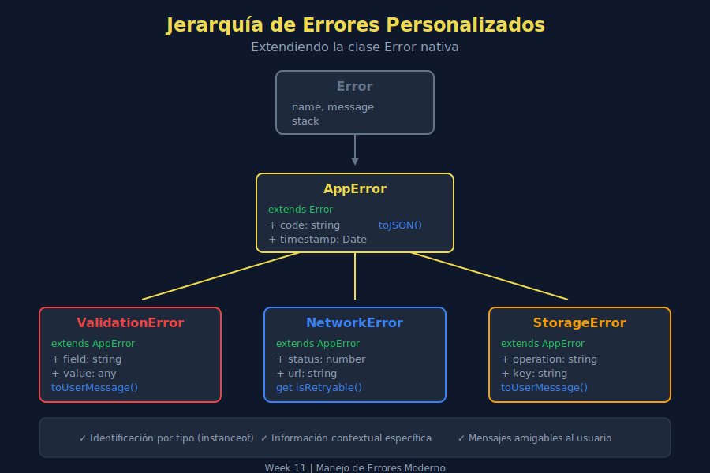

# 🎨 Errores Personalizados

## 🎯 Objetivos de Aprendizaje

- Crear clases de error personalizadas extendiendo `Error`
- Añadir propiedades útiles para debugging
- Implementar jerarquías de errores
- Usar métodos helper para mensajes y serialización

---

## 📖 Introducción

Los errores nativos de JavaScript (`Error`, `TypeError`, `SyntaxError`) son genéricos. Para aplicaciones reales necesitamos errores que comuniquen exactamente qué salió mal y por qué.



---

## 1️⃣ ¿Por Qué Errores Personalizados?

### Problema con Errores Genéricos

```javascript
// Generic error - not very helpful
throw new Error('Operation failed');

// Which operation? Why? What can we do about it?
```

### Solución con Errores Personalizados

```javascript
throw new ValidationError('email', 'Invalid format', 'user@');

// Clear: what field, what problem, what was the value
```

---

## 2️⃣ Crear una Clase de Error Básica

### Sintaxis Mínima

```javascript
class ValidationError extends Error {
  constructor(message) {
    super(message);
    this.name = 'ValidationError';
  }
}

// Usage
throw new ValidationError('Email is required');
```

### ¿Por Qué Funciona?

```javascript
const error = new ValidationError('Test');

console.log(error instanceof ValidationError); // true
console.log(error instanceof Error);           // true
console.log(error.name);                       // "ValidationError"
console.log(error.message);                    // "Test"
console.log(error.stack);                      // Full stack trace
```

---

## 3️⃣ Añadir Propiedades Útiles

### Error con Contexto

```javascript
class ValidationError extends Error {
  constructor(field, message, value = undefined) {
    super(message);
    this.name = 'ValidationError';
    this.field = field;
    this.value = value;
    this.timestamp = new Date().toISOString();
  }
}

// Usage
try {
  const email = 'invalid-email';
  if (!email.includes('@')) {
    throw new ValidationError('email', 'Must contain @', email);
  }
} catch (error) {
  if (error instanceof ValidationError) {
    console.log(`Field: ${error.field}`);       // "email"
    console.log(`Problem: ${error.message}`);   // "Must contain @"
    console.log(`Value: ${error.value}`);       // "invalid-email"
    console.log(`When: ${error.timestamp}`);    // "2025-12-22T..."
  }
}
```

---

## 4️⃣ Error con Código de Error

Los códigos de error facilitan la internacionalización y el manejo programático:

```javascript
class AppError extends Error {
  constructor(code, message, details = {}) {
    super(message);
    this.name = 'AppError';
    this.code = code;
    this.details = details;
  }

  // Static factory methods
  static validation(field, message) {
    return new AppError('VALIDATION_ERROR', message, { field });
  }

  static notFound(resource, id) {
    return new AppError('NOT_FOUND', `${resource} not found`, { resource, id });
  }

  static unauthorized(reason) {
    return new AppError('UNAUTHORIZED', reason);
  }
}

// Usage with factory methods
throw AppError.validation('email', 'Invalid email format');
throw AppError.notFound('User', 123);
throw AppError.unauthorized('Token expired');
```

---

## 5️⃣ Jerarquía de Errores

### Diseño de Jerarquía

```javascript
// Base error for the application
class AppError extends Error {
  constructor(message, code = 'UNKNOWN_ERROR') {
    super(message);
    this.name = 'AppError';
    this.code = code;
  }
}

// Domain-specific errors
class ValidationError extends AppError {
  constructor(field, message) {
    super(message, 'VALIDATION_ERROR');
    this.name = 'ValidationError';
    this.field = field;
  }
}

class NetworkError extends AppError {
  constructor(message, statusCode = null) {
    super(message, 'NETWORK_ERROR');
    this.name = 'NetworkError';
    this.statusCode = statusCode;
  }
}

class DatabaseError extends AppError {
  constructor(operation, message) {
    super(message, 'DATABASE_ERROR');
    this.name = 'DatabaseError';
    this.operation = operation;
  }
}
```

### Uso de la Jerarquía

```javascript
const handleError = error => {
  // Most specific first
  if (error instanceof ValidationError) {
    showFieldError(error.field, error.message);
  } else if (error instanceof NetworkError) {
    showNetworkError(error.statusCode);
  } else if (error instanceof DatabaseError) {
    showDatabaseError(error.operation);
  } else if (error instanceof AppError) {
    showGenericError(error.code);
  } else {
    // Unknown error
    console.error('Unexpected error:', error);
    showGenericError('UNKNOWN');
  }
};
```

---

## 6️⃣ Métodos Helper

### toJSON para Logging/API

```javascript
class AppError extends Error {
  constructor(message, code = 'UNKNOWN') {
    super(message);
    this.name = 'AppError';
    this.code = code;
    this.timestamp = Date.now();
  }

  toJSON() {
    return {
      name: this.name,
      code: this.code,
      message: this.message,
      timestamp: this.timestamp,
      stack: this.stack
    };
  }
}

// Usage - perfect for logging services
const error = new AppError('Something failed', 'OP_FAILED');
console.log(JSON.stringify(error.toJSON(), null, 2));
```

### toUserMessage para UI

```javascript
class ValidationError extends Error {
  constructor(field, message, value) {
    super(message);
    this.name = 'ValidationError';
    this.field = field;
    this.value = value;
  }

  toUserMessage() {
    const fieldLabels = {
      email: 'Email',
      password: 'Password',
      username: 'Username'
    };

    const label = fieldLabels[this.field] || this.field;
    return `${label}: ${this.message}`;
  }

  toDebugMessage() {
    return `[${this.name}] ${this.field}="${this.value}": ${this.message}`;
  }
}

// Usage
const error = new ValidationError('email', 'must be valid', 'bad@');

// For users
alert(error.toUserMessage()); // "Email: must be valid"

// For developers
console.error(error.toDebugMessage()); // "[ValidationError] email="bad@": must be valid"
```

---

## 7️⃣ HTTP Errors

Muy útil para aplicaciones que consumen APIs:

```javascript
class HttpError extends Error {
  constructor(status, statusText, url = '') {
    super(`HTTP ${status}: ${statusText}`);
    this.name = 'HttpError';
    this.status = status;
    this.statusText = statusText;
    this.url = url;
  }

  get isClientError() {
    return this.status >= 400 && this.status < 500;
  }

  get isServerError() {
    return this.status >= 500;
  }

  get isNotFound() {
    return this.status === 404;
  }

  get isUnauthorized() {
    return this.status === 401 || this.status === 403;
  }

  // Factory methods for common cases
  static notFound(url) {
    return new HttpError(404, 'Not Found', url);
  }

  static unauthorized() {
    return new HttpError(401, 'Unauthorized');
  }

  static serverError(url) {
    return new HttpError(500, 'Internal Server Error', url);
  }
}

// Usage with fetch
const fetchData = async url => {
  const response = await fetch(url);

  if (!response.ok) {
    throw new HttpError(response.status, response.statusText, url);
  }

  return response.json();
};

// Handling
try {
  const data = await fetchData('/api/users/123');
} catch (error) {
  if (error instanceof HttpError) {
    if (error.isNotFound) {
      showNotFoundPage();
    } else if (error.isUnauthorized) {
      redirectToLogin();
    } else if (error.isServerError) {
      showServerErrorMessage();
    }
  }
}
```

---

## 8️⃣ Aggregate Error

Para cuando múltiples operaciones pueden fallar:

```javascript
class MultiValidationError extends Error {
  constructor(errors = []) {
    const message = `${errors.length} validation errors`;
    super(message);
    this.name = 'MultiValidationError';
    this.errors = errors;
  }

  addError(error) {
    this.errors.push(error);
  }

  get hasErrors() {
    return this.errors.length > 0;
  }

  toUserMessages() {
    return this.errors.map(e => e.toUserMessage?.() || e.message);
  }
}

// Usage
const validateForm = formData => {
  const multiError = new MultiValidationError();

  if (!formData.email?.includes('@')) {
    multiError.addError(
      new ValidationError('email', 'Invalid format')
    );
  }

  if (!formData.password || formData.password.length < 8) {
    multiError.addError(
      new ValidationError('password', 'Must be at least 8 characters')
    );
  }

  if (multiError.hasErrors) {
    throw multiError;
  }

  return true;
};

// Handling
try {
  validateForm({ email: 'bad', password: '123' });
} catch (error) {
  if (error instanceof MultiValidationError) {
    const messages = error.toUserMessages();
    messages.forEach(msg => console.log('❌', msg));
    // ❌ Email: Invalid format
    // ❌ Password: Must be at least 8 characters
  }
}
```

---

## 9️⃣ Preservar el Stack Trace

### Problema

```javascript
class MyError extends Error {
  constructor(message) {
    super(message);
    this.name = 'MyError';
    // Stack trace points here, not where error was thrown
  }
}
```

### Solución con Error.captureStackTrace

```javascript
class MyError extends Error {
  constructor(message) {
    super(message);
    this.name = 'MyError';

    // Capture stack trace, excluding constructor
    if (Error.captureStackTrace) {
      Error.captureStackTrace(this, MyError);
    }
  }
}
```

---

## 🔟 Ejemplo Completo: Sistema de Errores

```javascript
// === Base Error ===
class AppError extends Error {
  constructor(message, code = 'APP_ERROR') {
    super(message);
    this.name = 'AppError';
    this.code = code;
    this.timestamp = new Date().toISOString();

    if (Error.captureStackTrace) {
      Error.captureStackTrace(this, this.constructor);
    }
  }

  toJSON() {
    return {
      name: this.name,
      code: this.code,
      message: this.message,
      timestamp: this.timestamp
    };
  }
}

// === Validation Error ===
class ValidationError extends AppError {
  constructor(field, message, value) {
    super(message, 'VALIDATION_ERROR');
    this.name = 'ValidationError';
    this.field = field;
    this.value = value;
  }

  toJSON() {
    return {
      ...super.toJSON(),
      field: this.field,
      value: this.value
    };
  }

  toUserMessage() {
    return `${this.field}: ${this.message}`;
  }
}

// === Network Error ===
class NetworkError extends AppError {
  constructor(message, status = null, url = '') {
    super(message, 'NETWORK_ERROR');
    this.name = 'NetworkError';
    this.status = status;
    this.url = url;
  }

  get isRetryable() {
    return this.status >= 500 || this.status === 429;
  }
}

// === Usage ===
const api = {
  async getUser(id) {
    if (!id) {
      throw new ValidationError('id', 'User ID is required', id);
    }

    const response = await fetch(`/api/users/${id}`);

    if (!response.ok) {
      throw new NetworkError(
        `Failed to fetch user ${id}`,
        response.status,
        response.url
      );
    }

    return response.json();
  }
};
```

---

## ✅ Checklist de Verificación

- [ ] Sé crear clases de error extendiendo Error
- [ ] Mis errores tienen propiedades útiles (code, field, etc.)
- [ ] Implemento toJSON() para logging
- [ ] Implemento toUserMessage() para UI
- [ ] Uso instanceof para identificar tipos de error
- [ ] Mi jerarquía de errores es clara y útil

---

## 📚 Recursos Adicionales

- [MDN: Custom Errors](https://developer.mozilla.org/en-US/docs/Web/JavaScript/Reference/Global_Objects/Error#custom_error_types)
- [JavaScript.info: Custom errors](https://javascript.info/custom-errors)

---

## 🔗 Navegación

| ⬅️ Anterior | 🏠 Índice | Siguiente ➡️ |
|:------------|:--------:|-------------:|
| [01 - try...catch...finally](./01-try-catch-finally.md) | [Teoría](./README.md) | [03 - Error Boundaries](./03-error-boundaries.md) |
