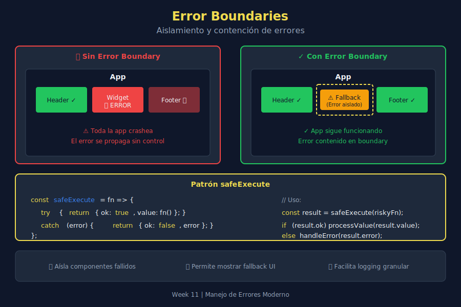

# 🛑 Error Boundaries

## 🎯 Objetivos de Aprendizaje

- Comprender el concepto de error boundaries (aislamiento de errores)
- Implementar patrones para contener fallos
- Evitar que un error colapse toda la aplicación
- Proporcionar fallbacks y recuperación graceful

---

## 📖 Introducción

Un **error boundary** es un patrón que aísla errores en una parte del código, evitando que se propaguen y colapsen toda la aplicación. Piensa en ellos como "cortafuegos" para errores.



---

## 1️⃣ El Problema: Errores que Colapsan Todo

### Sin Error Boundaries

```javascript
const app = () => {
  const header = renderHeader();      // Works
  const sidebar = renderSidebar();    // Works
  const content = renderContent();    // 💥 Throws error!
  const footer = renderFooter();      // Never runs

  return combine(header, sidebar, content, footer);
};

// One error = entire app crashes
```

### Con Error Boundaries

```javascript
const app = () => {
  const header = safeRender(renderHeader, defaultHeader);
  const sidebar = safeRender(renderSidebar, defaultSidebar);
  const content = safeRender(renderContent, errorContent);  // Error contained!
  const footer = safeRender(renderFooter, defaultFooter);   // Still runs

  return combine(header, sidebar, content, footer);
};

// Content shows error message, but app keeps working
```

---

## 2️⃣ Safe Execute Pattern

El patrón más simple de error boundary:

```javascript
const safeExecute = (fn, fallback = null) => {
  try {
    return fn();
  } catch (error) {
    console.error('Caught error:', error.message);
    return fallback;
  }
};

// Usage
const userData = safeExecute(
  () => JSON.parse(localStorage.getItem('user')),
  { name: 'Guest', isLoggedIn: false }
);

// Even if JSON is invalid, app continues with fallback
```

### Con Callback de Error

```javascript
const safeExecute = (fn, fallback = null, onError = null) => {
  try {
    return fn();
  } catch (error) {
    onError?.(error);
    return fallback;
  }
};

// Usage with error handling
const result = safeExecute(
  () => riskyOperation(),
  defaultValue,
  error => logToService(error)
);
```

---

## 3️⃣ Safe Execute para Async

```javascript
const safeExecuteAsync = async (fn, fallback = null, onError = null) => {
  try {
    return await fn();
  } catch (error) {
    onError?.(error);
    return fallback;
  }
};

// Usage
const users = await safeExecuteAsync(
  () => fetchUsers(),
  [],  // Fallback to empty array
  error => console.error('Failed to fetch users:', error)
);

// App continues even if API fails
```

---

## 4️⃣ Error Boundary Class

Una implementación más completa:

```javascript
class ErrorBoundary {
  constructor(options = {}) {
    this.fallback = options.fallback ?? null;
    this.onError = options.onError ?? console.error;
    this.shouldCatch = options.shouldCatch ?? (() => true);
  }

  execute(fn) {
    try {
      return fn();
    } catch (error) {
      if (this.shouldCatch(error)) {
        this.onError(error);
        return this.fallback;
      }
      throw error; // Re-throw if shouldn't catch
    }
  }

  async executeAsync(fn) {
    try {
      return await fn();
    } catch (error) {
      if (this.shouldCatch(error)) {
        this.onError(error);
        return this.fallback;
      }
      throw error;
    }
  }
}

// Usage
const boundary = new ErrorBoundary({
  fallback: [],
  onError: error => logToService(error),
  shouldCatch: error => error instanceof NetworkError
});

const data = boundary.execute(() => parseData(input));
```

---

## 5️⃣ Boundaries por Dominio

Diferentes partes de la app pueden tener diferentes boundaries:

```javascript
// UI Errors - show fallback component
const uiBoundary = new ErrorBoundary({
  fallback: '<div class="error">Something went wrong</div>',
  onError: error => console.error('[UI]', error)
});

// Data Errors - return empty/default data
const dataBoundary = new ErrorBoundary({
  fallback: { items: [], total: 0 },
  onError: error => trackError('data', error)
});

// Critical Errors - let them propagate
const criticalBoundary = new ErrorBoundary({
  shouldCatch: error => !(error instanceof CriticalError),
  onError: error => console.error('[Non-critical]', error)
});
```

---

## 6️⃣ Wrapper Functions

Crear funciones "seguras" de otras funciones:

```javascript
const createSafeFunction = (fn, fallback = null) => {
  return (...args) => {
    try {
      return fn(...args);
    } catch (error) {
      console.error(`Error in ${fn.name}:`, error);
      return fallback;
    }
  };
};

// Usage
const riskyParse = data => {
  if (!data) throw new Error('No data');
  return JSON.parse(data);
};

const safeParse = createSafeFunction(riskyParse, {});

// Now safeParse never throws
console.log(safeParse('{"a": 1}')); // { a: 1 }
console.log(safeParse('invalid'));  // {}
console.log(safeParse(null));       // {}
```

### Versión Async

```javascript
const createSafeAsyncFunction = (fn, fallback = null) => {
  return async (...args) => {
    try {
      return await fn(...args);
    } catch (error) {
      console.error(`Async error in ${fn.name}:`, error);
      return fallback;
    }
  };
};

// Usage
const safeFetch = createSafeAsyncFunction(
  url => fetch(url).then(r => r.json()),
  null
);

const data = await safeFetch('/api/users'); // null if fails
```

---

## 7️⃣ Error Boundaries para Arrays

Procesar items individualmente sin que uno falle todo:

```javascript
const safeMap = (array, fn, onError = null) => {
  return array.map((item, index) => {
    try {
      return fn(item, index);
    } catch (error) {
      onError?.(error, item, index);
      return null;
    }
  }).filter(item => item !== null);
};

// Usage
const rawData = ['{"a":1}', 'invalid', '{"b":2}', 'also bad'];

const parsed = safeMap(
  rawData,
  item => JSON.parse(item),
  (error, item, index) => console.warn(`Failed at ${index}:`, item)
);

console.log(parsed); // [{ a: 1 }, { b: 2 }]
// Logs warnings for invalid items but continues
```

### Promise.allSettled como Error Boundary

```javascript
const fetchAllUsers = async userIds => {
  const results = await Promise.allSettled(
    userIds.map(id => fetchUser(id))
  );

  const successful = [];
  const failed = [];

  results.forEach((result, index) => {
    if (result.status === 'fulfilled') {
      successful.push(result.value);
    } else {
      failed.push({ id: userIds[index], error: result.reason });
    }
  });

  if (failed.length > 0) {
    console.warn('Some users failed to load:', failed);
  }

  return successful;
};

// Gets as many users as possible, logs failures
const users = await fetchAllUsers([1, 2, 3, 4, 5]);
```

---

## 8️⃣ Isolation Pattern

Aislar operaciones críticas:

```javascript
const isolate = fn => {
  return (...args) => {
    // Create isolated context
    const context = {
      errors: [],
      warnings: [],
      log: msg => context.warnings.push(msg),
      error: err => context.errors.push(err)
    };

    try {
      const result = fn(...args, context);

      return {
        success: true,
        result,
        warnings: context.warnings,
        errors: context.errors
      };
    } catch (error) {
      return {
        success: false,
        result: null,
        error,
        warnings: context.warnings,
        errors: [...context.errors, error]
      };
    }
  };
};

// Usage
const processData = isolate((data, ctx) => {
  if (!data.items) {
    ctx.log('No items found, using empty array');
    data.items = [];
  }

  return data.items.map(item => transform(item));
});

const result = processData({ name: 'test' });
// { success: true, result: [], warnings: ['No items found...'], errors: [] }
```

---

## 9️⃣ Recovery Strategies

### Retry Pattern

```javascript
const withRetry = async (fn, maxRetries = 3, delay = 1000) => {
  let lastError;

  for (let attempt = 1; attempt <= maxRetries; attempt++) {
    try {
      return await fn();
    } catch (error) {
      lastError = error;
      console.warn(`Attempt ${attempt} failed:`, error.message);

      if (attempt < maxRetries) {
        await new Promise(r => setTimeout(r, delay * attempt));
      }
    }
  }

  throw lastError;
};

// Usage
const data = await withRetry(
  () => fetchData('/api/flaky-endpoint'),
  3,
  1000
);
```

### Fallback Chain

```javascript
const withFallbackChain = async (...fns) => {
  let lastError;

  for (const fn of fns) {
    try {
      return await fn();
    } catch (error) {
      lastError = error;
      console.warn('Fallback triggered:', error.message);
    }
  }

  throw lastError;
};

// Usage - try multiple sources
const userData = await withFallbackChain(
  () => fetchFromAPI('/api/user'),           // Primary
  () => fetchFromCache('user'),              // Fallback 1
  () => Promise.resolve({ name: 'Guest' })   // Fallback 2 (default)
);
```

---

## 🔟 Ejemplo Completo: UI con Error Boundaries

```javascript
// === Error Boundary System ===
class UIErrorBoundary {
  constructor(container, options = {}) {
    this.container = container;
    this.errorTemplate = options.errorTemplate ?? this.defaultErrorTemplate;
    this.onError = options.onError ?? console.error;
  }

  defaultErrorTemplate(error) {
    return `
      <div class="error-boundary">
        <h3>⚠️ Something went wrong</h3>
        <p>${error.message}</p>
        <button onclick="location.reload()">Retry</button>
      </div>
    `;
  }

  render(renderFn) {
    try {
      const content = renderFn();
      this.container.innerHTML = content;
    } catch (error) {
      this.onError(error);
      this.container.innerHTML = this.errorTemplate(error);
    }
  }

  async renderAsync(renderFn) {
    try {
      this.container.innerHTML = '<div class="loading">Loading...</div>';
      const content = await renderFn();
      this.container.innerHTML = content;
    } catch (error) {
      this.onError(error);
      this.container.innerHTML = this.errorTemplate(error);
    }
  }
}

// === Usage ===
const headerBoundary = new UIErrorBoundary(
  document.getElementById('header'),
  { errorTemplate: () => '<header>Default Header</header>' }
);

const contentBoundary = new UIErrorBoundary(
  document.getElementById('content'),
  {
    onError: error => trackError('content', error),
    errorTemplate: error => `
      <div class="error">
        <p>Failed to load content</p>
        <details>${error.stack}</details>
      </div>
    `
  }
);

// Each section is isolated
headerBoundary.render(() => renderHeader());
contentBoundary.renderAsync(() => fetchAndRenderContent());
```

---

## ✅ Checklist de Verificación

- [ ] Entiendo qué es un error boundary
- [ ] Puedo implementar safeExecute sync y async
- [ ] Sé crear wrapper functions seguros
- [ ] Uso Promise.allSettled para operaciones paralelas
- [ ] Implemento retry y fallback chains
- [ ] Mis errores no colapsan toda la aplicación

---

## 📚 Recursos Adicionales

- [JavaScript.info: Error handling](https://javascript.info/error-handling)
- [Patterns for fault-tolerant JavaScript](https://www.patterns.dev/posts/error-boundaries)

---

## 🔗 Navegación

| ⬅️ Anterior | 🏠 Índice | Siguiente ➡️ |
|:------------|:--------:|-------------:|
| [02 - Errores Personalizados](./02-errores-personalizados.md) | [Teoría](./README.md) | [04 - Errores Asíncronos](./04-errores-asincronos.md) |
