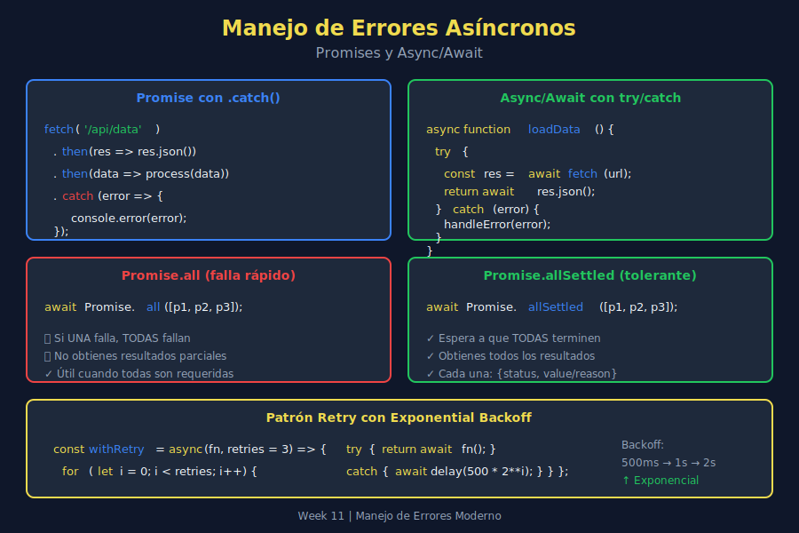

# ⏳ Errores Asíncronos

## 🎯 Objetivos de Aprendizaje

- Manejar errores en Promises con `.catch()`
- Usar try...catch con async/await
- Comprender `unhandledrejection`
- Aplicar `Promise.allSettled()` para operaciones paralelas

---

## 📖 Introducción

El manejo de errores en código asíncrono es diferente al código síncrono. Los errores pueden ocurrir en momentos inesperados y propagarse de formas distintas.



---

## 1️⃣ Errores en Callbacks (El Problema)

### Callback Hell + Error Hell

```javascript
// Traditional callback pattern - hard to handle errors
getData(url, (error, data) => {
  if (error) {
    handleError(error);
    return;
  }

  processData(data, (error, result) => {
    if (error) {
      handleError(error);  // Same error handling repeated
      return;
    }

    saveResult(result, (error) => {
      if (error) {
        handleError(error);  // Again...
        return;
      }
      console.log('Done!');
    });
  });
});
```

Por eso usamos Promises y async/await.

---

## 2️⃣ Errores en Promises

### .catch() Básico

```javascript
fetch('/api/users')
  .then(response => response.json())
  .then(users => console.log(users))
  .catch(error => console.error('Failed:', error));
```

### Propagación de Errores

Los errores se propagan por la cadena hasta encontrar un `.catch()`:

```javascript
fetch('/api/users')
  .then(response => {
    if (!response.ok) {
      throw new Error(`HTTP ${response.status}`);
    }
    return response.json();
  })
  .then(users => {
    // Process users
    return users.map(u => u.name);
  })
  .then(names => {
    console.log('Names:', names);
  })
  .catch(error => {
    // Catches errors from ANY .then() above
    console.error('Error in chain:', error.message);
  });
```

### .catch() en Medio de la Cadena

```javascript
fetch('/api/users')
  .then(response => response.json())
  .catch(error => {
    console.warn('Fetch failed, using cache');
    return getCachedUsers();  // Recovery - chain continues
  })
  .then(users => {
    // This runs with either fetched or cached users
    console.log('Got users:', users.length);
  });
```

### finally() para Cleanup

```javascript
showLoading();

fetch('/api/users')
  .then(response => response.json())
  .then(users => displayUsers(users))
  .catch(error => showError(error))
  .finally(() => {
    hideLoading();  // Always runs
  });
```

---

## 3️⃣ Errores con async/await

### try...catch Básico

```javascript
const fetchUsers = async () => {
  try {
    const response = await fetch('/api/users');
    const users = await response.json();
    return users;
  } catch (error) {
    console.error('Failed to fetch users:', error);
    return [];
  }
};
```

### Múltiples await en un try

```javascript
const processOrder = async orderId => {
  try {
    const order = await fetchOrder(orderId);
    const user = await fetchUser(order.userId);
    const inventory = await checkInventory(order.items);

    return { order, user, inventory };
  } catch (error) {
    // Catches error from ANY await above
    console.error('Order processing failed:', error);
    throw error;  // Re-throw if can't handle
  }
};
```

### try...catch...finally con async

```javascript
const uploadFile = async file => {
  const progressBar = showProgressBar();

  try {
    const result = await uploadToServer(file);
    showSuccess('File uploaded!');
    return result;
  } catch (error) {
    showError(`Upload failed: ${error.message}`);
    throw error;
  } finally {
    hideProgressBar(progressBar);  // Always cleanup
  }
};
```

---

## 4️⃣ Errores Específicos en async/await

### Manejo Granular

```javascript
const fetchUserData = async userId => {
  try {
    const response = await fetch(`/api/users/${userId}`);

    if (response.status === 404) {
      throw new NotFoundError('User', userId);
    }

    if (response.status === 401) {
      throw new UnauthorizedError('Session expired');
    }

    if (!response.ok) {
      throw new HttpError(response.status, response.statusText);
    }

    return await response.json();
  } catch (error) {
    if (error instanceof NotFoundError) {
      return createGuestUser();
    }

    if (error instanceof UnauthorizedError) {
      redirectToLogin();
      return null;
    }

    // Network error or other
    console.error('Unexpected error:', error);
    throw error;
  }
};
```

---

## 5️⃣ Promise.all() y Errores

### El Problema: Fail Fast

```javascript
// If ANY promise rejects, ALL results are lost
try {
  const [users, posts, comments] = await Promise.all([
    fetchUsers(),    // Success
    fetchPosts(),    // 💥 Fails
    fetchComments()  // Never gets result
  ]);
} catch (error) {
  // Lost all results, even successful ones
  console.error('Something failed:', error);
}
```

### La Solución: Promise.allSettled()

```javascript
const results = await Promise.allSettled([
  fetchUsers(),
  fetchPosts(),
  fetchComments()
]);

// results = [
//   { status: 'fulfilled', value: [...users] },
//   { status: 'rejected', reason: Error },
//   { status: 'fulfilled', value: [...comments] }
// ]

// Process results
const data = {
  users: [],
  posts: [],
  comments: []
};

results.forEach((result, index) => {
  const keys = ['users', 'posts', 'comments'];

  if (result.status === 'fulfilled') {
    data[keys[index]] = result.value;
  } else {
    console.warn(`Failed to fetch ${keys[index]}:`, result.reason);
  }
});
```

### Helper para allSettled

```javascript
const processSettledResults = (results, keys) => {
  const data = {};
  const errors = [];

  results.forEach((result, index) => {
    const key = keys[index];

    if (result.status === 'fulfilled') {
      data[key] = result.value;
    } else {
      data[key] = null;
      errors.push({ key, error: result.reason });
    }
  });

  return { data, errors };
};

// Usage
const results = await Promise.allSettled([
  fetchUsers(),
  fetchPosts(),
  fetchComments()
]);

const { data, errors } = processSettledResults(
  results,
  ['users', 'posts', 'comments']
);

if (errors.length > 0) {
  console.warn('Some requests failed:', errors);
}
```

---

## 6️⃣ Promise.race() y Timeout

### Implementar Timeout

```javascript
const withTimeout = (promise, ms) => {
  const timeout = new Promise((_, reject) => {
    setTimeout(() => {
      reject(new Error(`Timeout after ${ms}ms`));
    }, ms);
  });

  return Promise.race([promise, timeout]);
};

// Usage
try {
  const data = await withTimeout(
    fetch('/api/slow-endpoint'),
    5000  // 5 second timeout
  );
} catch (error) {
  if (error.message.includes('Timeout')) {
    console.log('Request took too long');
  } else {
    console.error('Request failed:', error);
  }
}
```

### Timeout con Cleanup

```javascript
const fetchWithTimeout = async (url, ms) => {
  const controller = new AbortController();
  const timeoutId = setTimeout(() => controller.abort(), ms);

  try {
    const response = await fetch(url, {
      signal: controller.signal
    });
    return await response.json();
  } catch (error) {
    if (error.name === 'AbortError') {
      throw new Error(`Request timeout after ${ms}ms`);
    }
    throw error;
  } finally {
    clearTimeout(timeoutId);
  }
};
```

---

## 7️⃣ Unhandled Rejections

### El Problema

```javascript
// This promise rejection is not handled!
const fetchData = async () => {
  const response = await fetch('/api/data');  // Might fail
  return response.json();
};

fetchData();  // No .catch(), no try...catch wrapper
// 💥 Unhandled Promise Rejection
```

### Global Handler

```javascript
// In browser
window.addEventListener('unhandledrejection', event => {
  console.error('Unhandled rejection:', event.reason);

  // Optionally prevent default browser behavior
  event.preventDefault();

  // Log to error tracking service
  trackError(event.reason);
});

// In Node.js
process.on('unhandledRejection', (reason, promise) => {
  console.error('Unhandled rejection at:', promise, 'reason:', reason);
});
```

### Prevenir Unhandled Rejections

```javascript
// Always handle async function calls
const main = async () => {
  try {
    await fetchData();
    await processData();
  } catch (error) {
    console.error('Main error:', error);
  }
};

main();  // Now errors are handled

// Or with .catch()
fetchData().catch(error => {
  console.error('Fetch error:', error);
});
```

---

## 8️⃣ Sequential vs Parallel Error Handling

### Sequential (Stop on First Error)

```javascript
const processSequential = async items => {
  const results = [];

  for (const item of items) {
    try {
      const result = await processItem(item);
      results.push(result);
    } catch (error) {
      console.error(`Failed on item ${item.id}:`, error);
      throw error;  // Stop processing
    }
  }

  return results;
};
```

### Sequential (Continue on Error)

```javascript
const processSequentialSafe = async items => {
  const results = [];
  const errors = [];

  for (const item of items) {
    try {
      const result = await processItem(item);
      results.push({ item, result, success: true });
    } catch (error) {
      results.push({ item, error, success: false });
      errors.push({ item, error });
    }
  }

  return { results, errors };
};
```

### Parallel (Get All Results)

```javascript
const processParallel = async items => {
  const results = await Promise.allSettled(
    items.map(item => processItem(item))
  );

  return results.map((result, index) => ({
    item: items[index],
    success: result.status === 'fulfilled',
    value: result.value,
    error: result.reason
  }));
};
```

---

## 9️⃣ Retry Pattern para Async

```javascript
const retry = async (fn, maxAttempts = 3, delay = 1000) => {
  let lastError;

  for (let attempt = 1; attempt <= maxAttempts; attempt++) {
    try {
      return await fn();
    } catch (error) {
      lastError = error;
      console.warn(`Attempt ${attempt} failed:`, error.message);

      if (attempt < maxAttempts) {
        // Exponential backoff
        await new Promise(r => setTimeout(r, delay * attempt));
      }
    }
  }

  throw new Error(
    `Failed after ${maxAttempts} attempts: ${lastError.message}`
  );
};

// Usage
const data = await retry(
  () => fetchFromUnreliableAPI(),
  3,
  1000
);
```

### Retry Condicional

```javascript
const retryIf = async (fn, shouldRetry, maxAttempts = 3) => {
  let lastError;

  for (let attempt = 1; attempt <= maxAttempts; attempt++) {
    try {
      return await fn();
    } catch (error) {
      lastError = error;

      if (!shouldRetry(error) || attempt === maxAttempts) {
        throw error;
      }

      await new Promise(r => setTimeout(r, 1000 * attempt));
    }
  }
};

// Only retry on network errors or 5xx
const data = await retryIf(
  () => fetchData(),
  error => error.status >= 500 || error.message.includes('network')
);
```

---

## 🔟 Ejemplo Completo: API Client

```javascript
class ApiClient {
  constructor(baseUrl, options = {}) {
    this.baseUrl = baseUrl;
    this.timeout = options.timeout ?? 10000;
    this.retries = options.retries ?? 3;
  }

  async request(endpoint, options = {}) {
    const url = `${this.baseUrl}${endpoint}`;

    return this.withRetry(async () => {
      const response = await this.fetchWithTimeout(url, options);

      if (!response.ok) {
        throw new HttpError(response.status, response.statusText, url);
      }

      return response.json();
    });
  }

  async fetchWithTimeout(url, options) {
    const controller = new AbortController();
    const timeoutId = setTimeout(
      () => controller.abort(),
      this.timeout
    );

    try {
      return await fetch(url, {
        ...options,
        signal: controller.signal
      });
    } catch (error) {
      if (error.name === 'AbortError') {
        throw new TimeoutError(url, this.timeout);
      }
      throw new NetworkError(error.message, url);
    } finally {
      clearTimeout(timeoutId);
    }
  }

  async withRetry(fn) {
    let lastError;

    for (let i = 0; i < this.retries; i++) {
      try {
        return await fn();
      } catch (error) {
        lastError = error;

        // Only retry on network/timeout errors
        if (!this.isRetryable(error)) {
          throw error;
        }

        await this.delay(1000 * (i + 1));
      }
    }

    throw lastError;
  }

  isRetryable(error) {
    return (
      error instanceof NetworkError ||
      error instanceof TimeoutError ||
      (error instanceof HttpError && error.status >= 500)
    );
  }

  delay(ms) {
    return new Promise(r => setTimeout(r, ms));
  }
}

// Usage
const api = new ApiClient('https://api.example.com', {
  timeout: 5000,
  retries: 3
});

try {
  const users = await api.request('/users');
} catch (error) {
  if (error instanceof TimeoutError) {
    showMessage('Server is slow, please try again');
  } else if (error instanceof NetworkError) {
    showMessage('Check your internet connection');
  } else if (error instanceof HttpError) {
    showMessage(`Error: ${error.status}`);
  }
}
```

---

## ✅ Checklist de Verificación

- [ ] Uso .catch() con Promises
- [ ] Uso try...catch con async/await
- [ ] Entiendo Promise.allSettled() vs Promise.all()
- [ ] Implemento timeouts en requests
- [ ] Manejo unhandledrejection globalmente
- [ ] Aplico retry pattern cuando es apropiado

---

## 📚 Recursos Adicionales

- [MDN: Promise](https://developer.mozilla.org/en-US/docs/Web/JavaScript/Reference/Global_Objects/Promise)
- [MDN: async/await](https://developer.mozilla.org/en-US/docs/Learn/JavaScript/Asynchronous/Promises)
- [JavaScript.info: Error handling with promises](https://javascript.info/promise-error-handling)

---

## 🔗 Navegación

| ⬅️ Anterior | 🏠 Índice | Siguiente ➡️ |
|:------------|:--------:|-------------:|
| [03 - Error Boundaries](./03-error-boundaries.md) | [Teoría](./README.md) | [05 - Mejores Prácticas](./05-mejores-practicas.md) |
