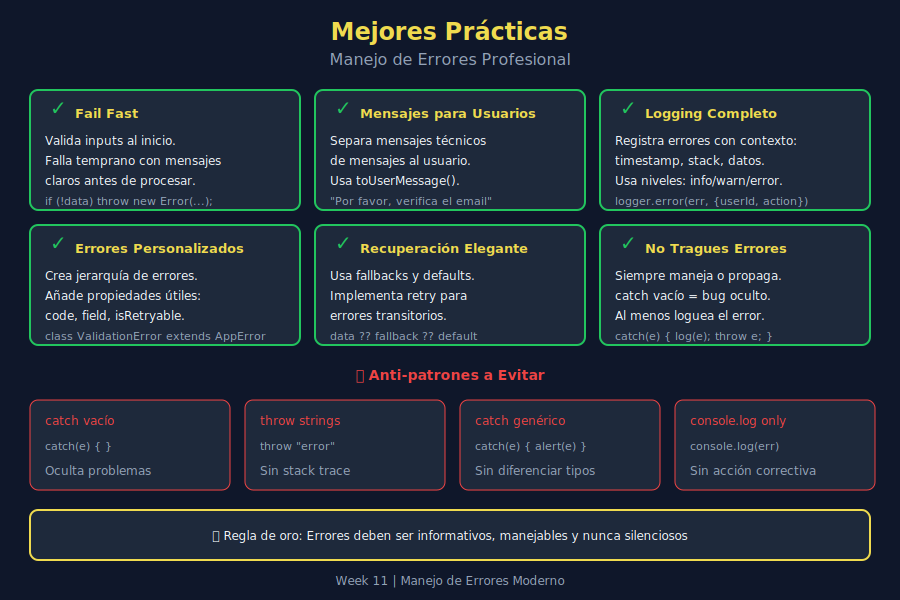

# 🏆 Mejores Prácticas de Manejo de Errores

## 🎯 Objetivos de Aprendizaje

- Aplicar principios de manejo de errores en producción
- Implementar logging efectivo
- Crear mensajes de error útiles para usuarios y desarrolladores
- Evitar anti-patrones comunes

---

## 📖 Introducción

El manejo de errores no es solo sobre capturar excepciones—es sobre crear sistemas resilientes que fallen de manera predecible y proporcionen información útil para debugging y recuperación.



---

## 1️⃣ Principios Fundamentales

### Fail Fast, Fail Loud

Detecta y reporta errores lo antes posible:

```javascript
// ❌ BAD - Error oculto, falla después
const processUser = user => {
  const name = user?.name || 'Unknown';  // Silently handles null
  // ... 100 lines later, something breaks because user was null
};

// ✅ GOOD - Fail immediately with clear message
const processUser = user => {
  if (!user) {
    throw new ValidationError('user', 'User object is required');
  }
  if (!user.name) {
    throw new ValidationError('user.name', 'User name is required');
  }
  // Now we know user is valid
};
```

### Never Silence Errors

```javascript
// ❌ TERRIBLE - Silent catch
try {
  riskyOperation();
} catch (error) {
  // Empty catch - bugs hide here forever
}

// ❌ BAD - Console but no action
try {
  riskyOperation();
} catch (error) {
  console.log(error);  // Easy to miss in production
}

// ✅ GOOD - Log and handle appropriately
try {
  riskyOperation();
} catch (error) {
  logger.error('Operation failed', { error, context: relevantData });
  notifyUser('Something went wrong. Please try again.');
  reportToErrorTracking(error);
}
```

### Single Responsibility for Error Handling

```javascript
// ❌ BAD - Mixed responsibilities
const fetchUser = async id => {
  try {
    const response = await fetch(`/api/users/${id}`);
    const user = await response.json();
    displayUser(user);           // UI logic mixed in
    updateLocalStorage(user);    // Side effect
    return user;
  } catch (error) {
    showErrorModal(error);       // UI in data function
    return null;
  }
};

// ✅ GOOD - Single responsibility
const fetchUser = async id => {
  const response = await fetch(`/api/users/${id}`);

  if (!response.ok) {
    throw new HttpError(response.status, response.statusText);
  }

  return response.json();
};

// Caller handles UI
try {
  const user = await fetchUser(123);
  displayUser(user);
} catch (error) {
  showErrorModal(error);
}
```

---

## 2️⃣ Errores Informativos

### Incluye Contexto Útil

```javascript
// ❌ BAD - No context
throw new Error('Validation failed');

// ✅ GOOD - Rich context
throw new ValidationError('email', 'Invalid format', {
  value: email,
  pattern: 'expected user@domain.com format',
  field: 'registrationForm.email'
});
```

### Estructura de Error Recomendada

```javascript
class AppError extends Error {
  constructor(message, options = {}) {
    super(message);
    this.name = this.constructor.name;
    this.code = options.code ?? 'UNKNOWN_ERROR';
    this.statusCode = options.statusCode ?? 500;
    this.isOperational = options.isOperational ?? true;
    this.context = options.context ?? {};
    this.timestamp = new Date().toISOString();

    Error.captureStackTrace?.(this, this.constructor);
  }

  toJSON() {
    return {
      name: this.name,
      message: this.message,
      code: this.code,
      statusCode: this.statusCode,
      context: this.context,
      timestamp: this.timestamp,
      stack: this.stack
    };
  }

  toUserMessage() {
    // Override in subclasses for user-friendly messages
    return 'An unexpected error occurred. Please try again.';
  }
}
```

---

## 3️⃣ Separar Errores Operacionales de Bugs

### Errores Operacionales (Esperados)

```javascript
// These are expected and should be handled gracefully
class OperationalError extends AppError {
  constructor(message, options = {}) {
    super(message, { ...options, isOperational: true });
  }
}

// Examples:
// - User input validation fails
// - Network request fails
// - Database connection lost
// - File not found
// - Rate limit exceeded
```

### Errores de Programación (Bugs)

```javascript
// These indicate bugs that should be fixed
class ProgrammerError extends AppError {
  constructor(message, options = {}) {
    super(message, { ...options, isOperational: false });
  }
}

// Examples:
// - TypeError: cannot read property of undefined
// - ReferenceError: variable not defined
// - Assertion failures
// - Logic errors
```

### Manejo Diferenciado

```javascript
const globalErrorHandler = error => {
  logger.error(error);

  if (error.isOperational) {
    // Operational error - handle gracefully
    showUserMessage(error.toUserMessage());
  } else {
    // Programmer error - something is very wrong
    showCriticalError();
    reportToDeveloper(error);

    // In production, might want to restart the process
    // process.exit(1);
  }
};
```

---

## 4️⃣ Logging Efectivo

### Niveles de Log

```javascript
const logger = {
  debug: (msg, data) => console.debug(`[DEBUG] ${msg}`, data),
  info: (msg, data) => console.info(`[INFO] ${msg}`, data),
  warn: (msg, data) => console.warn(`[WARN] ${msg}`, data),
  error: (msg, data) => console.error(`[ERROR] ${msg}`, data),
  fatal: (msg, data) => console.error(`[FATAL] ${msg}`, data)
};

// Usage
logger.debug('Processing started', { itemCount: items.length });
logger.info('User logged in', { userId: user.id });
logger.warn('Rate limit approaching', { current: 90, limit: 100 });
logger.error('Payment failed', { error, orderId, userId });
logger.fatal('Database connection lost', { error });
```

### Structured Logging

```javascript
const structuredLog = (level, message, data = {}) => {
  const logEntry = {
    timestamp: new Date().toISOString(),
    level,
    message,
    ...data,
    environment: process.env.NODE_ENV,
    version: process.env.APP_VERSION
  };

  console[level](JSON.stringify(logEntry));
};

// Usage
structuredLog('error', 'Payment processing failed', {
  error: error.message,
  stack: error.stack,
  userId: user.id,
  orderId: order.id,
  amount: order.total
});
```

### Qué Loggear en Errores

```javascript
const logError = (error, context = {}) => {
  const logData = {
    // Error info
    errorName: error.name,
    errorMessage: error.message,
    errorCode: error.code,
    errorStack: error.stack,

    // Context
    ...context,

    // Environment
    url: window.location?.href,
    userAgent: navigator?.userAgent,
    timestamp: new Date().toISOString(),

    // User (if available)
    userId: getCurrentUser()?.id
  };

  console.error('Error occurred:', logData);

  // Send to error tracking service
  if (process.env.NODE_ENV === 'production') {
    sendToErrorTracking(logData);
  }
};
```

---

## 5️⃣ Mensajes de Error para Usuarios

### Separar Mensajes Técnicos de Mensajes de Usuario

```javascript
class HttpError extends AppError {
  constructor(status, statusText, url) {
    super(`HTTP ${status}: ${statusText}`);
    this.status = status;
    this.url = url;
  }

  toUserMessage() {
    const messages = {
      400: 'The request was invalid. Please check your input.',
      401: 'Please log in to continue.',
      403: 'You don\'t have permission to do this.',
      404: 'The requested item was not found.',
      429: 'Too many requests. Please wait a moment.',
      500: 'Our servers are having issues. Please try again later.',
      502: 'Service temporarily unavailable. Please try again.',
      503: 'Service is undergoing maintenance. Please try later.'
    };

    return messages[this.status] ?? 'An unexpected error occurred.';
  }
}

// Usage
try {
  await fetchData();
} catch (error) {
  // Technical log for developers
  logger.error('API request failed', error.toJSON());

  // Friendly message for users
  showNotification(error.toUserMessage());
}
```

### Mensajes Accionables

```javascript
// ❌ BAD - Useless message
showError('Error 500');

// ❌ OKAY - Explains but no action
showError('Failed to save your changes.');

// ✅ GOOD - Explains and suggests action
showError('Failed to save your changes. Please check your connection and try again.');

// ✅ BETTER - With action button
showError({
  message: 'Failed to save your changes.',
  actions: [
    { label: 'Try Again', onClick: retrySave },
    { label: 'Save Offline', onClick: saveToLocal }
  ]
});
```

---

## 6️⃣ Validación de Input

### Validar Temprano

```javascript
// ✅ GOOD - Validate at entry points
const createUser = userData => {
  // Validate immediately
  validateUserData(userData);

  // Now safe to proceed
  return {
    id: generateId(),
    ...userData,
    createdAt: new Date()
  };
};

const validateUserData = data => {
  const errors = [];

  if (!data.email) {
    errors.push(new ValidationError('email', 'Email is required'));
  } else if (!isValidEmail(data.email)) {
    errors.push(new ValidationError('email', 'Invalid email format'));
  }

  if (!data.password) {
    errors.push(new ValidationError('password', 'Password is required'));
  } else if (data.password.length < 8) {
    errors.push(new ValidationError('password', 'Password must be at least 8 characters'));
  }

  if (errors.length > 0) {
    throw new MultiValidationError(errors);
  }
};
```

### Sanitizar Datos

```javascript
const sanitizeUserInput = input => {
  if (typeof input !== 'string') {
    throw new ValidationError('input', 'Expected string input');
  }

  return input
    .trim()
    .slice(0, 1000)  // Limit length
    .replace(/<[^>]*>/g, '');  // Remove HTML tags
};
```

---

## 7️⃣ Defensive Programming

### Guardia de Tipos

```javascript
const processItems = items => {
  // Guard clause
  if (!Array.isArray(items)) {
    throw new TypeError(
      `Expected array, got ${typeof items}`
    );
  }

  if (items.length === 0) {
    return [];  // Early return for empty case
  }

  return items.map(item => transform(item));
};
```

### Defaults Seguros

```javascript
// ❌ RISKY - Might fail if config is malformed
const timeout = config.settings.network.timeout;

// ✅ SAFE - With fallbacks
const timeout = config?.settings?.network?.timeout ?? 5000;

// ✅ SAFER - Validate and default
const getTimeout = config => {
  const value = config?.settings?.network?.timeout;

  if (typeof value !== 'number' || value < 0) {
    logger.warn('Invalid timeout config, using default', { value });
    return 5000;
  }

  return value;
};
```

---

## 8️⃣ Error Recovery

### Graceful Degradation

```javascript
const loadUserProfile = async userId => {
  try {
    // Try to get full profile
    return await api.getUserProfile(userId);
  } catch (error) {
    logger.warn('Failed to load full profile', { error, userId });

    try {
      // Fall back to basic info
      return await api.getUserBasic(userId);
    } catch (fallbackError) {
      logger.warn('Failed to load basic info', { error: fallbackError });

      // Last resort: return minimal default
      return {
        id: userId,
        name: 'Unknown User',
        isPartialData: true
      };
    }
  }
};
```

### Circuit Breaker Pattern

```javascript
class CircuitBreaker {
  constructor(options = {}) {
    this.failureThreshold = options.failureThreshold ?? 5;
    this.resetTimeout = options.resetTimeout ?? 30000;
    this.failures = 0;
    this.state = 'CLOSED';  // CLOSED, OPEN, HALF_OPEN
    this.nextAttempt = 0;
  }

  async execute(fn) {
    if (this.state === 'OPEN') {
      if (Date.now() < this.nextAttempt) {
        throw new Error('Circuit breaker is OPEN');
      }
      this.state = 'HALF_OPEN';
    }

    try {
      const result = await fn();
      this.onSuccess();
      return result;
    } catch (error) {
      this.onFailure();
      throw error;
    }
  }

  onSuccess() {
    this.failures = 0;
    this.state = 'CLOSED';
  }

  onFailure() {
    this.failures++;

    if (this.failures >= this.failureThreshold) {
      this.state = 'OPEN';
      this.nextAttempt = Date.now() + this.resetTimeout;
    }
  }
}

// Usage
const apiBreaker = new CircuitBreaker({
  failureThreshold: 3,
  resetTimeout: 60000
});

const fetchData = async () => {
  return apiBreaker.execute(() => api.getData());
};
```

---

## 9️⃣ Testing de Errores

### Probar que Errores se Lanzan

```javascript
// Jest example
describe('validateEmail', () => {
  test('throws ValidationError for invalid email', () => {
    expect(() => {
      validateEmail('not-an-email');
    }).toThrow(ValidationError);
  });

  test('error has correct field name', () => {
    try {
      validateEmail('bad');
    } catch (error) {
      expect(error.field).toBe('email');
      expect(error.code).toBe('VALIDATION_ERROR');
    }
  });
});
```

### Probar Manejo de Errores

```javascript
describe('fetchUser', () => {
  test('handles network error gracefully', async () => {
    // Mock fetch to fail
    global.fetch = jest.fn().mockRejectedValue(
      new Error('Network error')
    );

    const result = await fetchUserSafe(123);

    expect(result).toEqual({
      error: true,
      message: 'Failed to load user'
    });
  });
});
```

---

## 🔟 Anti-Patrones a Evitar

### ❌ Catch Genérico sin Re-throw

```javascript
// BAD
try {
  doMany();
  things();
  here();
} catch (error) {
  console.log('error');  // Which operation failed?
}

// GOOD - Specific catches or re-throw
try {
  await doMany();
} catch (error) {
  if (error instanceof ExpectedError) {
    handleExpected(error);
  } else {
    throw error;  // Unexpected errors propagate
  }
}
```

### ❌ Usar Errores para Control de Flujo

```javascript
// BAD - Using exceptions for expected cases
const findUser = id => {
  try {
    return db.getUser(id);
  } catch {
    return null;  // Not found is expected, not exceptional
  }
};

// GOOD - Explicit checks
const findUser = id => {
  const user = db.getUser(id);
  return user ?? null;
};
```

### ❌ Información Sensible en Errores

```javascript
// BAD - Exposes sensitive info
throw new Error(`Login failed for ${email} with password ${password}`);

// GOOD - Log sensitive info separately, sanitize user message
logger.error('Login failed', { email, hasPassword: !!password });
throw new AuthError('Invalid credentials');
```

---

## ✅ Checklist de Mejores Prácticas

- [ ] Nunca silencio errores (catch vacío)
- [ ] Mis errores incluyen contexto útil
- [ ] Separo mensajes técnicos de mensajes de usuario
- [ ] Valido input en puntos de entrada
- [ ] Uso logging estructurado
- [ ] Mis errores son testeables
- [ ] Implemento graceful degradation donde es posible
- [ ] No uso errores para control de flujo normal

---

## 📚 Recursos Adicionales

- [Node.js Error Handling Best Practices](https://nodejs.org/api/errors.html)
- [JavaScript Error Handling Patterns](https://www.patterns.dev/posts/error-handling)
- [Clean Code: Error Handling](https://www.oreilly.com/library/view/clean-code-a/9780136083238/)

---

## 🔗 Navegación

| ⬅️ Anterior | 🏠 Índice | Siguiente ➡️ |
|:------------|:--------:|-------------:|
| [04 - Errores Asíncronos](./04-errores-asincronos.md) | [Teoría](./README.md) | [Prácticas](../2-practicas/) |
