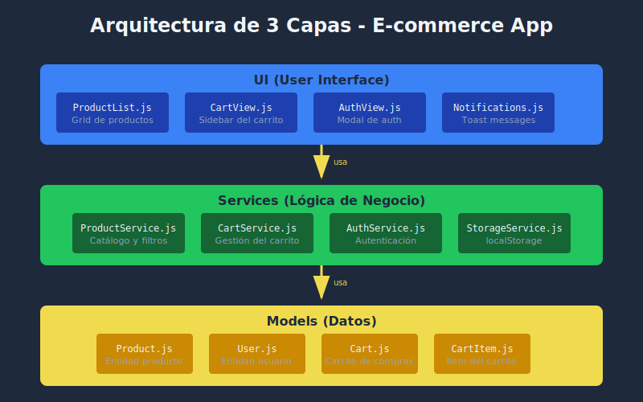
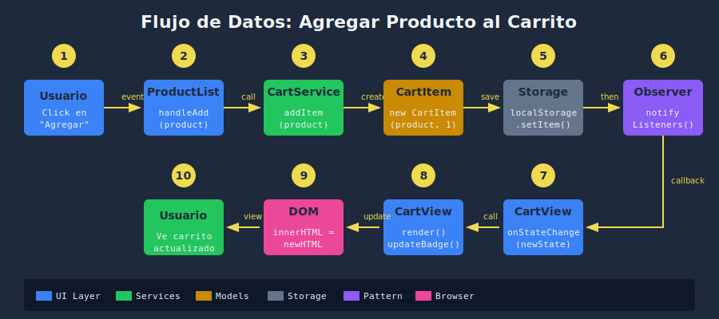

# 🏗️ Arquitectura de Aplicación

## 🎯 Objetivo

Diseñar una estructura modular y escalable para la aplicación E-commerce.

---

## 📂 Estructura de Carpetas

```
ecommerce-app/
├── index.html              # Entry point HTML
├── styles.css              # Estilos globales
├── js/
│   ├── main.js             # Entry point JS (inicialización)
│   ├── app.js              # Lógica principal de la aplicación
│   ├── config.js           # Configuración y constantes
│   │
│   ├── models/             # Clases de dominio
│   │   ├── Product.js
│   │   ├── User.js
│   │   ├── Cart.js
│   │   └── CartItem.js
│   │
│   ├── services/           # Lógica de negocio
│   │   ├── ProductService.js
│   │   ├── CartService.js
│   │   ├── AuthService.js
│   │   └── StorageService.js
│   │
│   └── ui/                 # Componentes de UI
│       ├── ProductList.js
│       ├── CartView.js
│       ├── SearchBar.js
│       └── Notifications.js
```

### Diagrama Visual



---

## 🧩 Capas de la Aplicación

### 1. Models (Datos)

Representan las entidades del dominio:

```javascript
// models/Product.js
export class Product {
  #id;

  constructor({ id, name, price, category, image, stock }) {
    this.#id = id ?? crypto.randomUUID();
    this.name = name;
    this.price = price;
    this.category = category;
    this.image = image;
    this.stock = stock ?? 0;
  }

  get id() { return this.#id; }

  toJSON() {
    return {
      id: this.#id,
      name: this.name,
      price: this.price,
      category: this.category,
      image: this.image,
      stock: this.stock
    };
  }
}
```

### 2. Services (Lógica de Negocio)

Manejan operaciones y datos:

```javascript
// services/ProductService.js
import { Product } from '../models/Product.js';
import { StorageService } from './StorageService.js';

class ProductService {
  #products = [];

  constructor() {
    this.#loadProducts();
  }

  getAll() {
    return [...this.#products];
  }

  getById(id) {
    return this.#products.find(p => p.id === id);
  }

  filter({ category, minPrice, maxPrice, search }) {
    return this.#products.filter(product => {
      if (category && product.category !== category) return false;
      if (minPrice && product.price < minPrice) return false;
      if (maxPrice && product.price > maxPrice) return false;
      if (search && !product.name.toLowerCase().includes(search.toLowerCase())) {
        return false;
      }
      return true;
    });
  }

  #loadProducts() {
    // Cargar de storage o usar datos iniciales
  }
}

export const productService = new ProductService();
```

### 3. UI (Presentación)

Renderizan y manejan interacciones:

```javascript
// ui/ProductList.js
import { productService } from '../services/ProductService.js';
import { cartService } from '../services/CartService.js';

export class ProductList {
  #container;
  #products = [];

  constructor(containerSelector) {
    this.#container = document.querySelector(containerSelector);
    this.#bindEvents();
  }

  render(products = productService.getAll()) {
    this.#products = products;
    this.#container.innerHTML = products
      .map(p => this.#renderProduct(p))
      .join('');
  }

  #renderProduct(product) {
    return `
      <article class="product-card" data-id="${product.id}">
        
        <h3>${product.name}</h3>
        <p class="price">$${product.price}</p>
        <button class="add-to-cart">Agregar</button>
      </article>
    `;
  }

  #bindEvents() {
    this.#container.addEventListener('click', e => {
      if (e.target.classList.contains('add-to-cart')) {
        const id = e.target.closest('.product-card').dataset.id;
        cartService.add(id);
      }
    });
  }
}
```

---

## 🔄 Flujo de Datos



El diagrama muestra el flujo completo cuando un usuario agrega un producto al carrito:

1. **Usuario** hace click en "Agregar"
2. **ProductList** captura el evento y llama al servicio
3. **CartService** procesa la operación
4. **CartItem** se crea/actualiza
5. **StorageService** persiste en localStorage
6. **Observer** notifica a los listeners
7. **CartView** recibe la notificación
8. **render()** actualiza la UI
9. **DOM** refleja los cambios
10. **Usuario** ve el carrito actualizado
                    └─────────────┘     └─────────────┘
```

1. **Usuario** interactúa (click, input)
2. **UI** captura evento y llama a Service
3. **Service** procesa lógica con Models
4. **UI** re-renderiza con datos actualizados

---

## 📦 Patrón de Exportación

### Singleton para Services

```javascript
// services/CartService.js
class CartService {
  // ... implementación
}

// Exportar instancia única
export const cartService = new CartService();
```

### Clases para Models

```javascript
// models/Product.js
export class Product {
  // ... implementación
}

// Se instancian múltiples veces
const product1 = new Product({ name: 'Laptop' });
const product2 = new Product({ name: 'Phone' });
```

---

## 🎯 Entry Point

```javascript
// main.js
import { App } from './app.js';

// Inicializar cuando el DOM esté listo
document.addEventListener('DOMContentLoaded', () => {
  const app = new App();
  app.init();
});
```

```javascript
// app.js
import { ProductList } from './ui/ProductList.js';
import { CartView } from './ui/CartView.js';
import { SearchBar } from './ui/SearchBar.js';
import { authService } from './services/AuthService.js';

export class App {
  #productList;
  #cartView;
  #searchBar;

  init() {
    this.#productList = new ProductList('#products');
    this.#cartView = new CartView('#cart');
    this.#searchBar = new SearchBar('#search');

    this.#productList.render();
    this.#cartView.render();
  }
}
```

---

## ✅ Principios Clave

| Principio | Aplicación |
|-----------|------------|
| **Separación de responsabilidades** | Models, Services, UI en carpetas separadas |
| **Encapsulación** | Campos privados (#) en clases |
| **Single source of truth** | Services manejan el estado |
| **Bajo acoplamiento** | Módulos independientes con imports explícitos |

---

## 🔗 Navegación

| ⬅️ Anterior | 🏠 Semana | ➡️ Siguiente |
|:------------|:---------:|-------------:|
| [Revisión](./01-revision-conceptos.md) | [README](../README.md) | [Clean Code](./03-clean-code.md) |
