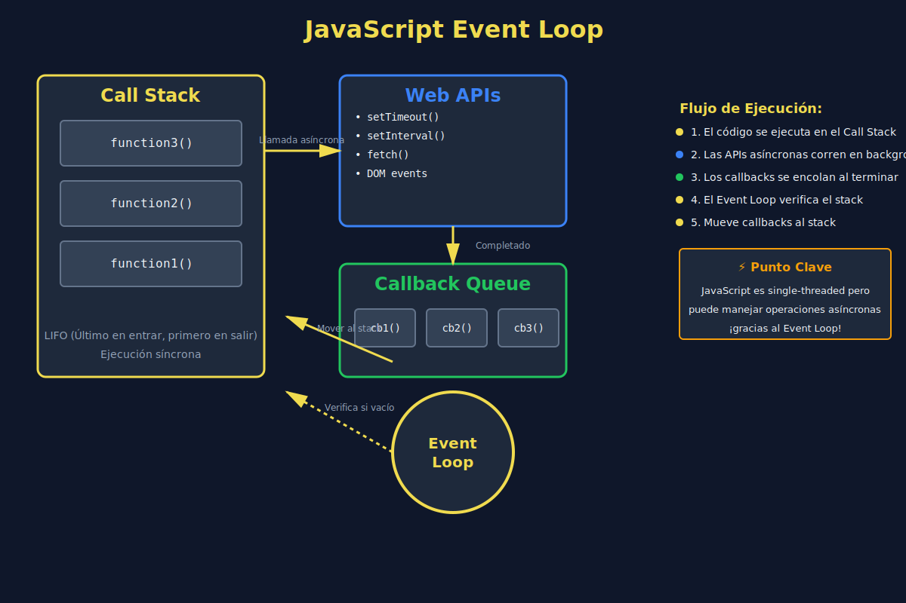

# 🔄 Introducción a la Programación Asincrónica

## 🎯 Objetivos

Al finalizar este tema, comprenderás:

- ✅ Qué es la programación asincrónica
- ✅ Diferencias entre código síncrono y asíncrono
- ✅ Cómo funciona el Event Loop de JavaScript
- ✅ Por qué JavaScript es single-threaded
- ✅ El concepto de operaciones no bloqueantes

---

## 📋 Contenido



---

### 1. ¿Qué es la Programación Asincrónica?

La **programación asincrónica** permite que tu código ejecute operaciones que toman tiempo (como leer archivos, hacer peticiones HTTP, consultar bases de datos) **sin bloquear** la ejecución del resto del programa.

#### Ejemplo del mundo real

Imagina que estás en una cafetería:

**☕ Modelo Síncrono (Bloqueante)**:
```
Cliente 1 pide café → Espera 5 min → Recibe café
Cliente 2 pide café → Espera 5 min → Recibe café
Cliente 3 pide café → Espera 5 min → Recibe café
Total: 15 minutos
```

**⚡ Modelo Asíncrono (No bloqueante)**:
```
Cliente 1 pide café → Se le da número
Cliente 2 pide café → Se le da número
Cliente 3 pide café → Se le da número
Todos reciben sus cafés cuando están listos
Total: 5 minutos
```

---

### 2. Código Síncrono vs Asíncrono

#### 🔴 Código Síncrono

Se ejecuta **línea por línea**, en orden, bloqueando la siguiente instrucción hasta que la actual termine:

```javascript
// ============================================
// CÓDIGO SÍNCRONO (BLOQUEANTE)
// ============================================

console.log('1. Inicio');

// Esta función bloquea durante 3 segundos
const blockingTask = () => {
  const start = Date.now();
  while (Date.now() - start < 3000) {
    // Bloquea el hilo durante 3 segundos
  }
  return 'Tarea completada';
};

console.log('2. Ejecutando tarea bloqueante...');
const result = blockingTask(); // ⏸️ BLOQUEA aquí por 3 segundos
console.log('3. Resultado:', result);
console.log('4. Fin');

// Output:
// 1. Inicio
// 2. Ejecutando tarea bloqueante...
// (espera 3 segundos) ⏱️
// 3. Resultado: Tarea completada
// 4. Fin
```

**Problema**: Durante esos 3 segundos, **nada más puede ejecutarse**. La aplicación se congela.

#### 🟢 Código Asíncrono

Permite que otras operaciones continúen mientras espera:

```javascript
// ============================================
// CÓDIGO ASÍNCRONO (NO BLOQUEANTE)
// ============================================

console.log('1. Inicio');

// Esta función NO bloquea
const asyncTask = () => {
  console.log('2. Iniciando tarea asíncrona...');

  setTimeout(() => {
    console.log('4. Tarea completada (después de 3 segundos)');
  }, 3000);

  console.log('3. Tarea delegada, continuando...');
};

asyncTask();
console.log('5. Fin');

// Output INMEDIATO:
// 1. Inicio
// 2. Iniciando tarea asíncrona...
// 3. Tarea delegada, continuando...
// 5. Fin
// (espera 3 segundos) ⏱️
// 4. Tarea completada (después de 3 segundos)
```

**Ventaja**: El programa **no se congela**. Puede hacer otras cosas mientras espera.

---

### 3. El Event Loop de JavaScript

JavaScript es **single-threaded** (un solo hilo de ejecución), pero puede manejar operaciones asíncronas gracias al **Event Loop**.

#### 🧩 Componentes del Event Loop

```
┌─────────────────────────────┐
│      JavaScript Engine      │
├─────────────────────────────┤
│                             │
│  ┌─────────────────────┐    │
│  │    Call Stack       │    │  ← Pila de ejecución
│  │  [function3()]      │    │
│  │  [function2()]      │    │
│  │  [function1()]      │    │
│  └─────────────────────┘    │
│                             │
│  ┌─────────────────────┐    │
│  │   Web APIs          │    │  ← Navegador/Node.js
│  │  - setTimeout       │    │
│  │  - fetch            │    │
│  │  - DOM events       │    │
│  └─────────────────────┘    │
│                             │
│  ┌─────────────────────┐    │
│  │ Microtask Queue     │    │  ← Promises
│  │  [promise1]         │    │
│  └─────────────────────┘    │
│                             │
│  ┌─────────────────────┐    │
│  │ Callback Queue      │    │  ← setTimeout, etc.
│  │  [callback1]        │    │
│  └─────────────────────┘    │
│                             │
│      ⬆️ Event Loop ⬆️        │
└─────────────────────────────┘
```

#### 📝 Explicación

1. **Call Stack**: Pila de funciones en ejecución
2. **Web APIs**: APIs del navegador/Node.js que manejan operaciones asíncronas
3. **Callback Queue**: Cola de callbacks listos para ejecutarse
4. **Microtask Queue**: Cola prioritaria para Promises
5. **Event Loop**: Revisa si el call stack está vacío y mueve callbacks a ejecutar

---

### 4. Flujo de Ejecución Asíncrona

Veamos un ejemplo paso a paso:

```javascript
// ============================================
// EJEMPLO DE FLUJO ASÍNCRONO
// ============================================

console.log('A');

setTimeout(() => {
  console.log('B');
}, 0);

Promise.resolve().then(() => {
  console.log('C');
});

console.log('D');

// Output:
// A
// D
// C
// B
```

#### 🔍 ¿Por qué este orden?

**Paso a paso**:

1. `console.log('A')` → **Call Stack** → Ejecuta → Output: `A`
2. `setTimeout(...)` → **Web API** → Registra callback en **Callback Queue**
3. `Promise.resolve().then(...)` → Registra callback en **Microtask Queue**
4. `console.log('D')` → **Call Stack** → Ejecuta → Output: `D`
5. **Call Stack vacío** → Event Loop revisa colas
6. **Microtask Queue** tiene prioridad → Ejecuta → Output: `C`
7. **Callback Queue** → Ejecuta → Output: `B`

**Regla de oro**:
- **Microtasks (Promises)** tienen **prioridad** sobre **Callbacks (setTimeout)**

---

### 5. Operaciones Asíncronas Comunes

En JavaScript, estas operaciones son **asíncronas por naturaleza**:

#### 🌐 Red y HTTP
```javascript
// Fetch API
fetch('https://api.example.com/data')
  .then(response => response.json())
  .then(data => console.log(data));
```

#### 📁 Sistema de Archivos (Node.js)
```javascript
// Leer archivo
const fs = require('fs').promises;
fs.readFile('file.txt', 'utf8')
  .then(content => console.log(content));
```

#### ⏱️ Temporizadores
```javascript
// setTimeout
setTimeout(() => {
  console.log('Ejecuta después de 2 segundos');
}, 2000);

// setInterval
const interval = setInterval(() => {
  console.log('Ejecuta cada segundo');
}, 1000);
```

#### 🖱️ Eventos del DOM
```javascript
// Event listeners
button.addEventListener('click', () => {
  console.log('Button clicked!');
});
```

#### 💾 Base de Datos
```javascript
// Consulta a BD
db.query('SELECT * FROM users')
  .then(users => console.log(users));
```

---

### 6. ¿Por qué JavaScript es Single-Threaded?

JavaScript fue diseñado para manipular el DOM, y tener múltiples hilos modificando el DOM simultáneamente causaría **condiciones de carrera** y **bugs difíciles de rastrear**.

#### Ventajas del Single-Thread

✅ **Simplicidad**: No necesitas preocuparte por locks, deadlocks, o race conditions
✅ **Predecibilidad**: El código se ejecuta en orden definido
✅ **Facilidad de debug**: Un solo contexto de ejecución

#### Desventajas

❌ **Operaciones CPU-intensivas bloquean**: Cálculos pesados congelan la UI
❌ **No aprovecha multi-core**: Solo usa un núcleo del CPU

#### Soluciones

💡 **Web Workers**: Hilos separados para tareas pesadas (sin acceso al DOM)
💡 **Async/Await**: Sintaxis moderna para manejar asincronía (próxima semana)
💡 **Service Workers**: Para operaciones en background

---

### 7. Ejemplo Práctico Completo

```javascript
// ============================================
// SIMULACIÓN DE CARGA DE DATOS
// ============================================

const loadUserData = userId => {
  console.log(`⏳ Cargando datos del usuario ${userId}...`);

  // Simula una petición HTTP que tarda 2 segundos
  setTimeout(() => {
    const userData = {
      id: userId,
      name: 'Ana García',
      email: 'ana@example.com'
    };

    console.log('✅ Datos cargados:', userData);
  }, 2000);
};

const loadUserPosts = userId => {
  console.log(`⏳ Cargando posts del usuario ${userId}...`);

  setTimeout(() => {
    const posts = [
      { id: 1, title: 'Mi primer post' },
      { id: 2, title: 'JavaScript es genial' }
    ];

    console.log('✅ Posts cargados:', posts);
  }, 1500);
};

// Ejecución
console.log('🚀 Inicio de la aplicación');
loadUserData(123);
loadUserPosts(123);
console.log('📝 Continuando con otras tareas...');

// Output:
// 🚀 Inicio de la aplicación
// ⏳ Cargando datos del usuario 123...
// ⏳ Cargando posts del usuario 123...
// 📝 Continuando con otras tareas...
// (espera 1.5 segundos)
// ✅ Posts cargados: [...]
// (espera 0.5 segundos más)
// ✅ Datos cargados: {...}
```

---

## 🎯 Casos de Uso

La programación asincrónica es esencial para:

- 🌐 **Peticiones HTTP**: Consumir APIs REST
- 📁 **Operaciones de archivo**: Leer/escribir archivos
- 💾 **Consultas a BD**: Queries a bases de datos
- ⏱️ **Animaciones**: Transiciones suaves en UI
- 🎮 **Juegos**: Game loops y renderizado
- 📊 **Data streaming**: Procesamiento de datos en tiempo real
- 🔔 **Notificaciones**: Push notifications

---

## ✅ Checklist de Verificación

Antes de continuar, asegúrate de comprender:

- [ ] La diferencia entre código síncrono y asíncrono
- [ ] Qué es el Event Loop y cómo funciona
- [ ] La diferencia entre Callback Queue y Microtask Queue
- [ ] Por qué JavaScript es single-threaded
- [ ] Qué operaciones son asíncronas por naturaleza
- [ ] Por qué las Promises tienen prioridad sobre setTimeout

---

## 📚 Recursos Adicionales

- 📖 [MDN: Asynchronous JavaScript](https://developer.mozilla.org/en-US/docs/Learn/JavaScript/Asynchronous)
- 🎥 [What the heck is the event loop anyway?](https://www.youtube.com/watch?v=8aGhZQkoFbQ) - Philip Roberts
- 🔧 [Loupe - Event Loop Visualizer](http://latentflip.com/loupe/)
- 📘 [JavaScript.info: Introduction to callbacks](https://javascript.info/callbacks)

---

**Próximo tema**: [02 - Callbacks y sus Problemas](./02-callbacks-problemas.md)
