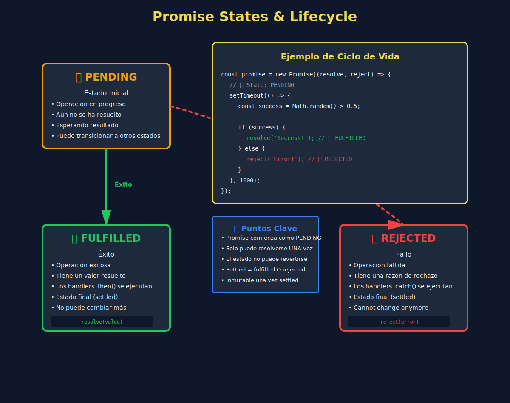
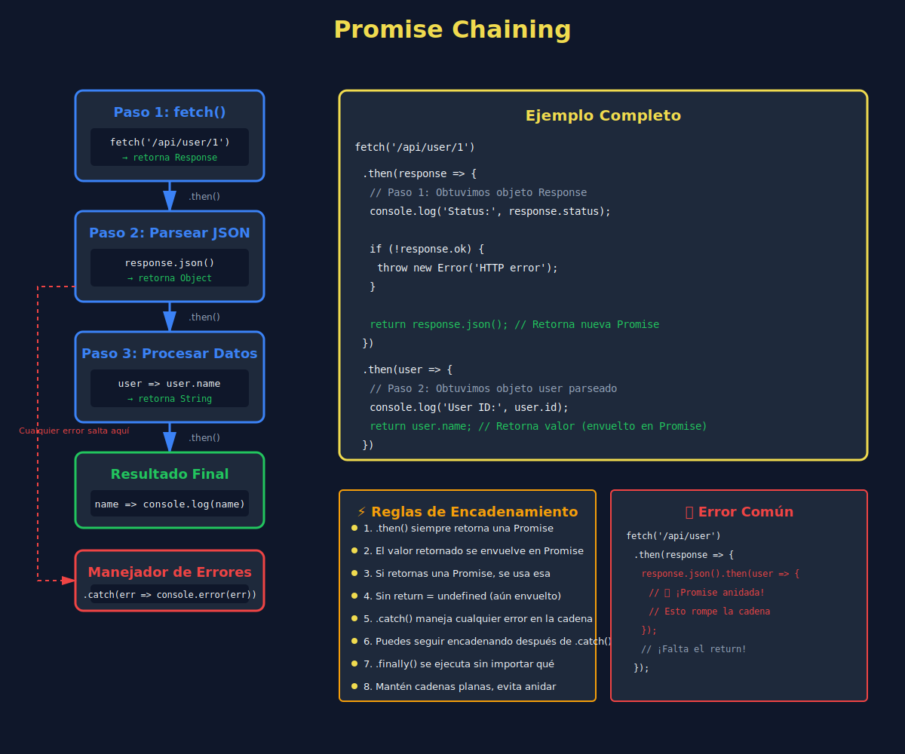

# 🎁 Promises: Fundamentos

## 🎯 Objetivos

Al finalizar este tema, comprenderás:

- ✅ Qué es una Promise y cómo funciona
- ✅ Los tres estados de una Promise
- ✅ Cómo crear Promises con el constructor
- ✅ Cómo consumir Promises con `.then()`, `.catch()` y `.finally()`
- ✅ Promise chaining (encadenamiento)
- ✅ Manejo de errores en Promises

---

## 📋 Contenido



---

### 1. ¿Qué es una Promise?

Una **Promise** (promesa) es un objeto que representa el **resultado eventual** de una operación asíncrona. Es como un "pagaré" que promete un valor en el futuro.

#### Analogía del Mundo Real

Imagina que pides comida a domicilio:

```
📱 Haces el pedido → Recibes un TICKET (Promise)
⏳ La comida se prepara → Estado: PENDING
✅ Llega la comida → Estado: FULFILLED (cumplida)
❌ Se cancela el pedido → Estado: REJECTED (rechazada)
```

---

### 2. Estados de una Promise

Una Promise puede estar en uno de **tres estados**:

```javascript
// ============================================
// ESTADOS DE UNA PROMISE
// ============================================

// 1️⃣ PENDING (Pendiente)
//    - Estado inicial
//    - La operación aún está en progreso
//    - No está ni cumplida ni rechazada

// 2️⃣ FULFILLED (Cumplida)
//    - La operación se completó exitosamente
//    - Tiene un valor resultado
//    - Se ejecuta el .then()

// 3️⃣ REJECTED (Rechazada)
//    - La operación falló
//    - Tiene una razón de error
//    - Se ejecuta el .catch()
```

#### Diagrama de Estados

```
       pending
         ⬇️
    ┌────┴────┐
    ⬇️         ⬇️
fulfilled  rejected
    ⬇️         ⬇️
  .then()  .catch()
```

**Importante**: Una vez que una Promise se resuelve (fulfilled o rejected), **no puede cambiar de estado**.

---

### 3. Crear una Promise

Usa el constructor `new Promise()`:

```javascript
// ============================================
// CREAR UNA PROMISE
// ============================================

const myPromise = new Promise((resolve, reject) => {
  // Código asíncrono aquí

  // Si tiene éxito:
  resolve(value); // Cambia estado a fulfilled

  // Si falla:
  reject(error); // Cambia estado a rejected
});
```

#### Ejemplo Simple

```javascript
// ============================================
// PROMISE SIMPLE
// ============================================

const simplePromise = new Promise((resolve, reject) => {
  const success = true;

  if (success) {
    resolve('¡Éxito!');
  } else {
    reject('Error');
  }
});

console.log(simplePromise);
// Promise { '¡Éxito!' } ← Estado fulfilled
```

#### Ejemplo con setTimeout

```javascript
// ============================================
// PROMISE CON OPERACIÓN ASÍNCRONA
// ============================================

const waitSeconds = seconds => {
  return new Promise((resolve, reject) => {
    setTimeout(() => {
      resolve(`Esperé ${seconds} segundos`);
    }, seconds * 1000);
  });
};

const promise = waitSeconds(2);
console.log(promise); // Promise { <pending> }

// Después de 2 segundos:
// Promise { 'Esperé 2 segundos' }
```

---

### 4. Consumir una Promise

Usa `.then()` para manejar el resultado:

```javascript
// ============================================
// CONSUMIR PROMISE CON .then()
// ============================================

const fetchUser = userId => {
  return new Promise((resolve, reject) => {
    setTimeout(() => {
      const user = {
        id: userId,
        name: 'Ana García',
        email: 'ana@example.com'
      };
      resolve(user);
    }, 1000);
  });
};

// Consumir la promise
fetchUser(123).then(user => {
  console.log('Usuario recibido:', user);
});

// Output (después de 1 segundo):
// Usuario recibido: { id: 123, name: 'Ana García', ... }
```

---

### 5. Manejo de Errores con `.catch()`

```javascript
// ============================================
// MANEJO DE ERRORES
// ============================================

const riskyOperation = () => {
  return new Promise((resolve, reject) => {
    const random = Math.random();

    setTimeout(() => {
      if (random > 0.5) {
        resolve('Operación exitosa! 🎉');
      } else {
        reject(new Error('Operación fallida 😢'));
      }
    }, 1000);
  });
};

// Usar .catch() para manejar errores
riskyOperation()
  .then(result => {
    console.log('Éxito:', result);
  })
  .catch(error => {
    console.error('Error:', error.message);
  });

// Output (50% chance cada uno):
// Éxito: Operación exitosa! 🎉
// o
// Error: Operación fallida 😢
```

---

### 6. `.finally()` - Ejecutar Código Siempre

El método `.finally()` se ejecuta **independientemente** del resultado:

```javascript
// ============================================
// .finally() - SIEMPRE SE EJECUTA
// ============================================

const loadData = () => {
  return new Promise((resolve, reject) => {
    setTimeout(() => {
      Math.random() > 0.5
        ? resolve('Datos cargados')
        : reject(new Error('Error al cargar'));
    }, 1000);
  });
};

// Mostrar spinner mientras carga
console.log('🔄 Cargando...');

loadData()
  .then(data => {
    console.log('✅', data);
  })
  .catch(error => {
    console.error('❌', error.message);
  })
  .finally(() => {
    console.log('🏁 Proceso terminado');
    // Ocultar spinner aquí
  });

// Output:
// 🔄 Cargando...
// (1 segundo después)
// ✅ Datos cargados  o  ❌ Error al cargar
// 🏁 Proceso terminado
```

**Casos de uso de `.finally()`**:
- Ocultar spinners/loaders
- Cerrar conexiones
- Limpiar recursos
- Logging

---

### 7. Promise Chaining (Encadenamiento)



---

Puedes encadenar múltiples `.then()` para ejecutar operaciones secuenciales:

```javascript
// ============================================
// PROMISE CHAINING
// ============================================

const getUser = userId => {
  return new Promise(resolve => {
    setTimeout(() => {
      resolve({ id: userId, name: 'Ana García' });
    }, 1000);
  });
};

const getPosts = userId => {
  return new Promise(resolve => {
    setTimeout(() => {
      resolve([
        { id: 1, title: 'Post 1', userId },
        { id: 2, title: 'Post 2', userId }
      ]);
    }, 1000);
  });
};

const getComments = postId => {
  return new Promise(resolve => {
    setTimeout(() => {
      resolve([
        { id: 1, text: 'Great!', postId },
        { id: 2, text: 'Nice!', postId }
      ]);
    }, 1000);
  });
};

// ✅ ENCADENAMIENTO LIMPIO
getUser(123)
  .then(user => {
    console.log('1. Usuario:', user.name);
    return getPosts(user.id); // Retorna una nueva Promise
  })
  .then(posts => {
    console.log('2. Posts:', posts.length);
    return getComments(posts[0].id);
  })
  .then(comments => {
    console.log('3. Comentarios:', comments.length);
  })
  .catch(error => {
    console.error('Error en la cadena:', error);
  });

// Output (cada segundo):
// 1. Usuario: Ana García
// 2. Posts: 2
// 3. Comentarios: 2
```

**Regla importante**:
- **Siempre retorna** una Promise en el `.then()` para continuar la cadena
- **Un solo `.catch()`** al final maneja todos los errores

---

### 8. Comparación: Callbacks vs Promises

Mismo código, dos enfoques:

#### ❌ Con Callbacks (Callback Hell)

```javascript
getUser(123, (error, user) => {
  if (error) {
    console.error(error);
    return;
  }

  getPosts(user.id, (error, posts) => {
    if (error) {
      console.error(error);
      return;
    }

    getComments(posts[0].id, (error, comments) => {
      if (error) {
        console.error(error);
        return;
      }

      console.log('Comments:', comments);
    });
  });
});
```

#### ✅ Con Promises (Código Plano)

```javascript
getUser(123)
  .then(user => getPosts(user.id))
  .then(posts => getComments(posts[0].id))
  .then(comments => console.log('Comments:', comments))
  .catch(error => console.error(error));
```

🎉 **Mucho más limpio y fácil de leer!**

---

### 9. Errores Comunes

#### 🔴 Error 1: Olvidar Retornar en `.then()`

```javascript
// ❌ INCORRECTO
getUser(123)
  .then(user => {
    getPosts(user.id); // ❌ No retorna!
  })
  .then(posts => {
    console.log(posts); // undefined
  });

// ✅ CORRECTO
getUser(123)
  .then(user => {
    return getPosts(user.id); // ✅ Retorna la Promise
  })
  .then(posts => {
    console.log(posts); // ✅ Funciona
  });
```

#### 🔴 Error 2: No Capturar Errores

```javascript
// ❌ INCORRECTO - Error no capturado
riskyOperation()
  .then(result => {
    console.log(result);
  });
// Si falla, error sin manejar ⚠️

// ✅ CORRECTO - Siempre usa .catch()
riskyOperation()
  .then(result => {
    console.log(result);
  })
  .catch(error => {
    console.error('Error:', error);
  });
```

#### 🔴 Error 3: Crear Callback Hell con Promises

```javascript
// ❌ INCORRECTO - Anidando promises
getUser(123).then(user => {
  getPosts(user.id).then(posts => {
    getComments(posts[0].id).then(comments => {
      console.log(comments);
    });
  });
});

// ✅ CORRECTO - Encadenamiento plano
getUser(123)
  .then(user => getPosts(user.id))
  .then(posts => getComments(posts[0].id))
  .then(comments => console.log(comments));
```

---

### 10. Ejemplo Práctico Completo

```javascript
// ============================================
// SIMULADOR DE LOGIN
// ============================================

const validateCredentials = (username, password) => {
  return new Promise((resolve, reject) => {
    console.log('🔍 Validando credenciales...');

    setTimeout(() => {
      if (username === 'admin' && password === '1234') {
        resolve({ username, role: 'admin' });
      } else {
        reject(new Error('Credenciales inválidas'));
      }
    }, 1000);
  });
};

const generateToken = user => {
  return new Promise(resolve => {
    console.log('🔑 Generando token...');

    setTimeout(() => {
      const token = `token_${user.username}_${Date.now()}`;
      resolve({ user, token });
    }, 1000);
  });
};

const fetchUserData = token => {
  return new Promise(resolve => {
    console.log('📊 Obteniendo datos del usuario...');

    setTimeout(() => {
      resolve({
        name: 'Admin User',
        email: 'admin@example.com',
        lastLogin: new Date()
      });
    }, 1000);
  });
};

// Proceso de login completo
const login = (username, password) => {
  console.log('🚀 Iniciando login...');

  validateCredentials(username, password)
    .then(user => generateToken(user))
    .then(({ user, token }) => {
      console.log('✅ Token generado:', token);
      return fetchUserData(token);
    })
    .then(userData => {
      console.log('✅ Login exitoso!');
      console.log('Datos del usuario:', userData);
    })
    .catch(error => {
      console.error('❌ Error en login:', error.message);
    })
    .finally(() => {
      console.log('🏁 Proceso de login finalizado');
    });
};

// Pruebas
login('admin', '1234'); // ✅ Exitoso
// login('admin', 'wrong'); // ❌ Falla
```

---

### 11. Promise.resolve() y Promise.reject()

Métodos estáticos para crear Promises ya resueltas:

```javascript
// ============================================
// PROMISE.RESOLVE() Y PROMISE.REJECT()
// ============================================

// Promise ya cumplida
const fulfilledPromise = Promise.resolve('Valor inmediato');
fulfilledPromise.then(value => {
  console.log(value); // 'Valor inmediato'
});

// Promise ya rechazada
const rejectedPromise = Promise.reject(new Error('Error inmediato'));
rejectedPromise.catch(error => {
  console.error(error.message); // 'Error inmediato'
});

// Útil para convertir valores en Promises
const wrapValue = value => {
  return Promise.resolve(value);
};

wrapValue(42)
  .then(val => val * 2)
  .then(result => console.log(result)); // 84
```

---

## ✅ Checklist de Verificación

Antes de continuar, asegúrate de comprender:

- [ ] Los tres estados de una Promise (pending, fulfilled, rejected)
- [ ] Cómo crear una Promise con `new Promise()`
- [ ] Cómo consumir Promises con `.then()` y `.catch()`
- [ ] Cuándo usar `.finally()`
- [ ] Cómo encadenar Promises correctamente
- [ ] Por qué debes retornar Promises en `.then()`
- [ ] La importancia de manejar errores con `.catch()`

---

## 🎯 Buenas Prácticas

✅ **Siempre retorna** en `.then()` para continuar la cadena
✅ **Siempre usa `.catch()`** para manejar errores
✅ **Usa `.finally()`** para cleanup
✅ **Evita anidar** Promises (usa chaining)
✅ **Nombra bien** tus variables en cada `.then()`
✅ **Maneja casos edge** (null, undefined, etc.)

---

## 📚 Recursos Adicionales

- 📖 [MDN: Promise](https://developer.mozilla.org/en-US/docs/Web/JavaScript/Reference/Global_Objects/Promise)
- 📘 [JavaScript.info: Promises](https://javascript.info/promise-basics)
- 🎥 [JavaScript Promises In 10 Minutes](https://www.youtube.com/watch?v=DHvZLI7Db8E)
- 🔧 [Promises/A+ Specification](https://promisesaplus.com/)

---

**Próximo tema**: [04 - Métodos de Promise](./04-promise-methods.md)
