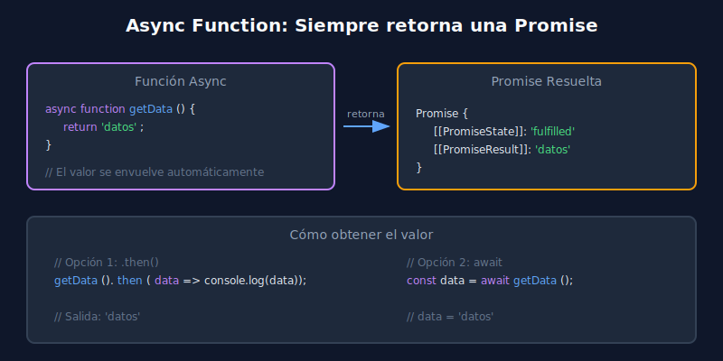

# 🚀 Funciones Async

## 🎯 Objetivos

Al finalizar este tema, serás capaz de:

- Comprender qué es una función `async` y cómo se diferencia de una función normal
- Entender que las funciones async siempre retornan una Promise
- Crear funciones async y convertir código basado en Promises

---

## 📋 Contenido

### 1. ¿Qué es una función async?

Una **función async** es una función que siempre retorna una Promise. Se declara colocando la palabra clave `async` antes de la declaración de la función.

```javascript
// Función async básica
async function fetchUserData() {
  return 'datos del usuario';
}

// Llamar a la función async retorna una Promise
const result = fetchUserData();
console.log(result); // Promise {<fulfilled>: 'datos del usuario'}

// Para obtener el valor, usamos .then() o await
fetchUserData().then(data => console.log(data)); // 'datos del usuario'
```

---

### 2. Sintaxis de funciones async

Hay varias formas de declarar funciones async:

```javascript
// ============================================
// 1. Function Declaration
// ============================================
async function getUserById(id) {
  // Código asíncrono aquí
  return { id, name: 'Usuario' };
}

// ============================================
// 2. Function Expression
// ============================================
const getProductById = async function(id) {
  return { id, name: 'Producto' };
};

// ============================================
// 3. Arrow Function (más común en código moderno)
// ============================================
const getOrderById = async (id) => {
  return { id, status: 'pending' };
};

// ============================================
// 4. Método de clase
// ============================================
class DataService {
  async fetchData(endpoint) {
    // Lógica de fetching
    return { endpoint, data: [] };
  }
}

// ============================================
// 5. Método de objeto
// ============================================
const api = {
  async getData() {
    return 'datos';
  }
};
```

---

### 3. Comportamiento de retorno

Una función async **siempre envuelve el valor retornado en una Promise**:

```javascript
// ============================================
// Caso 1: Retornar un valor simple
// ============================================
async function returnString() {
  return 'Hola mundo';
}
// Equivale a: return Promise.resolve('Hola mundo');

returnString().then(value => console.log(value)); // 'Hola mundo'

// ============================================
// Caso 2: Retornar una Promise
// ============================================
async function returnPromise() {
  return Promise.resolve('Ya soy una Promise');
}
// No se envuelve dos veces, sigue siendo una Promise

returnPromise().then(value => console.log(value)); // 'Ya soy una Promise'

// ============================================
// Caso 3: Lanzar un error
// ============================================
async function throwError() {
  throw new Error('Algo salió mal');
}
// Equivale a: return Promise.reject(new Error('Algo salió mal'));

throwError().catch(error => console.log(error.message)); // 'Algo salió mal'

// ============================================
// Caso 4: No retornar nada (undefined)
// ============================================
async function noReturn() {
  console.log('Ejecutando...');
}
// Equivale a: return Promise.resolve(undefined);

noReturn().then(value => console.log(value)); // undefined
```

#### 📊 Diagrama: Cómo async envuelve valores en Promise



---

### 4. Comparación: Promises vs Async

Veamos cómo se traduce código basado en Promises a async:

```javascript
// ============================================
// VERSIÓN CON PROMISES
// ============================================
function fetchUserWithPromises(userId) {
  return fetch(`/api/users/${userId}`)
    .then(response => {
      if (!response.ok) {
        throw new Error('Usuario no encontrado');
      }
      return response.json();
    })
    .then(user => {
      return {
        ...user,
        fetchedAt: new Date()
      };
    });
}

// ============================================
// VERSIÓN CON ASYNC (equivalente)
// ============================================
async function fetchUserWithAsync(userId) {
  const response = await fetch(`/api/users/${userId}`);

  if (!response.ok) {
    throw new Error('Usuario no encontrado');
  }

  const user = await response.json();

  return {
    ...user,
    fetchedAt: new Date()
  };
}

// Ambas se usan de la misma manera:
fetchUserWithAsync(123)
  .then(user => console.log(user))
  .catch(error => console.error(error));
```

---

### 5. Ventajas de async/await

| Aspecto | Promises (.then) | Async/Await |
|---------|-----------------|-------------|
| **Legibilidad** | Callbacks anidados | Código secuencial |
| **Debugging** | Stack traces complejos | Stack traces claros |
| **Manejo de errores** | .catch() encadenado | try/catch familiar |
| **Lógica condicional** | Complejo con .then() | Natural con if/else |
| **Loops** | Difícil de implementar | for/while normales |

```javascript
// ============================================
// Ejemplo: Lógica condicional
// ============================================

// ❌ Con Promises (complejo)
function processUserPromises(userId) {
  return getUser(userId)
    .then(user => {
      if (user.isPremium) {
        return getPremiumData(user.id);
      } else {
        return getBasicData(user.id);
      }
    })
    .then(data => {
      // ¿Cuál data es? Difícil de seguir
      return formatData(data);
    });
}

// ✅ Con Async (claro y legible)
async function processUserAsync(userId) {
  const user = await getUser(userId);

  let data;
  if (user.isPremium) {
    data = await getPremiumData(user.id);
  } else {
    data = await getBasicData(user.id);
  }

  return formatData(data);
}
```

---

### 6. Importante: async no bloquea

Aunque el código dentro de una función async se ve síncrono, **no bloquea el hilo principal**:

```javascript
async function longOperation() {
  console.log('1. Iniciando operación');

  // Esto NO bloquea - el navegador sigue respondiendo
  const result = await fetch('/api/large-data');

  console.log('2. Operación completada');
  return result;
}

console.log('A. Antes de llamar');
longOperation().then(() => console.log('C. Promise resuelta'));
console.log('B. Después de llamar');

// Salida:
// A. Antes de llamar
// 1. Iniciando operación
// B. Después de llamar
// 2. Operación completada
// C. Promise resuelta
```

---

## ✅ Checklist de Verificación

- [ ] Puedo declarar funciones async con diferentes sintaxis
- [ ] Entiendo que async siempre retorna una Promise
- [ ] Puedo convertir código con .then() a async
- [ ] Comprendo que async no bloquea el hilo principal

---

## 📚 Recursos Adicionales

- [MDN: async function](https://developer.mozilla.org/es/docs/Web/JavaScript/Reference/Statements/async_function)
- [JavaScript.info: Async/await](https://javascript.info/async-await)

---

[⬅️ Volver a Semana 14](../README.md) | [Siguiente: await keyword ➡️](02-await-keyword.md)
