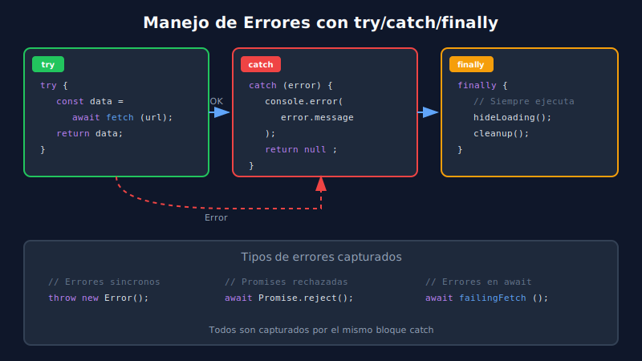

# 🛡️ Manejo de Errores en Async/Await

## 🎯 Objetivos

Al finalizar este tema, serás capaz de:

- Manejar errores con `try/catch` en funciones async
- Entender cómo se propagan los errores en código asíncrono
- Implementar estrategias de manejo de errores robustas
- Combinar múltiples niveles de manejo de errores

---

## � Diagrama: Flujo de try/catch/finally



---

## �📋 Contenido

### 1. try/catch en funciones async

La gran ventaja de `async/await` es que podemos usar `try/catch` de forma natural:

```javascript
// ============================================
// Manejo de errores básico
// ============================================
async function fetchUserData(userId) {
  try {
    const response = await fetch(`/api/users/${userId}`);

    if (!response.ok) {
      throw new Error(`HTTP Error: ${response.status}`);
    }

    const user = await response.json();
    return user;

  } catch (error) {
    console.error('Error al obtener usuario:', error.message);
    return null; // Valor por defecto
  }
}

// Uso
const user = await fetchUserData(123);
if (user) {
  console.log('Usuario:', user.name);
} else {
  console.log('No se pudo obtener el usuario');
}
```

---

### 2. Tipos de errores capturados

`try/catch` en async captura tanto errores síncronos como asíncronos:

```javascript
async function demonstrateErrors() {
  try {
    // ============================================
    // Error síncrono - se captura
    // ============================================
    // throw new Error('Error síncrono');

    // ============================================
    // Promise rechazada - se captura
    // ============================================
    // await Promise.reject(new Error('Promise rechazada'));

    // ============================================
    // Error en operación async - se captura
    // ============================================
    const response = await fetch('https://invalid-url-12345.com');

    // ============================================
    // Error después de await - se captura
    // ============================================
    const data = await response.json();

  } catch (error) {
    // Todos los errores anteriores llegan aquí
    console.error('Tipo:', error.name);
    console.error('Mensaje:', error.message);
  }
}
```

---

### 3. Usando finally

`finally` se ejecuta siempre, haya error o no:

```javascript
async function fetchWithLoading(url) {
  const loadingIndicator = document.getElementById('loading');

  try {
    // Mostrar indicador de carga
    loadingIndicator.style.display = 'block';

    const response = await fetch(url);
    const data = await response.json();
    return data;

  } catch (error) {
    console.error('Error de fetch:', error);
    throw error; // Re-lanzar para que el llamador lo maneje

  } finally {
    // Siempre ocultar el indicador, éxito o error
    loadingIndicator.style.display = 'none';
  }
}
```

---

### 4. Manejo granular de errores

Puedes tener múltiples bloques try/catch para manejar errores específicos:

```javascript
async function complexOperation() {
  let user, products, order;

  // ============================================
  // Intento 1: Obtener usuario
  // ============================================
  try {
    user = await fetchUser();
  } catch (error) {
    console.error('Error al obtener usuario:', error.message);
    throw new Error('No se pudo autenticar');
  }

  // ============================================
  // Intento 2: Obtener productos
  // ============================================
  try {
    products = await fetchProducts();
  } catch (error) {
    console.error('Error al obtener productos:', error.message);
    // Continuar con lista vacía
    products = [];
  }

  // ============================================
  // Intento 3: Crear orden (crítico)
  // ============================================
  try {
    order = await createOrder(user, products);
  } catch (error) {
    // Usar Error cause (ES2022) para contexto
    throw new Error('Fallo al crear orden', { cause: error });
  }

  return order;
}
```

---

### 5. Errores personalizados

Crea clases de error para diferentes situaciones:

```javascript
// ============================================
// Definición de errores personalizados
// ============================================
class NetworkError extends Error {
  constructor(message, statusCode) {
    super(message);
    this.name = 'NetworkError';
    this.statusCode = statusCode;
  }
}

class ValidationError extends Error {
  constructor(message, field) {
    super(message);
    this.name = 'ValidationError';
    this.field = field;
  }
}

class NotFoundError extends Error {
  constructor(resource, id) {
    super(`${resource} con ID ${id} no encontrado`);
    this.name = 'NotFoundError';
    this.resource = resource;
    this.id = id;
  }
}

// ============================================
// Uso con async/await
// ============================================
async function fetchResource(type, id) {
  try {
    const response = await fetch(`/api/${type}/${id}`);

    if (response.status === 404) {
      throw new NotFoundError(type, id);
    }

    if (!response.ok) {
      throw new NetworkError('Error de red', response.status);
    }

    return await response.json();

  } catch (error) {
    // Manejar según el tipo de error
    if (error instanceof NotFoundError) {
      console.log(`${error.resource} no existe`);
      return null;
    }

    if (error instanceof NetworkError) {
      console.log(`Error de red: ${error.statusCode}`);
      // Quizás reintentar?
    }

    // Error desconocido, re-lanzar
    throw error;
  }
}
```

---

### 6. Error cause (ES2022)

Encadena errores preservando el contexto original:

```javascript
async function processData() {
  try {
    const data = await fetchData();
    return transform(data);

  } catch (originalError) {
    // Preservar el error original como "causa"
    throw new Error('Error al procesar datos', {
      cause: originalError
    });
  }
}

// Uso
async function main() {
  try {
    await processData();
  } catch (error) {
    console.error('Error:', error.message);

    // Acceder al error original
    if (error.cause) {
      console.error('Causa original:', error.cause.message);
    }
  }
}
```

---

### 7. Manejo de errores en Promise.all

Cuando usas `Promise.all`, un error rechaza todo:

```javascript
async function fetchMultipleUsers(userIds) {
  try {
    // ============================================
    // Promise.all - falla si UNA falla
    // ============================================
    const users = await Promise.all(
      userIds.map(id => fetchUser(id))
    );
    return users;

  } catch (error) {
    // Se captura el PRIMER error
    console.error('Al menos una petición falló:', error.message);
    return [];
  }
}

// ============================================
// Alternativa: Promise.allSettled (no rechaza)
// ============================================
async function fetchMultipleUsersSafe(userIds) {
  const results = await Promise.allSettled(
    userIds.map(id => fetchUser(id))
  );

  // Separar éxitos de fallos
  const users = results
    .filter(r => r.status === 'fulfilled')
    .map(r => r.value);

  const errors = results
    .filter(r => r.status === 'rejected')
    .map(r => r.reason);

  if (errors.length > 0) {
    console.warn('Algunos usuarios no se pudieron cargar:', errors);
  }

  return users;
}
```

---

### 8. Patrones de retry

Implementar reintentos cuando una operación falla:

```javascript
// ============================================
// Función de retry genérica
// ============================================
async function withRetry(asyncFn, maxRetries = 3, delay = 1000) {
  let lastError;

  for (let attempt = 1; attempt <= maxRetries; attempt++) {
    try {
      return await asyncFn();
    } catch (error) {
      lastError = error;
      console.log(`Intento ${attempt}/${maxRetries} falló:`, error.message);

      if (attempt < maxRetries) {
        console.log(`Reintentando en ${delay}ms...`);
        await new Promise(resolve => setTimeout(resolve, delay));
        delay *= 2; // Exponential backoff
      }
    }
  }

  throw new Error(`Falló después de ${maxRetries} intentos`, {
    cause: lastError
  });
}

// Uso
async function fetchWithRetry() {
  const data = await withRetry(
    () => fetch('/api/unreliable-endpoint').then(r => r.json()),
    3,    // máximo 3 intentos
    1000  // esperar 1 segundo inicial
  );

  return data;
}
```

---

### 9. Comparación: .catch() vs try/catch

| Aspecto | .catch() | try/catch |
|---------|----------|-----------|
| **Sintaxis** | Encadenada | Bloque estructurado |
| **Alcance** | Solo esa cadena | Todo el bloque try |
| **Legibilidad** | Puede anidar | Más plano |
| **Uso** | Con Promises | Con async/await |

```javascript
// ============================================
// Ambos enfoques son válidos
// ============================================

// Con .catch()
fetchData()
  .then(data => processData(data))
  .catch(error => handleError(error));

// Con try/catch
async function main() {
  try {
    const data = await fetchData();
    await processData(data);
  } catch (error) {
    handleError(error);
  }
}
```

---

## ✅ Checklist de Verificación

- [ ] Puedo usar try/catch con async/await
- [ ] Sé la diferencia entre capturar y re-lanzar errores
- [ ] Puedo implementar finally para limpieza
- [ ] Entiendo Error cause (ES2022)
- [ ] Puedo implementar patrones de retry

---

## 📚 Recursos Adicionales

- [MDN: try...catch](https://developer.mozilla.org/es/docs/Web/JavaScript/Reference/Statements/try...catch)
- [JavaScript.info: Error handling with promises](https://javascript.info/promise-error-handling)

---

[⬅️ Anterior: await keyword](02-await-keyword.md) | [Siguiente: Patrones Avanzados ➡️](04-advanced-patterns.md)
