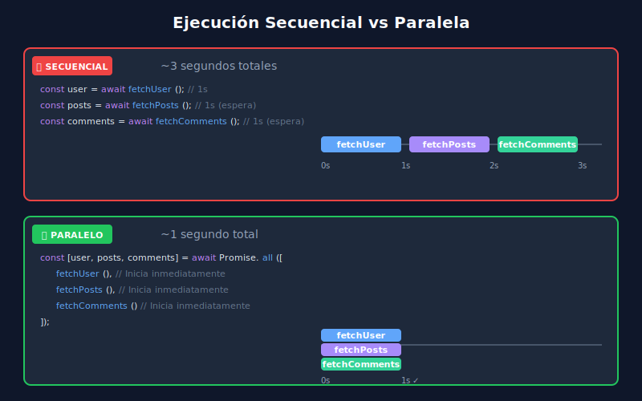

# 🚀 Patrones Avanzados de Async/Await

## 🎯 Objetivos

Al finalizar este tema, serás capaz de:

- Distinguir entre ejecución paralela y secuencial
- Usar `for await...of` para iteración asíncrona
- Implementar generadores asíncronos
- Aplicar patrones avanzados en situaciones reales

---

## 📋 Contenido

### 1. Ejecución Secuencial vs Paralela

Entender cuándo usar cada enfoque es crucial para el rendimiento:

#### 📊 Diagrama: Comparación de tiempos



```javascript
// ============================================
// ❌ SECUENCIAL - Una operación espera a la otra
// ============================================
async function fetchSequential() {
  console.time('Secuencial');

  const user = await fetchUser();      // 1 segundo
  const posts = await fetchPosts();     // 1 segundo
  const comments = await fetchComments(); // 1 segundo

  console.timeEnd('Secuencial'); // ~3 segundos
  return { user, posts, comments };
}

// ============================================
// ✅ PARALELO - Todas las operaciones inician juntas
// ============================================
async function fetchParallel() {
  console.time('Paralelo');

  const [user, posts, comments] = await Promise.all([
    fetchUser(),      // 1 segundo
    fetchPosts(),     // 1 segundo (simultáneo)
    fetchComments()   // 1 segundo (simultáneo)
  ]);

  console.timeEnd('Paralelo'); // ~1 segundo
  return { user, posts, comments };
}
```

---

### 2. Cuándo usar cada enfoque

```javascript
// ============================================
// SECUENCIAL: Cuando cada operación depende de la anterior
// ============================================
async function checkout() {
  // El carrito necesita el usuario
  const user = await getUser();

  // El total necesita el carrito
  const cart = await getCart(user.cartId);

  // El pago necesita el total
  const payment = await processPayment(cart.total);

  // La orden necesita todo lo anterior
  const order = await createOrder(user, cart, payment);

  return order;
}

// ============================================
// PARALELO: Cuando las operaciones son independientes
// ============================================
async function loadDashboard() {
  // Estas operaciones no dependen entre sí
  const [
    userData,
    notifications,
    recentActivity,
    stats
  ] = await Promise.all([
    fetchUserData(),
    fetchNotifications(),
    fetchRecentActivity(),
    fetchStats()
  ]);

  return { userData, notifications, recentActivity, stats };
}

// ============================================
// MIXTO: Combinación de ambos
// ============================================
async function loadUserDashboard(userId) {
  // Primero necesitamos el usuario
  const user = await fetchUser(userId);

  // Luego cargamos sus datos en paralelo
  const [posts, followers, settings] = await Promise.all([
    fetchPosts(user.id),
    fetchFollowers(user.id),
    fetchSettings(user.id)
  ]);

  return { user, posts, followers, settings };
}
```

---

### 3. for await...of

Para iterar sobre fuentes de datos asíncronas:

```javascript
// ============================================
// Iterable asíncrono básico
// ============================================
const asyncIterable = {
  data: ['A', 'B', 'C', 'D'],

  async *[Symbol.asyncIterator]() {
    for (const item of this.data) {
      // Simular operación asíncrona
      await new Promise(resolve => setTimeout(resolve, 500));
      yield item;
    }
  }
};

// Usar con for await...of
async function processItems() {
  console.log('Iniciando procesamiento...');

  for await (const item of asyncIterable) {
    console.log('Procesando:', item);
  }

  console.log('Procesamiento completado');
}

// Salida (cada línea aparece con 500ms de diferencia):
// Iniciando procesamiento...
// Procesando: A
// Procesando: B
// Procesando: C
// Procesando: D
// Procesamiento completado
```

---

### 4. Generadores Asíncronos

Combina generadores con async para flujos de datos complejos:

```javascript
// ============================================
// Generador asíncrono básico
// ============================================
async function* asyncGenerator() {
  yield await fetchData(1);
  yield await fetchData(2);
  yield await fetchData(3);
}

// Uso
async function processGenerator() {
  for await (const data of asyncGenerator()) {
    console.log('Recibido:', data);
  }
}

// ============================================
// Generador para paginación
// ============================================
async function* paginate(endpoint, pageSize = 10) {
  let page = 1;
  let hasMore = true;

  while (hasMore) {
    const response = await fetch(
      `${endpoint}?page=${page}&limit=${pageSize}`
    );
    const data = await response.json();

    // Producir cada item individualmente
    for (const item of data.items) {
      yield item;
    }

    hasMore = data.hasNextPage;
    page++;
  }
}

// Uso: procesar todos los items paginados
async function processAllItems() {
  for await (const item of paginate('/api/items')) {
    await processItem(item);

    // Podemos break cuando queramos
    if (item.isLast) break;
  }
}
```

---

### 5. Streaming de datos

Leer streams con for await...of:

```javascript
// ============================================
// Leer un Response body como stream
// ============================================
async function readStream(url) {
  const response = await fetch(url);
  const reader = response.body.getReader();
  const decoder = new TextDecoder();

  let result = '';

  while (true) {
    const { done, value } = await reader.read();

    if (done) break;

    result += decoder.decode(value, { stream: true });
    console.log('Chunk recibido:', value.length, 'bytes');
  }

  return result;
}

// ============================================
// Con for await...of (si el body es async iterable)
// ============================================
async function readStreamModern(url) {
  const response = await fetch(url);
  const chunks = [];

  // En algunos entornos, response.body es async iterable
  for await (const chunk of response.body) {
    chunks.push(chunk);
    console.log('Chunk:', chunk.length, 'bytes');
  }

  return new Blob(chunks);
}
```

---

### 6. Concurrencia limitada

Ejecutar muchas operaciones en paralelo pero con límite:

```javascript
// ============================================
// Procesar N items con concurrencia limitada
// ============================================
async function processWithLimit(items, limit, asyncFn) {
  const results = [];
  const executing = new Set();

  for (const item of items) {
    // Crear la promesa y agregarla al set
    const promise = asyncFn(item).then(result => {
      executing.delete(promise);
      return result;
    });

    results.push(promise);
    executing.add(promise);

    // Si alcanzamos el límite, esperar a que una termine
    if (executing.size >= limit) {
      await Promise.race(executing);
    }
  }

  return Promise.all(results);
}

// Uso: procesar 100 items, máximo 5 simultáneos
const items = Array.from({ length: 100 }, (_, i) => i);

const results = await processWithLimit(
  items,
  5,  // máximo 5 operaciones simultáneas
  async (item) => {
    const result = await processItem(item);
    return result;
  }
);
```

---

### 7. Timeout con async/await

Implementar timeout de forma limpia:

```javascript
// ============================================
// Helper para timeout
// ============================================
const timeout = (ms) => new Promise((_, reject) =>
  setTimeout(() => reject(new Error(`Timeout después de ${ms}ms`)), ms)
);

// ============================================
// Operación con timeout
// ============================================
async function fetchWithTimeout(url, timeoutMs = 5000) {
  try {
    const response = await Promise.race([
      fetch(url),
      timeout(timeoutMs)
    ]);

    return await response.json();

  } catch (error) {
    if (error.message.includes('Timeout')) {
      console.error('La operación tardó demasiado');
    }
    throw error;
  }
}

// ============================================
// AbortController (mejor para fetch)
// ============================================
async function fetchWithAbort(url, timeoutMs = 5000) {
  const controller = new AbortController();
  const timeoutId = setTimeout(() => controller.abort(), timeoutMs);

  try {
    const response = await fetch(url, {
      signal: controller.signal
    });
    return await response.json();

  } catch (error) {
    if (error.name === 'AbortError') {
      throw new Error(`Fetch abortado después de ${timeoutMs}ms`);
    }
    throw error;

  } finally {
    clearTimeout(timeoutId);
  }
}
```

---

### 8. Cancelación de operaciones

Patrón para cancelar operaciones async:

```javascript
// ============================================
// Clase para operación cancelable
// ============================================
class CancelableOperation {
  #cancelled = false;

  async execute(asyncFn) {
    const result = await asyncFn();

    // Verificar si fue cancelada mientras esperaba
    if (this.#cancelled) {
      throw new Error('Operación cancelada');
    }

    return result;
  }

  cancel() {
    this.#cancelled = true;
  }

  get isCancelled() {
    return this.#cancelled;
  }
}

// Uso
const operation = new CancelableOperation();

// Iniciar operación
operation.execute(async () => {
  const data = await fetchData();
  return processData(data);
})
.then(result => console.log('Completado:', result))
.catch(error => console.log('Error:', error.message));

// Cancelar si el usuario navega
window.addEventListener('beforeunload', () => {
  operation.cancel();
});
```

---

### 9. Composición de funciones async

```javascript
// ============================================
// Pipe de funciones async
// ============================================
const asyncPipe = (...fns) => async (input) => {
  let result = input;
  for (const fn of fns) {
    result = await fn(result);
  }
  return result;
};

// Uso
const processUser = asyncPipe(
  fetchUser,
  validateUser,
  enrichUserData,
  saveUser
);

const result = await processUser(userId);

// ============================================
// Compose (orden inverso)
// ============================================
const asyncCompose = (...fns) => asyncPipe(...fns.reverse());
```

---

## ✅ Checklist de Verificación

- [ ] Distingo cuándo usar ejecución paralela vs secuencial
- [ ] Puedo usar for await...of para iteración asíncrona
- [ ] Entiendo cómo crear generadores asíncronos
- [ ] Puedo implementar timeout y cancelación
- [ ] Sé limitar la concurrencia de operaciones paralelas

---

## 📚 Recursos Adicionales

- [MDN: for await...of](https://developer.mozilla.org/es/docs/Web/JavaScript/Reference/Statements/for-await...of)
- [JavaScript.info: Async iterators and generators](https://javascript.info/async-iterators-generators)

---

[⬅️ Anterior: Error Handling](03-error-handling.md) | [Volver a Semana 14](../README.md)
