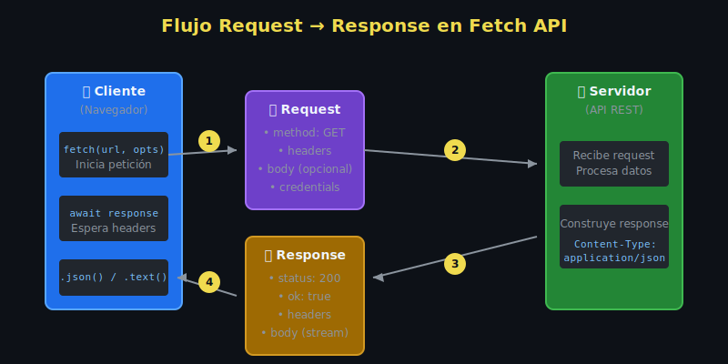

# 🌐 Fetch API Básica

## 🎯 Objetivos

Al finalizar este tema, serás capaz de:

- Comprender qué es la Fetch API y por qué reemplazó a XMLHttpRequest
- Realizar peticiones GET básicas con fetch
- Entender el flujo de una petición HTTP
- Trabajar con respuestas JSON

---

## 📋 Contenido

### 1. ¿Qué es Fetch API?

**Fetch API** es la forma moderna de hacer peticiones HTTP en JavaScript. Reemplaza a `XMLHttpRequest` con una API basada en Promises, más limpia y fácil de usar.

```javascript
// ============================================
// Fetch básico - Petición GET
// ============================================

// fetch() retorna una Promise que resuelve a un objeto Response
const response = await fetch('https://jsonplaceholder.typicode.com/users/1');

// Para obtener los datos, debemos parsear la respuesta
const user = await response.json();

console.log(user);
// { id: 1, name: "Leanne Graham", email: "Sincere@april.biz", ... }
```

---

### 2. Anatomía de una petición fetch

```javascript
// ============================================
// El flujo de una petición fetch
// ============================================

async function fetchUserData() {
  // PASO 1: Hacer la petición
  // fetch() inicia la petición y retorna una Promise
  const response = await fetch('https://api.example.com/users');

  // En este punto:
  // - La conexión está establecida
  // - Los headers de respuesta están disponibles
  // - El body AÚN NO está descargado completamente

  console.log('Status:', response.status);        // 200
  console.log('OK:', response.ok);                // true
  console.log('Headers:', response.headers);      // Headers object

  // PASO 2: Leer el body de la respuesta
  // .json() lee el body y lo parsea como JSON
  // Esto también retorna una Promise
  const data = await response.json();

  // Ahora tenemos los datos listos para usar
  return data;
}
```

---

### 3. Métodos para leer el body

El body de la respuesta solo se puede leer **una vez**. Fetch ofrece varios métodos según el tipo de contenido:

```javascript
// ============================================
// Diferentes formas de leer el body
// ============================================

// 1. JSON - Para APIs REST
const data = await response.json();

// 2. Texto plano - Para HTML, XML, texto
const html = await response.text();

// 3. Blob - Para imágenes, archivos binarios
const imageBlob = await response.blob();
const imageUrl = URL.createObjectURL(imageBlob);

// 4. ArrayBuffer - Para datos binarios que necesitas procesar
const buffer = await response.arrayBuffer();

// 5. FormData - Para respuestas multipart/form-data
const formData = await response.formData();
```

```javascript
// ============================================
// ⚠️ ERROR COMÚN: Leer el body dos veces
// ============================================

const response = await fetch('/api/data');
const json = await response.json();  // ✅ Primera lectura - OK

// ❌ ERROR: body ya fue consumido
const text = await response.text();
// TypeError: Failed to execute 'text': body stream already read

// ✅ SOLUCIÓN: Clonar la respuesta si necesitas leer múltiples veces
const response2 = await fetch('/api/data');
const clone = response2.clone();

const json2 = await response2.json();  // ✅ OK
const text2 = await clone.text();       // ✅ OK (del clon)
```

---

### 4. Petición GET con parámetros

```javascript
// ============================================
// Agregar query parameters a la URL
// ============================================

// Opción 1: String manual (propenso a errores)
const url1 = 'https://api.example.com/search?q=javascript&limit=10';

// Opción 2: URLSearchParams (recomendado)
const params = new URLSearchParams({
  q: 'javascript',
  limit: 10,
  page: 1
});

const url2 = `https://api.example.com/search?${params}`;
// https://api.example.com/search?q=javascript&limit=10&page=1

const response = await fetch(url2);
const results = await response.json();
```

```javascript
// ============================================
// URLSearchParams maneja caracteres especiales
// ============================================

const params = new URLSearchParams({
  query: 'hello world',      // Espacio → %20
  filter: 'name:John&age>25' // Caracteres especiales escapados
});

console.log(params.toString());
// query=hello+world&filter=name%3AJohn%26age%3E25

// También puedes usar URL API
const url = new URL('https://api.example.com/search');
url.searchParams.set('q', 'hello world');
url.searchParams.set('limit', 10);

console.log(url.href);
// https://api.example.com/search?q=hello+world&limit=10
```

---

### 5. Ejemplo práctico completo

```javascript
// ============================================
// Función reutilizable para obtener usuarios
// ============================================

/**
 * Obtiene lista de usuarios desde la API
 * @param {Object} options - Opciones de búsqueda
 * @param {number} options.limit - Cantidad de usuarios
 * @param {number} options.page - Página actual
 * @returns {Promise<Array>} Lista de usuarios
 */
const getUsers = async (options = {}) => {
  const { limit = 10, page = 1 } = options;

  // Construir URL con parámetros
  const params = new URLSearchParams({ _limit: limit, _page: page });
  const url = `https://jsonplaceholder.typicode.com/users?${params}`;

  // Hacer petición
  const response = await fetch(url);

  // Parsear respuesta
  const users = await response.json();

  return users;
};

// Uso
const users = await getUsers({ limit: 5, page: 1 });
console.log(`Obtenidos ${users.length} usuarios`);
```

---

### 6. Fetch vs XMLHttpRequest

```javascript
// ============================================
// Comparación: XMLHttpRequest vs Fetch
// ============================================

// ❌ XMLHttpRequest (forma antigua)
function getDataXHR(url, callback) {
  const xhr = new XMLHttpRequest();
  xhr.open('GET', url);
  xhr.onload = function() {
    if (xhr.status === 200) {
      callback(null, JSON.parse(xhr.responseText));
    } else {
      callback(new Error('Error: ' + xhr.status));
    }
  };
  xhr.onerror = function() {
    callback(new Error('Network error'));
  };
  xhr.send();
}

// ✅ Fetch (forma moderna)
async function getDataFetch(url) {
  const response = await fetch(url);
  return response.json();
}

// Ventajas de Fetch:
// 1. Basado en Promises (compatible con async/await)
// 2. API más limpia y simple
// 3. Objetos Request/Response inmutables
// 4. Mejor manejo de streams
// 5. Soporte nativo para CORS
```

---

## 🧪 Ejercicio Rápido

```javascript
// Practica: Obtén el post con ID 1 de JSONPlaceholder
// URL: https://jsonplaceholder.typicode.com/posts/1

// Tu código aquí:
const getPost = async (id) => {
  // 1. Hacer fetch a la URL correcta
  // 2. Parsear como JSON
  // 3. Retornar el post
};

// Resultado esperado:
// { id: 1, title: "sunt aut facere...", body: "...", userId: 1 }
```

---

## 📊 Diagrama: Flujo Request → Response



---

## ✅ Checklist de Aprendizaje

- [ ] Entiendo que fetch() retorna una Promise
- [ ] Sé que el body se lee con .json(), .text(), etc.
- [ ] Comprendo que el body solo se puede leer una vez
- [ ] Puedo construir URLs con URLSearchParams
- [ ] Entiendo la diferencia entre fetch y XMLHttpRequest

---

## 🔗 Recursos

- [MDN: Fetch API](https://developer.mozilla.org/es/docs/Web/API/Fetch_API)
- [MDN: Using Fetch](https://developer.mozilla.org/es/docs/Web/API/Fetch_API/Using_Fetch)
- [JavaScript.info: Fetch](https://javascript.info/fetch)

---

## 🔗 Navegación

[⬅️ Volver a Semana 15](../README.md) | [Siguiente: Request y Response ➡️](02-request-response.md)
